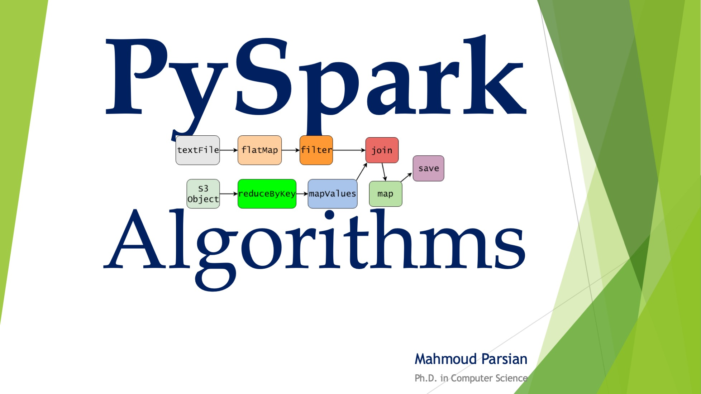

# [Big Data Modeling & Analytics](https://www.scu.edu/business/graduate-degrees/ms-programs/ms-business-analytics/course-descriptions/)

## [Santa Clara University](http://scu.edu/)

--------------------------

[comment]: <> (This is a comment, it will not be included)
[comment]: <> (Big Data, Big Data Modeling & Analytics)
[comment]: <> (MapReduce, map, mapper, reduce, reducer)
[comment]: <> (Spark, PySpark, RDD, DataFrame)
[comment]: <> (Spark, PySpark, Transformations, Actions, Partitions)
[comment]: <> (SCU web site  URL: https://www.scu.edu/business/graduate-degrees/ms-programs/ms-business-analytics/course-descriptions/)
[comment]: <> (SCU web site  online URL: https://onlinedegrees.scu.edu/academics/masters-business-analytics/curriculum)

----------------------------

## Fall Quarter 2023
## Course Information: 
* [Graduate School, Leavey School of Business](https://www.scu.edu/business/)
* [Department of Information Systems & Analytics](https://www.scu.edu/business/isa/)
* Course MSIS 2527: Big Data Modeling & Analytics
* **Class meeting dates**: 
	* Start: September 19, 2023
	* End: December 8, 2023
	* Final Exam week: December 4-8, 2023
* **Class hours**:  
	* Tuesday 5:45 PM - 7:20 PM PST
	* Thursday 5:45 PM - 7:20 PM PST
* Class room: TBDL
* Office: TBDL, Lucas Hall 
* Office Hours: TBDL (via Zoom and by appointment)

------------

## 1.  [Instructor, Adjunct Professor: Mahmoud Parsian](https://www.scu.edu/business/isa/faculty/parsian/)

## 2.  [Prerequisite](./web_docs/prerequisite.md)

## 3.  [Course Description & Concepts](./web_docs/course_description.md)

## 4.  [Big Data Modeling Class Web Site](https://github.com/mahmoudparsian/big-data-mapreduce-course)

## 5.  [Glossary of Big Data, MapReduce, Spark](./slides/glossary/glossary_of_big_data_and_mapreduce.md)

## 6.  [Required Books and Papers](./web_docs/required_books.md)

## 7.  [Optional Books and References](./web_docs/additional_books.md)

## 8.  [Required Software: MapReduce & Spark/PySpark](./web_docs/required_software.md)

## 9.  [Syllabus, Fall Quarter 2023](./syllabus/2023-Fall/README.md)

## 10.  [Grading and Class Conduct](./web_docs/grading_and_class_conduct.md)

## 11. [Python Tutorials](./web_docs/python_tutorials.md)

## 12. [MapReduce Tutorials](./web_docs/mapreduce_tutorials.md)

## 13. [PySpark Tutorials](./web_docs/pyspark_tutorials.md)

## 14. [Office Hours](./web_docs/office_hours.md)

## 15. [Midterm Exam](./web_docs/midterm_exam.md)

## 16. [Final Exam](./web_docs/final_exam.md)

## 17. Mahmoud Parsian's Latest Books: 

-------

### Data Algorithms with Spark 

------

### PySpark Algorithms 

-------

### Data Algorithms 

