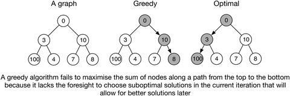
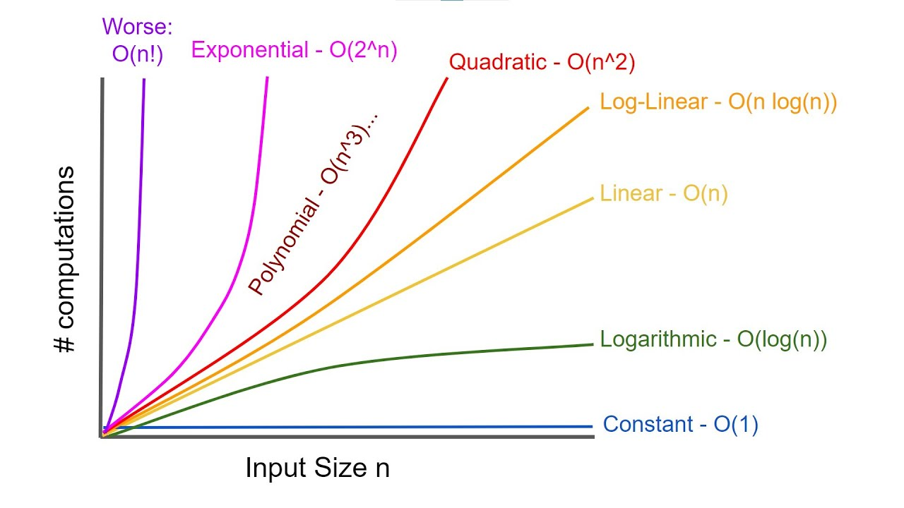
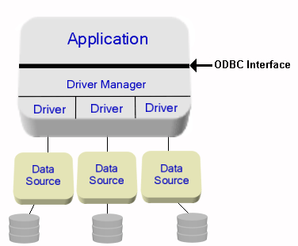
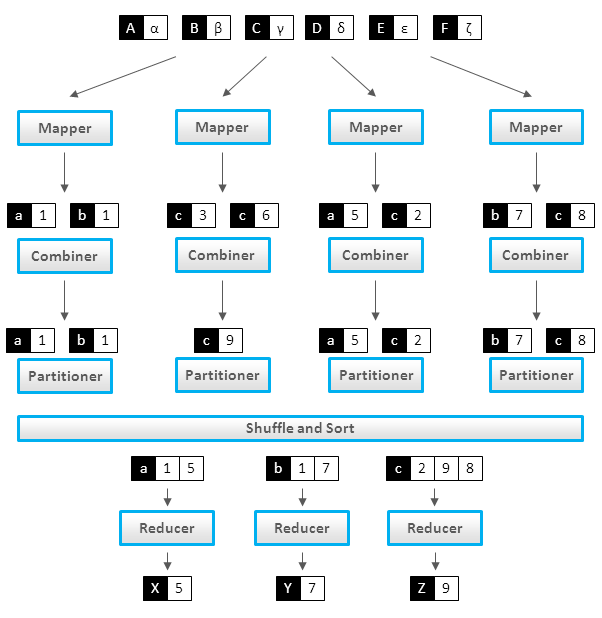
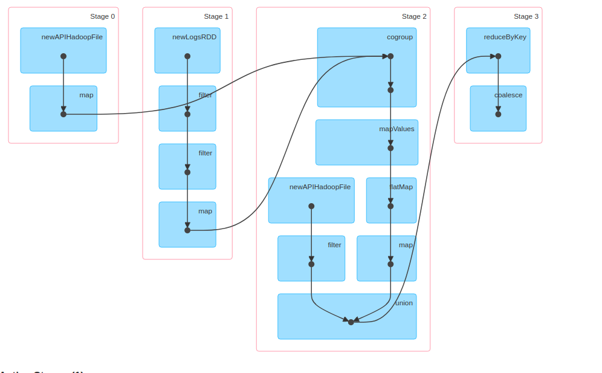
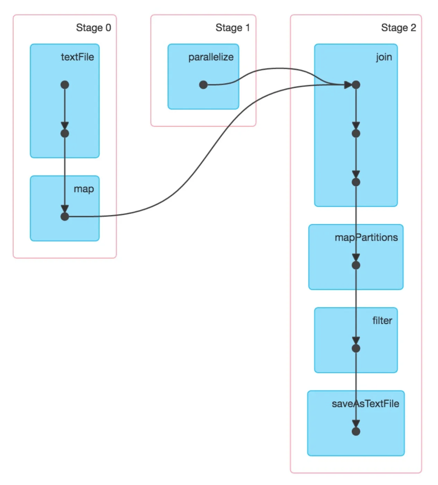
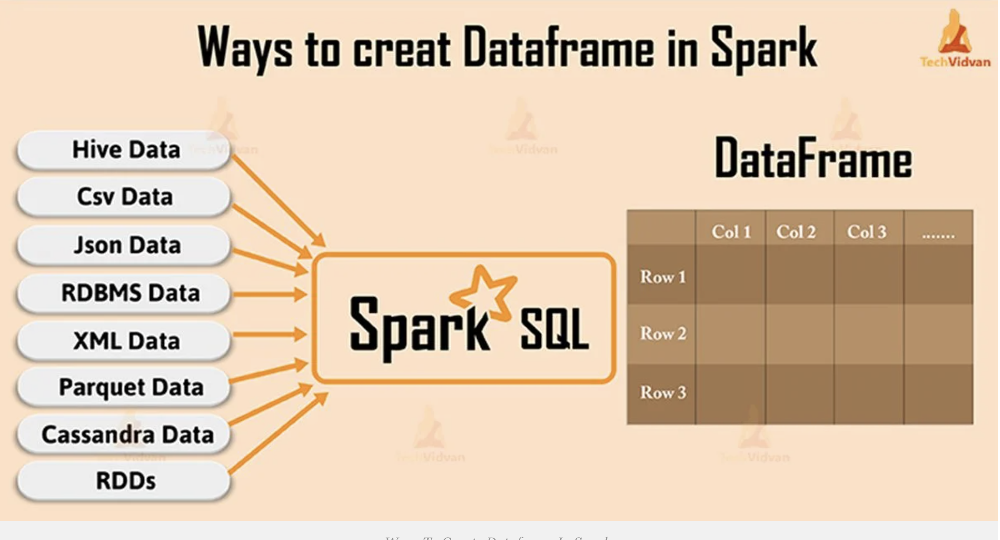
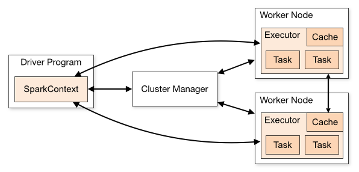

# Glossary of Big Data, MapReduce, Spark

## Prelude

* This glossary is written for my students taking 
  [Big Data Modeling & Analytics](https://github.com/mahmoudparsian/big-data-mapreduce-course/) 
  at [Santa Clara University](https://www.scu.edu).

* This is not a regular glossary: it is a detailed glossary 
  for my students to learn basics of key terms in big data, 
  MapReduce, and PySpark (Python API for Apache Spark).

* Compiled and edited by: 
  [Mahmoud Parsian](../../bio/mahmoud_parsian_scu_bio.md)

* Last updated date: 3/21/2023 (March 21, 2023)


<table>
<tr>

<td>
<a href="https://www.oreilly.com/library/view/data-algorithms-with/9781492082378/">

</a>
</td>

<td>
"... This  book  will be a  great resource for <br>
both readers looking  to  implement  existing <br>
algorithms in a scalable fashion and readers <br>
who are developing new, custom algorithms  <br>
using Spark. ..." <br>
<br>
<a href="https://cs.stanford.edu/people/matei/">Dr. Matei Zaharia</a><br>
Original Creator of Apache Spark <br>
<br>
<a href="https://github.com/mahmoudparsian/data-algorithms-with-spark/blob/master/docs/FOREWORD_by_Dr_Matei_Zaharia.md">FOREWORD by Dr. Matei Zaharia</a><br>
</td>
</tr>
</table>


## Introduction
Big data is a broad and rapidly evolving topic.
Big data is a vast and complex field that is 
constantly evolving, and for that reason, it’s 
important to understand the basic common terms 
and the more technical vocabulary so that your 
understanding can evolve with it. The intention 
is to put these definitions and concepts in one 
single place for ease of exploring, searching 
and learning.

Big data environment involves many tools and 
technologies:

* Data preparation from multiple sources
* Engine for large-scale data analytics 
  (such as Spark)
* ETL processes to analyze prepare data 
  for Query engine 
* Relational database systems
* Query engines such as Amazon Athena, 
  Google BigQuery, Snowflake
* much more...

The purpose of this glossary is to shed some 
light on the fundamental definitions of big 
data, MapReduce, and Spark. This document 
is a list of terms, words, concepts, and
examples found in or relating to big data, 
MapReduce, and Spark.


## Algorithm 

Why are algorithms called algorithms? It's thanks 
to Persian mathematician Muhammad al-Khwarizmi who 
was born way back in around AD780.  [Mohammed 
Ibn Musa-al-Khwarizmi](https://en.wikipedia.org/wiki/Muhammad_ibn_Musa_al-Khwarizmi) was a Persian mathematician 
and creator of the term: ***algorithm***.

* An algorithm is a mathematical formula that 
  can perform certain analyses on data
* An algorithm is a procedure used for solving 
  a problem or performing a computation. 
* An algorithm is a set of well-defined steps 
  to solve a problem
* For example, given a set of words, sort them 
  in ascending order
* For example, given a set of text documents, 
  find frequecy of every unique word
* For example, given a set of numbers, 
  find (minimum, maximum) of given numbers

An algorithm is a step-by-step set of operations 
which can be performed to solve a particular class 
of problem. The steps may involve calculation, 
processing, or reasoning. To be effective, an 
algorithm must reach a solution in finite space 
and time. As an example, Google uses algorithms 
extensively to rank page results and autocomplete 
user queries. Typically an algorithm is implemented 
using a programming language such as Python, Java, 
SQL, ...

In big data world, an algorithm can be implemented 
using a compute engine such as MapReduce and Spark.


In The Art of Computer Programming, a famous computer scientist, 
[Donald E. Knuth](https://www-cs-faculty.stanford.edu/~knuth/), 
defines an algorithm as a set of steps, or rules, with five 
basic properties: 

> 1) **Finiteness**: an algorithm must always 
     terminate after a finite number of steps.
     An algorithm must start and stop. The rules 
     an algorithm applies must also conclude in a 
     reasonable amount of time. What "reasonable" 
     is depends on the nature of the algorithm, 
     but in no case can an algorithm take an 
     infinite amount of time to complete its task. 
     Knuth calls this property the finiteness of 
     an algorithm.

> 2) **Definiteness**: each step of an algorithm must be 
     precisely defined. The actions that an algorithm 
     performs cannot be open to multiple interpretations; 
     each step must be precise and unambiguous. Knuth 
     terms this quality definiteness. An algorithm cannot 
     iterate a "bunch" of times. The number of times must 
     be precisely expressed, for example `2`, `1000000`, 
     or a randomly chosen number.

> 3) **Input**: an algorithm has zero or more inputs.
     An algorithm starts its computation from an initial 
     state. This state may be expressed as input values 
     given to the algorithm before it starts.

> 4) **Output**: an algorithm has one or more outputs.
     An algorithm must produces a result with a specific 
     relation to the inputs.

> 5) **Effectiveness**: an algorithm is also generally 
    expected to be effective.  The steps an algorithm 
    takes must be sufficiently simple that they could 
    be expressed "on paper"; these steps must make 
    sense for the quantities used. Knuth terms this 
    property effectiveness.
   

 

   
## List of Algorithms

#### Simple Algorithms (partial list):

* Sum of list of numbers 
* Average of list of numbers
* Median of list of numbers 
* Finding the standard deviation for a set of numbers
* Mode of list of numbers: the most frequent number-that 
 is, the number that occurs the highest number of times. 
* Minimum and Maximum of list of numbers
* Cartesian product of two sets
* Given a list of numbers, find (number-of-zeros, 
	  number-of-negatives, number-of-positives)
* Word Count: given a set of text documents, 
	  find frequency of every unique word in 
	  these documents
* Given a set of integer numbers, identify 
	  prime and non-prime numbers
* Anagrams Count: given a set of text documents, 
	  find frequency of every unique anagram in 
	  these documents
* Given users, movies, and ratings (1 to 5), what 
	  are the Top-10 movies rated higher than 2.
* DNA base count for FASTA and FASTQ files
* Given a list of numbers, sort them in ascending order
* Given a list of strings, sort them in descending order


#### Famous Algorithms (partial list):
* Sorting algorithms (BubbleSort, QuickSort, ...)
* T-Test algorithm
* Tree traversal algorithms
* Suffix Tree Algorithms
* Red–Black tree	algorithms
* Dijkstra's Algorithm
* Merge Sort
* Quicksort
* Depth First Search
* Breadth-First Search
* Linear Search
* Binary Search
* Minimum Spanning Tree Algorithms
* Bloom Filter
* All-Pairs Shortest Paths – Floyd Warshall Algorithm
* Kmers for DNA sequences
* Huffman Coding Compression Algorithm
* Bioinformatics Algorithms
* The Knuth-Morris-Pratt algorithm
* Connected Components
* Finding Unique Triangles in a graph
	


## Example of a Simple Algorithm

**US Change Algorithm:**
Convert some amount of money (in cents/pennies) to 
fewest number of coins. Here we assume that the 
**penny**, **nickel**, **dime**, and **quarter** 
are the circulating coins that we use today.


**FACTs on US Coins:**

* One dollar = 4 quarters = 100 pennies
* One quarter = 25 pennies
* One dime = 10 pennies
* One nickle = 5 pennies


* **Input**: An amount of money, `M`, in pennies (as in integer)

* **Output**: The smallest number of quarters `q`, 
	  dimes `d`, nickles `n`, and pennies `p` whose 
	  value add to `M`: the following rules must be satisfied:
	  
	* `25q +10d + 5n + p = M` and
	* `q + d + n + p` is as small as possible.

* **Algorithm**: Greedy algorithm: a greedy algorithm 
  is any algorithm that follows the problem-solving 
  heuristic of making the locally optimal choice at 
  each stage.  According to the National Institute 
  of Standards and Technology (NIST), a greedy algorithm 
  is one that always takes the best immediate, or local, 
  solution while finding an answer. Greedy algorithms 
  find the overall, or globally, optimal solution for 
  some optimization problems, but may find less-than-optimal 
  solutions for some instances of other problems.
  
  Greedy algorithm is designed to achieve optimum solution 
  for a given problem (here US Change problem). In greedy 
  algorithm approach, decisions are made from the given 
  solution domain. As being greedy, the closest solution 
  that seems to provide an optimum solution is chosen.

* **Algorithm Implementation**:
The following is a basic US Change Algorithm 
in Python. In this algorithm, we use the 
`divmod(arg_1, arg_2)` built-in function which 
returns a tuple containing the **quotient** and 
the **remainder** when `arg_1` (dividend) is divided 
by `arg_2` (divisor). We are using Greedy algorithm,
which finds the optimal solution: first find the 
number of quarters (x 25), then dimes (x 10), finally
the number of nickles (x 5) and pennies (x 1). 


~~~python
# M : number of pennies
# returns (q, d, n, p) where
#    q = number of quarters
#    d = number of dimes
#    n = number of nickle
#    p = number of pennies
# where
#   25q +10d + 5n + p = M and
#   q + d + n + p is as small as possible.
#
def change(M):
  # step-1: make sure that M is an integer
  if not(isinstance(M, int)):
    print('M is not an integer')
    return (0, 0, 0, 0)
  #end-if
  
  # here: M is an integer type
  # step-2: make sure M > 0
  if (M < 1):
    return (0, 0, 0, 0)
  #end-if
  
  # step-3: first, find quarters as q
  q, p = divmod(M, 25)
  if (p == 0):
    return (q, 0, 0, 0)
  #end-if
  
  # here  0 =< p < 25 
  # step-4: find dimes
  d, p = divmod(p, 10)
  if (p == 0):
    return (q, d, 0, 0)
  #end-if
  
  # here 0 =< p < 9
  # step-5: find nickles and pennies
  n, p = divmod(p, 5)
  
  # here 0 =< p < 5
  # step-6: return the final result
  return (q, d, n, p)
#end-def
~~~


Basic testing of the `change()` function:

~~~python
>>> change(None)
M is not an integer
(0, 0, 0, 0)
>>> change([1, 2, 3])
M is not an integer
(0, 0, 0, 0)
>>> change('x')
M is not an integer
(0, 0, 0, 0)
>>> change(2.4)
M is not an integer
(0, 0, 0, 0)
>>> change(0)
(0, 0, 0, 0)
>>> change(141)
(5, 1, 1, 1)
>>> change(30)
(1, 0, 1, 0)
>>> change(130)
(5, 0, 1, 0)
>>> change(55089)
(2203, 1, 0, 4)
>>> change(44)
(1, 1, 1, 4)
~~~


## Types of Algorithms

* Sorting algorithms: Bubble Sort, insertion 
  sort, and many more. These algorithms are 
  used to sort the data in a particular format.

* Searching algorithms: Linear search, binary 
  search, etc. These algorithms are used in 
  finding a value or record that the user 
  demands.

* Graph Algorithms: It is used to find solutions 
  to problems like finding the shortest path 
  between cities, and real-life problems like 
  traveling salesman problems.
  
* Dynamic Programming Algorithms

* Greedy Algorithms: minimization and maximization


## Greedy Algorithm
Greedy Algorithm is defined as a method 
for solving optimization problems by taking 
decisions that result in the most evident 
and immediate benefit irrespective of the 
final outcome. It works for cases where 
minimization or maximization leads to the 
required solution.


**Characteristics of Greedy algorithm:**
For a problem to be solved using the Greedy 
approach, it must follow a few major 
characteristics:

* There is an ordered list of resources 
  (profit, cost, value, etc.) 
* Maximum of all the resources(max profit, 
  max value, etc.) are taken. 
* For example, in the fractional knapsack 
  problem, the maximum value/weight is taken 
  first according to available capacity. 
  




Storing Files on Tape is an example of 
[Greedy Algorithm](https://jeffe.cs.illinois.edu/teaching/algorithms/book/04-greedy.pdf).


## Recursive Algorithms
In computer science, recursion is a method of solving 
a computational problem where the solution depends on 
solutions to smaller instances of the same problem. 
Recursion solves such recursive problems by using 
functions that call themselves from within their own code. 

A [recursive algorithm]
(https://www.cs.odu.edu/~toida/nerzic/content/recursive_alg/rec_alg.html) 
is an algorithm which calls itself with "smaller (or simpler)" 
input values, and which obtains the result for the current 
input by applying simple operations to the returned value 
for the smaller (or simpler) input. More generally if a 
problem can be solved utilizing solutions to smaller versions 
of the same problem, and the smaller versions reduce to easily 
solvable cases, then one can use a recursive algorithm to solve 
that problem. For example, the elements of a recursively defined 
set, or the value of a recursively defined function can be obtained 
by a recursive algorithm.

The classic example of recursive programming involves computing 
factorials. The factorial of a number is computed as that number 
times all of the numbers below it up to and including 1. For 
example, `factorial(5)` is the same as `5 * 4 * 3 * 2 * 1`, and 
`factorial(3)` is `3 * 2 * 1`.

An interesting property of a factorial is that the factorial 
of a number is equal to the starting number multiplied by the 
factorial of the number immediately below it. For example, 
`factorial(5)` is the same as `5 * factorial(4)`. You could 
almost write the factorial function simply as this:


	factorial(n) = n * factorial(n ‑ 1) for n > 0 (general definition)
	factorial(n) = 1                    for n = 0 (base definition) 


Factorial function can be expressed in a pseudo-code:

	# assumption: n >= 0
	int factorial(int n) {
	   if (n == 0) {
	      return 1;
	   }
	   else {
	      return n * factorial(n ‑ 1);
	   }
	}

***Example of Recursive Algorithms***:

1. Factorial of a Number
2. Greatest Common Divisor
3. Fibonacci Numbers
4. Recursive Binary Search
5. Linked List
6. Reversing a String
7. QuickSort Algorithm
8. Binary Tree Algorithms
9. Towers of Hanoi
10. Inorder/Preorder/Postorder Tree Traversals
11. DFS of Graph
12. File system traversal


Recursive definitions are often used to model the 
structure of expressions and statements in programming 
languages. Language designers often express grammars 
in a syntax such as Backus–Naur form; here is such a 
grammar,  for  a  simple  language  of  arithmetic 
expressions  (denoted  as  an `<expr>`)  with 
multiplication and addition:

````
     <expr> ::= <number>
              | (<expr> * <expr>)
              | (<expr> + <expr>)
````


## Algorithm Complexity
An algorithm is analyzed using Time 
Complexity and Space Complexity. Writing 
an efficient algorithm help to consume 
the minimum amount of time for processing 
the logic. For algorithm `A`, it is judged 
on the basis of two parameters for an 
input of size `n` :

* **Time Complexity**: Time taken by the 
  algorithm to solve the problem. It is 
  measured by calculating the iteration 
  of loops, number of comparisons etc.
  In computer science, the time complexity 
  is the computational complexity that 
  describes the amount of computer time 
  it takes to run an algorithm.

* **Space Complexity**: Space taken by 
  the algorithm to solve the problem. 
  It includes space used by necessary 
  input variables and any extra space 
  (excluding the space taken by inputs) 
  that is used by the algorithm. For 
  example, if we use a hash table (a 
  kind of data structure), we need an 
  array to store values so this is an 
  extra space occupied, hence will count 
  towards the space complexity of the 
  algorithm. This extra space is known 
  as Auxiliary Space.
  
  **Computational Complexity of Algorithms**:
  
  
  
## Distributed Algorithm
A distributed algorithm is an algorithm designed 
to run on computer hardware constructed from 
interconnected processors. Distributed algorithms 
are used in different application areas  of  
distributed  computing, such as DNA  analysis, 
telecommunications, scientific computing, 
distributed information processing, and real-time 
process control. Standard problems solved by 
distributed algorithms include leader election, 
consensus, distributed search, spanning tree 
generation, mutual exclusion, finding association 
of genes in DNA, and resource allocation. 
Distributed algorithms run in parallel/concurrent 
environments. 

In implementing distributed algorithms, you have 
to make sure that your aggregations and reductions 
are semantically correct (since these are executed 
partition by partition) regardless of the number 
of partitions for your data. For example, you need 
to remember that average of an average is not 
an average.

**Example of systems running distributed algorithms**:

* Apache Spark can be used to implement 
  and run distributed algorithms.

* MapReduce/Hadoop can be used to implement 
  and run distributed algorithms.

* Amazon Athena

* Google BigQuery

* Snowflake


## Access Control List (ACL)
In a nutshell, in computer security, an 
access-control-list (ACL) is a list of 
permissions associated with a system 
resource (object).

In a file system, ACL is a list of 
permissions associated with an object 
in a computer file system. An ACL 
specifies which users or processes 
are allowed to access an object, and 
what operations can be performed.


## Apache Software Foundation (ASF)
[ASF](https://apache.org) is a non-profit 
corporation that supports various open-source 
software products, including Apache Hadoop, 
Apache Spark, and Apache Maven. Apache projects 
are developed by teams of collaborators and 
protected by an ASF license that provides legal 
protection to volunteers who work on Apache 
products and protect the Apache brand name.


Apache projects are characterized by a 
collaborative, consensus-based development 
process and an open and pragmatic software 
license. Each project is managed by a 
self-selected team of technical experts who 
are active contributors to the project.


## Partitioner
Partitioner  is a program, which distributes the data 
across the cluster. The types of partitioners are 

* Hash Partitioner
* Murmur3 Partitioner
* Random Partitioner
* Order Preserving Partitioner

For example, an Spark RDD of `480,000,000,000` 
elements might be partitioned in to `60,000` 
chunks (partitions), where each chunk/partition 
will have a bout `8,000,000` elements.

	480,000,000,000 = 60,000 x 8,000,000

One of the main reasons of data partitioning 
is to process many small partitions in parallel 
(at the same time) to reduce the overall data 
processing time.

In Apache Spark, your data can be represented 
as an RDD, and Spark partitions (to enable 
parallelism of data transformations) your 
immutable RDD into chunks called partitions. 
The Partitions are the parts of RDD that allow 
Spark to execute in parallel on a cluster of 
nodes. It is distributed across the node of the 
cluster and logical division of data. In Spark, 
all input, intermediate, and output data is 
presented as partitions in which one task process 
one partitions at a time. RDD is a group of partitions.

In the following figure, the Spark RDD has 
`8` elements as `{1, 3, 5, 7, 9, 11, 13, 15}` 
and has `4` partitions as:

* `RDD = { Partition-1, Partition-2, Partition-3, Partition-4 }`
* `Partition-1`: `{ 1, 3 }`
* `Partition-2`: `{ 5, 7 }`
* `Partition-3`: `{ 9, 11 }`
* `Partition-4`: `{ 13, 15 }`

The main purpose of partitions is to 
enable independent and parallel execution 
of transformations (such as mappers, 
filters, and reducers). Partitions can 
be executed on different servers/nodes.


## Aggregation

* A process of searching, gathering and presenting data.

* Data aggregation refers to the process of collecting 
  data and presenting it in a summarised format. The 
  data can be gathered from multiple sources to be 
  combined for a summary.


## Data Aggregation
Data aggregation refers to the collection of data 
from multiple sources to bring all the data together 
into a common athenaeum for the purpose of reporting 
and/or analysis.

* Data aggregation is the process of compiling typically 
  some large amounts of information from a given database 
  and organizing it into a more consumable and comprehensive 
  medium. 
  
* For example, read customer data from a data source,
  read products data from another data source, then
  write algorithms to find average age of customer by product
  
* For example, read users data from a data source, read movies
  from another data source, read ratings from a data source, and
  fianlly find median rating for movies rated last year
  


What is Data Aggregation? Data aggregators summarize 
data from multiple data sources. They provide capabilities 
for multiple aggregate measurements, such as sum, median, 
average and counting.

In a nutshell, we can say that data aggregation is the 
process of bringing together data from multiple sources 
and consolidating it in a storage solution for data
analysis and reporting. 


## What is Data Visualization?
Data visualization is the representation of data through 
use of common graphics, such as charts, plots, infographics, 
and even animations. These visual displays of information 
communicate complex data relationships and data-driven 
insights in a way that is easy to understand.

#### Spark Job Visualization:


[Data visualization](https://www.ibm.com/topics/data-visualization) 
can be utilized for a variety of purposes, and it’s important to 
note that is not only reserved for use by data teams. Management 
also leverages it to convey organizational structure and hierarchy 
while data analysts and data scientists use it to discover and 
explain patterns and trends. 

#### Jupyter Notebook Visualization:


## Jupyter Notebook
The [Jupyter Notebook](http://jupyter.org) is the web 
application for creating and sharing computational 
documents. It offers a simple, streamlined, document
centric experience.

Jupyter Notebook is a popular application that enables 
you to edit, run and share Python code into a web view. 
It allows you to modify and re-execute parts of your 
code in a very flexible way. That’s why Jupyter is a 
great tool to test and prototype programs.

#### PySpark in Jupyter
There are two ways to get PySpark available in a 
Jupyter Notebook:

* Configure PySpark driver to use Jupyter Notebook: running pyspark will automatically open a Jupyter Notebook
* Load a regular Jupyter Notebook and load PySpark using findSpark package

The following shell script enables you to run PySpark in Jupyter
(you need to update your script accordingly):

~~~sh
# define your Python PATH
export PATH=/home/mparsian/Library/Python/3.10/bin:$PATH
# define your Spark installation directory
export SPARK_HOME=/home/mparsian/spark-3.3.1
# update your PATH for Spark
export PATH=$SPARK_HOME/bin:$PATH
# define Python for PySpark Driver
export PYSPARK_DRIVER_PYTHON=jupyter
# You want to run it as a notebook
export PYSPARK_DRIVER_PYTHON_OPTS='notebook'
# invoke PySpark in Jupyter
$SPARK_HOME/bin/pyspark
~~~

#### PySpark in Jupyter Screenshot


## Analytics 

* The discovery of insights in data, find 
  interesting patterns in data
* For example, given a graph, find (identify) 
  all of the triangles
* For example, given a DNA data, find genes, 
  which are assocaited with each other
* For example, given a DNA data, find 
  rare variants


What is Data Analytics? Data analytics helps 
individuals and organizations make sense of 
data. Data analysts typically analyze raw data 
for insights, patterns, and trends.

According to NIST: "analytics is the systematic 
processing and manipulation of data to uncover 
patterns, relationships between data, historical 
trends and attempts at predictions of future 
behaviors and events."


## Data Analytics
Data analytics helps individuals and organizations 
make sense of data. Data analysts typically analyze 
raw data for insights and trends.

Data analytics converts raw data into actionable 
insights. It includes a range of tools, technologies, 
and processes used to find trends and solve problems 
by using data. Data analytics can shape business 
processes, improve decision making, and foster 
business growth.


Data Analytics is the process of examining large 
data sets to uncover hidden patterns, unknown 
correlations, trends, customer preferences and 
other useful business insights. The end result 
might be a report, an indication of status or 
an action taken automatically based on the 
information received. Businesses typically use 
the following types of analytics:

* **Behavioral Analytics:** Using data about people’s 
  behavior to understand intent and predict future 
  actions.

* **Descriptive Analytics:** Condensing big numbers 
  into smaller pieces of information. This is similar 
  to summarizing the data story. Rather than listing 
  every single number and detail, there is a general 
  thrust and narrative.

* **Diagnostic Analytics**: Reviewing past performance 
  to determine what happened and why. Businesses use this 
  type of analytics to complete root cause analysis.

* **Predictive Analytics:** Using statistical functions 
  on one or more data sets to predict trends or future 
  events. In big data predictive analytics, data scientists 
  may use advanced techniques like data mining, machine 
  learning and advanced statistical processes to study 
  recent and historical data to make predictions about 
  the future. It can be used to forecast weather, predict
  what people are likely to buy, visit, do or how they 
  may behave in the near future.
  
* **Prescriptive Analytics:** Prescriptive analytics 
  builds on predictive analytics by including actions 
  and make data-driven decisions by looking at the 
  impacts of various actions.


## Data Analysis Process
The data analysis process consists of 5 key stages. 


* **Identify**:  you first need to identify why do 
  you need this data and what is the purpose of it 
  in the enterprise

* **Collect**: this is the stage where you start 
  collecting the needed data. Here, you define which 
  sources of information you will use and how you will 
  use them. The collection of data can come in different 
  forms such as internal or external sources; you need 
  to identify where the data will reside
 
* **Clean**: Once you have the necessary data it is 
  time to clean it and leave it ready for analysis. 
  Not all the data you collect will be useful, when 
  collecting big amounts of information in different 
  formats it is very likely that you will find yourself 
  with duplicate or badly formatted data. 
  
* **Analyze**: With the help of various tools and 
  techniques such as statistical analysis, regressions, 
  neural networks, text analysis, DNA analysis, and 
  more, you can start analyzing and manipulating your 
  data to extract relevant conclusions. At this stage, 
  you find trends, correlations, variations, and patterns 
  that can help you answer the questions you first thought 
  of in the identify stage. 
  
* **Interprete**: Last but not least you have one of 
  the most important steps: it is time to interpret 
  your results. This stage is where the researcher 
  comes up with courses of action based on the findings. 


[7 Fundamental Steps to Complete a Data Analytics Project:](https://blog.dataiku.com/2019/07/04/fundamental-steps-data-project-success)


## Data Lake
A data lake is a centralized repository that 
allows you to store all your structured and 
unstructured data at any scale.


A storage repository that holds a vast amount of 
raw data in its native format until it's required. 
Every data element within a data lake is assigned 
a unique identifier and set of extended metadata 
tags. When a business question arises, users can 
access the data lake to retrieve any relevant, 
supporting data.


## Data Science
[Data science](https://clevertap.com/blog/data-science/) 
is really the fusion of three disciplines: computer 
science, mathematics, and business.


Data Science is the field of applying advanced 
analytics techniques and scientific principles 
to extract valuable information from data. Data 
science typically involves the use of statistics, 
data   visualization   and   mining,   computer 
programming, machine learning and database 
engineering to solve complex problems.

Data science is the methodology for the synthesis 
of useful knowledge directly from data through a 
process of discovery or of hypothesis formulation 
and hypothesis testing.  Data science is tightly 
linked to the analysis of Big Data, and refers to 
the management and execution of the end-to-end data 
processes, including the behaviors of the components 
of the data system. As such, data science includes 
all of analytics as a step in the process. Data 
science contains different approaches to leveraging 
data to solve mission needs. While the term data 
science can be understood as the activities in any 
analytics pipeline that produces knowledge from 
data, the term is typically used in the context 
of Big Data.


## Data Science Process
According to 
[NIST](https://nvlpubs.nist.gov/nistpubs/SpecialPublications/NIST.SP.1500-1r2.pdf), 
Data Science is focused on the end-to-end 
data processing life cycle of Big Data and 
related activities. The data science life 
cycle encompasses the data analytics life 
cycle (as described below) plus many more 
activities including policy and regulation, 
governance, operations, data security, master 
data management, meta-data management, and 
retention/destruction. The data analytics 
life cycle is focused on the processing of 
Big Data, from data capture to use of the 
analysis.  The data analytics life cycle is 
the set of processes that is guided by the 
organizational need to transform raw data 
into actionable knowledge, which includes 
data collection, preparation, analytics, 
visualization, and access.


The end-to-end data science life cycle consists 
of five fundamental steps:

1. **Capture**: gathering and storing data, 
   typically in its original form (i.e., raw data);

2. **Preparation**: processes that convert raw data 
   into cleaned, organized information;

3. **Analysis**: techniques that produce synthesized 
   knowledge from organized information;

4. **Visualization**: presentation of data or analytic 
   results in a way that communicates to others;

5. **Action**: processes that use the synthesized 
   knowledge to generate value for the enterprise.


## Anonymization 

* Making data anonymous; removing all data points that could 
  lead to identify a person 
  
* For example, replacing social security numbers with fake 
  18 digit numbers
  
* For example, replacing patient name with fake ID.


## API
* An Application Programming Interface (API) is a set of 
function definitions, protocols, and tools for building 
application software. What Are APIs Used For? APIs are 
used to abstract the complexity of back-end logic in a 
variety of software systems.

* For example, MapReduce paradigm provides the following functions
	* mapper: `map()`
	* reducer: `reduce()`
	* combiner: `combine()` [optional]

* For example, Apache Spark provides 
	* RDDs and DataFrames as Data Abstractions
	* mappers: `map()`, `flatMap()`,  `mapPartitions()` 
	* filters: `filter()`
	* reducers: `groupByKey()`, `reduceByKey()`, `combineByKey()`
	* SQL access to DataFrames

* For example, Google Maps API: The Google Maps API gives 
  users the privilege of nearly limitless geographic aptitude 
  at their fingertips. Search nearby restaurants, niche shops, 
  and whatever else is in relative distance to your location.

* SQL API:
	* CREATE TABLE
	* DROP TABLE
	* INSERT row(s)
	* DELETE row(s)
	* UPDATE row(s)
	* SELECT 
	* SELECT ... GROUP BY
	* SELECT ... ORDER BY
	* JOIN
	* ...


## Application 
* An Application is a computer software that enables a 
  computer to perform a certain task
* For example, a payroll application, which issues monthly 
  checks to employees
* For example, a MapReduce application, which identifies 
  and eliminates duplicate records
* For example, an Spark application, which finds close and 
  related communities in a given graph
* For example, an Spark application, which finds rare variants 
  for DNA samples


## Data sizes 

|Short name |Full Name  | Description|
|--- | --- | ---|
| Bit |Bit|`0` or `1`|
|B|Byte|8 bits: (`00000000 .. 11111111`) : <br/> can represent 256 combinations (0 to 255)|
| KB | Kilo Byte | 1,024 bytes = 2<sup>10</sup> bytes ~ 1000 bytes |
| MB | Mega Byte | 1,024 x 1,024 bytes = 1,048,576 bytes ~ 1000 KB |
| GB | Giga Byte | 1,024 x 1,024 x 1,024 bytes = 1,073,741,824 bytes ~ 1000 MB |
| TB |  Tera Byte| 1,024 x 1,024 x 1,024 x 1024 bytes = 1,099,511,627,776 bytes ~ 1000 GB|
| PB | Peta Byte | 1,024 x 1,024 x 1,024 x 1024 x 1024 bytes = 1,125,899,906,842,624 bytes ~ 1000 TB |
| EB | Exa Byte |  1,152,921,504,606,846,976 (= 2<sup>60</sup>) bytes ~ 1000 PB |
| ZB | Zetta Byte | 1,208,925,819,614,629,174,706,176 bytes (= 2<sup>80</sup>) bytes |


~ denotes "about"
 


## Behavioural Analytics 
Behavioural Analytics is a kind of analytics that 
informs about the how, why and what instead of just 
the who and when. It looks at humanized patterns in 
the data.


## ODBC
Open Database Connectivity (ODBC) is a standard 
application programming interface (API) for accessing 
database management systems (DBMS). The designers of 
ODBC aimed to make it independent of database systems 
and operating systems. An application written using 
ODBC can be ported to other platforms, both on the 
client and server side, with few changes to the data 
access code.




Open Database Connectivity (ODBC) is a protocol that 
you can use to connect a Microsoft Access database 
to an external data source such as Microsoft SQL 
Server. 


## JDBC
Java database connectivity (JDBC) is the specification 
of a standard application programming interface (API) 
that allows Java programs to access database management 
systems. The JDBC API consists of a set of interfaces 
and classes written in the Java programming language.

Using these standard interfaces and classes, programmers 
can write applications that connect to databases, send 
queries written in structured query language (SQL), and 
process the results.


Since JDBC is a standard specification, one Java 
program that uses the JDBC API can connect to any 
database management system (DBMS), as long as a 
driver exists for that particular DBMS.


## Big Data
According to 
[Gartner](https://www.gartner.com/en/information-technology/glossary/big-data):
"Big Data is high-volume, high-velocity and/or 
high-variety information assets that demand 
cost-effective, innovative forms of information 
processing that enable enhanced insight, 
decision making, and process automation."

Big Data consists of extensive datasets -- 
primarily in the characteristics of volume, 
velocity, variety, and/or variability -- that 
require a scalable architecture for efficient 
storage, manipulation, and analysis.


Big data is an umbrella term for any collection 
of data sets so large or complex that it becomes 
difficult to process them using traditional 
data-processing applications.  In a nutshell, big 
data refers to data that is so large, fast or 
complex that it's difficult or impossible to 
process using traditional methods.  Also, big 
data deals with accessing and storing large 
amounts of information for analytics. 

So, what is Big Data? Big Data is a large data 
set with increasing volume, variety and velocity. 

Big data solutions may have many components 
(to mention some):

* Distributed File System (such as HDFS, Amazon S3)
* Analytics Engine (such as Spark)
* Query Engine (Such as Snowflake, Amazon Athena, Google BigQuery, ...)
* ETL Support
* Relational database systems 
* Search engine (sich as Apache Solr, Apache Lucene)
* ...


## Big Data Engineering 
Big Data engineering is the discipline 
for engineering scalable systems for 
data-intensive processing.

Data collected from different sources 
are in a raw format, i.e., usually in 
a form that is not fit for Data Analysis. 
The idea behind what is Big Data Engineering 
is not only to collect Big Data but also 
to transform and store it in a dedicated 
database that can support insights 
generation or the creation of Machine 
Learning based solutions.

[What is the Data Engineering 
Lifecycle?](https://www.oreilly.com/library/view/fundamentals-of-data/9781098108298/ch02.html)  The data engineering 
lifecycle comprises stages that turn raw data 
ingredients into a useful end product, ready 
for consumption by analysts, data scientists, 
ML engineers, and others. 


Data Engineers are the force behind Data 
Engineering that is focused on gathering 
information   from   disparate   sources, 
transforming the data, devising schemas, 
storing data, and managing its flow.


## What Does a Big Data Life Cycle Look Like?
So how is data actually processed when dealing with 
a big data system? While approaches to implementation 
differ, there are some commonalities in the strategies 
and software that we can talk about generally. While 
the steps presented below might not be true in all 
cases, they are widely used.


The general categories of activities (typically using
a cluster computing services) involved with big data 
processing are:

* Understanding data requirements
* Ingesting data into the system
* Persisting the data in storage
* Computing and Analyzing data
* Visualizing the results


## Big Data Modeling
What is Big Data Modeling? Data modeling is 
the method of constructing a specification 
for the storage of data in a database. It is 
a theoretical representation of data objects 
and relationships between them. The process 
of formulating data in a structured format 
in an information system is known as data 
modeling.

In a practical sense, Big Data Modeling involves:

* **Queries**: understand queries and algorithms, 
  which needs to be implemented using big data
  
* **Formalizing Queries**: understaning queries for big data 
  (how big data will be accessed, what are the parameters to 
  these queries): this is a very important step to understand 
  queries before designing proper data model
  
* **Data Model**: once queries are understood, then design a 
  data model, which optimally satisfies queries
  
* **Data Analytics Engine**: engine which distributed algorithms 
  and ETL will run; for example: Apache Spark
  
* **ETL Processes**: design and implement ETL processes to 
  build big data in a suitable format and environment
  
* **Scalability**: scalability needs to be understood and 
  addressed at every level


## Big Data Platforms/Solutions
* Apache Hadoop, which implements a MapReduce paradigm. 
  Hadoop is slow and very complex (does not take advantage 
  of RAM/memory). Hadoop's analytics API is limited to 
  `map-then-reduce` functions.
* Apache Spark, which implements a superset of MapReduce 
  paradigm: it is fast, and has a very simple and powerful 
  API and works about 100 times faster than Hadoop. Spark 
  takes advantage of memory and embraces in-memory computing.
  Spark can be used for ETL and implementing many types of
  distributed algorithms.
* Apache Tez
* Amazon Athena (mainly used as a query engine)
* Snowflake (mainly used as a query engine)
* Google BigQuery: is a serverless and multicloud data warehouse 
  designed to help you turn big data into valuable business insights


## Biometrics 
According to dictionary: the automated recognition of 
individuals by means of unique physical characteristics, 
typically for the purposes of security. Biometrics refers 
to the use of data and technology to identify people by 
one or more of their physical traits (for example, 
face recognition).

While there are many types of biometrics for authentication, 
the five most common types of biometric identifiers are: 
fingerprints, facial, voice, iris, and palm or finger vein 
patterns.


## Data Modelling 
Data modeling is the process of creating a data model 
for  the  data  to be stored in a database. This data 
model is a conceptual representation of Data objects, 
the associations between different data objects, and 
the rules. The analysis of data sets using data 
modelling techniques to create insights from the data: 

* data summarization, 
* data aggregation, 
* joining data


There are 5 different types of data models:

* **Hierarchical Data Model**:  A hierarchical data 
  model is a structure for organizing data into a 
  tree-like hierarchy, otherwise known as a parent-child 
  relationship. 

* **Relational Data Model**: relational model represents 
  the database as a collection of relations. A relation 
  is nothing but a table of values (or rows and columns).

* **Entity-relationship (ER) Data Model**: an entity 
  relationship diagram (ERD), also known as an entity 
  relationship model, is a graphical representation that 
  depicts relationships among people, objects, places, 
  concepts or events within an information technology 
  (IT) system.

* **Object-oriented Data Model**: the Object-Oriented 
  Model in DBMS or OODM is the data model where data 
  is stored in the form of objects. This model is used 
  to represent real-world entities. The data and data 
  relationship is stored together in a single entity 
  known as an object in the Object Oriented Model.

* **Dimensional Data Model**: Dimensional Modeling 
  (DM) is a data structure technique optimized for 
  data storage in a Data warehouse. The purpose of 
  dimensional modeling is to optimize the database 
  for faster retrieval of data. The concept of 
  Dimensional Modelling was developed by Ralph 
  Kimball and consists of “fact” and “dimension” 
  tables.


## Design Patterns
What is a design pattern? In software engineering, 
a design pattern is a general repeatable solution 
to a commonly occurring problem in software design. 
In general, design patterns are categorized mainly 
into three categories: 

* Creational Design Pattern
* Structural Design Pattern
* Behavioral Design Pattern

Gang of Four (Erich Gamma, Richard Helm, Ralph Johnson, 
and John Vlissides) Design Patterns is the collection of 23 
design patterns from the book [Design Patterns: Elements 
of Reusable Object-Oriented Software](https://www.amazon.com/Design-Patterns-Elements-Reusable-Object-Oriented/dp/0201633612/ref=sr_1_1).

What are **data design patterns**? Data Design 
Pattern is a general repeatable solution to a 
commonly occurring data problem in big data area.

The following are common **Data Design Patterns**:

* Summarization patterns
* Filtering patterns
* In-Mapper patterns
* Data Organization patterns
* Join patterns
* Meta patterns
* Input/Output patterns


The data design patterns can be implemented by 
MapReduce and Spark and other big data solutions.


## Data Set 
A collection of (structured, semi-structured, 
and unstructured) data.

Example of Data Sets:

* DNA data samples for 10,000 patients can be a data set.
* Daily log files for a search engine
* Weekly credit card transactions
* Monthly flight data for a country
* Twitter daily data 
* Facebook daily messages


## Data Type
In computer science and computer programming, 
a **data type** (or simply type) is a set of 
possible values and a set of allowed operations 
on it. A data type tells the compiler or 
interpreter how the programmer intends to use 
the data. 


In a nutshell, data types are the entities 
that tell the compiler or interpreter that 
which variable will hold what kind of values. 
While providing the inputs, there can be a 
different kind of data entered by a user 
likewise a number or a character or a 
sequence of an alphanumeric value. To handle 
these different kinds of data, the language 
has Data Types. These data types are of two 
types:

* **Primitive Data Type**: <br/>
  These are the readymade/built-in data type 
  that comes as a part of language compiler.
  
* **Composite Data Type**: <br/>
  These are the data types designed by the 
  user as per requirements. These data types 
  are always based on the primitive ones.
  Python and Java provide built-in composite
  data types (such as lists, sets, arrays, ...)

<br/>


<br/>

For example, 
	
* [Java](https://www.oracle.com/java/technologies/downloads/) 
  is a strongly typed (strong typing means that the 
  type of a value doesn't change in unexpected ways) 
  language, every variable must be defined by an 
  explicit data type before usage. Java is considered 
  strongly typed because it demands the declaration of 
  every variable with a data type. Users cannot create 
  a variable without the range of values it can hold.
  
	  * Java example

				// bob's data type is int
				int bob = 1;
			
				// bob can not change its type: the following line is invalid
				// String bob = "bob";
				
				// but, you can use anther variable name
				String bob_name = "bob";


* [Python is strongly, dynamically typed:](https://stackoverflow.com/questions/11328920/is-python-strongly-typed)

	* Strong typing means that the type of a value 
	  doesn't change in unexpected ways. A string 
	  containing only digits doesn't magically become 
	  a number, as may happen in Perl. Every change 
	  of type requires an explicit conversion.
	  
	* Dynamic typing means that runtime objects (values) 
	  have a type, as opposed to static typing where 
	  variables have a type.
	  
	  * Python example

				# bob's data type is int
				bob = 1
			
				# bob's data type changes to str
				bob = "bob"

		This works because the variable does not have 
		a type; it can name any object. After `bob=1`, 
		you'll find that `type(bob)` returns int, but 
		after `bob="bob"`, it returns `str`. (Note that 
		type is a regular function, 	so it evaluates its 
		argument, then returns the type of the value.)
 
 
# Primitive Data Type
A data type that allows you to represent a 
single data value in a single column position. 
In a nutshell, a primitive data type is either 
a data type that is built into a programming 
language, or one that could be characterized 
as a basic structure for building more 
sophisticated data types. 

* Java examples:

		int a = 10;
		boolean b = true;
		double d = 2.4;
		String s = "fox";
		String t = null;
		
* Python examples:	

		a = 10
		b = True
		d = 2.4
		s = "fox"
		t = None


## Composite Data Type
In computer science, a composite data type or 
compound data type is any data type which can 
be constructed in a program using the programming 
language's primitive data types.

* Java examples:

		import java.util.Arrays;
		import java.util.List;
		...
		int[] a = {10, 11, 12};
		List<String> names = Arrays.asList("n1", "n2", "n3");
		
* Python examples:	

		a = [10, 11, 12];
		names = ("n1", "n2", "n3") # immutable
		names = ["n1", "n2", "n3"] # mutable

In Java and Python, custom composite data types can 
be created by the concept of "class" and objects are
created by instantiation of the class objects.


## Abstract Data Type
In computer science, an 
[abstract data type (ADT)](https://en.wikipedia.org/wiki/Abstract_data_type) 
is a mathematical model for data types. An abstract 
data type is defined by its behavior (semantics) 
from the point of view of a user, of the data,
specifically in terms of possible values, possible 
operations on data of this type, and the behavior 
of these operations. This mathematical model 
contrasts with data structures, which are concrete 
representations of data, and are the point of view 
of an implementer, not a user.


[Abstract Data type (ADT)](https://www.geeksforgeeks.org/abstract-data-types/)
is a type (or class) for objects whose behavior is 
defined by a set of values and a set of operations. 
The definition of ADT only mentions what operations 
are to be performed but not how these operations 
will be implemented.

### Example: **Stack as an Abstract Data Type**
The stack data structure is a linear data structure 
that accompanies a principle known as LIFO (Last-In-First-Out) 
or FILO (First-In-Last-Out). In computer science, a stack is 
an abstract data type that serves as a collection of elements, 
with two main operations (adding or removing is only possible 
at the top):

* `push`, which adds an element to the collection, and
* `pop`, which removes the most recently added element 
  that was not yet removed.

	
		##### Stack as an Abstract Data Tyoe #####
	
		# create a new empty Stack
		CREATE: -> Stack
		
		# add an Item to a given Stack
		PUSH: Stack × Item -> Stack
		
		# Return the top element and remove from the Stack
		POP: Stack -> Item
		
		# Gets the element at the top of the Stack without removing it
		PEEK: Stack -> Item
		
		# remove the top element and return an updated Stack
		REMOVE: Stack -> Stack
		
		# return True if the Stack is empty, otherwise return False
		IS_EMPTY: Stack -> Boolean
		
		# return the size of a given Stack
		SIZE: Stack -> Integer
		

	


	
### Example: **Queue as an Abstract Data Type**
For example, operations for a Queue (First-In-First-Out 
-- FIFO)  as an abstract data type can be specified as 
the following.  Note that a Queue can be implemented in 
many ways (using lists, arrays, linked lists, ...).
Queue is an abstract data structure, somewhat similar 
to Stacks. Unlike stacks, a queue is open at both its 
ends. One end is always used to insert data (enqueue) 
and the other is used to remove data (dequeue). Queue 
follows First-In-First-Out methodology, i.e., the data 
item stored first will be accessed first.


	##### Queue as an Abstract Data Type #####
	
	# create a new empty Queue
	CREATE: -> Queue
	
	# add an Item to a given Queue
	ADD: Queue × Item -> Queue
	
	# Return a front element and remove from the Queue
	FRONT: Queue -> Item
	
	# Gets the element at the front of the Queue without removing it
	PEEK: Queue -> Item
	
	# remove a front element and return an updated Queue
	REMOVE: Queue -> Queue
	
	# return True if the Queue is empty, otherwise return False
	IS_EMPTY: Queue -> Boolean
	
	# return the size of a given Queue
	SIZE: Queue -> Integer

		


## Apache Lucene
[Lucene](https://lucene.apache.org) is an open-source 
search engine software library written in Java. It 
provides robust search and indexing features.


Apache Lucene is a high-performance, full-featured 
search engine library written entirely in Java. It 
is a technology suitable for nearly any application 
that requires structured search, full-text search, 
faceting, nearest-neighbor search across high
dimensionality vectors, spell correction or query 
suggestions.


## Apache Solr
[Solr](https://solr.apache.org) is the popular, 
blazing-fast, open source enterprise search platform 
built on Apache Lucene.  Solr is highly reliable, 
scalable and fault tolerant, providing distributed 
indexing, replication and load-balanced querying, 
automated  failover and  recovery, centralized 
configuration and more. Solr powers the search 
and navigation features of many of the world's 
largest internet sites.


## Apache Hadoop 
[Hadoop](https://hadoop.apache.org) is an open
source framework that is built to enable the 
process and storage of big data across a 
distributed file system. Hadoop implements 
MapReduce paradigm, it is slow and complex and 
uses disk for read/write operations. Hadoop 
does not take advantage of in-memory computing. 
Hadoop runs a computing cluster.

Hadoop takes care of running your MapReduce 
code (by `map() first, then reduce()` logic) 
across   a   cluster   of   machines.  Its 
responsibilities include chunking up the 
input data, sending it to each machine, 
running your code on each chunk, checking 
that the code ran, passing any results 
either on to further processing stages 
or to the final output location, performing 
the sort that occurs between the **map** 
and **reduce**  stages  and sending each 
chunk of that sorted data to the right machine, 
and writing debugging information on each 
job’s progress, among other things.

Hadoop architecture:


`NameNode` is the master node in the Apache 
Hadoop HDFS Architecture that maintains and 
manages the blocks present on the DataNodes 
(worker nodes). NameNode is a very highly 
available server that manages the File System 
Namespace and controls access to files by 
clients.

Hadoop provides:

* MapReduce: you can run MapReduce 
  jobs by implementing a series of 
  `map() first, then reduce()` functions.
  With MapReduce, you can analyze data 
  at a scale.
  
* HDFS: Hadoop Distributed File System


Note that for some big data problems, a single MapReduce
job will not be enough to solve the problem, in this case,
then you might need to run multiple Mapreduce jobs (as 
illustrated below):

**Big data solution with Hadoop (comprised of 2 MapReduce jobs):**


## What is the difference between Hadoop and RDBMS?

* Hadoop is an implementation of MapReduce paradigm
* RDBMS denoes a relational database system such as 
  Oracle, MySQL, Maria

 
Criteria      | Hadoop                                          | RDBMS
------------- | ----------------------------------------------- |-----------
Data Types    | Processes semi-structured and unstructured data | Processes structured data
Schema	     | Schema on Read	                                | Schema on Write 
Best Fit for Applications | Data discovery and Massive Storage/Processing of Unstructured data. | Best suited for OLTP and ACID transactions                                 
Speed         |	Writes are Fast	| Reads are Fast
Data Updates  | Write once, Read many times | Read/Write many times
Data Access   | Batch | Interactive and Batch
Data Size     | Tera bytes to Peta bytes | Giga bytes to Tera bytes
Development   | Time consuming and complex  | Simple
API           | Low level (by  `map()` and `reduce()`) functions | SQL and extensive


## Replication
In computer science and software engineering, 
replication refers to the use of redundant 
resources to improve reliability, fault-tolerance, 
or performance. One example of a replication 
is data replication.  For example in Hadoop: HDFS 
(Hadoop Distributed File System) is designed to 
reliably store very large files across 
machines in a large cluster. It stores each 
file as a sequence of blocks; all blocks in a 
file except the last block are the same 
size. The blocks of a file are replicated for 
fault tolerance: it means that if a server holding 
specific data (say block X) fails, then that specific 
data (block X) can be retrieved and 
read from other replicated servers.


In HDFS, the block size and replication factor are configurable 
per file. An application can specify the number of replicas of 
a file. The replication factor can be specified at file creation 
time and can be changed later. Files in HDFS are write-once and 
have strictly one writer at any time.

***Replication Example***:

* file name: sample.txt
* file size: 1900 MB
* Data Block Size: 512 MB
* Replication Factor: 3
* Cluster of 6 nodes (one master + 6 worker nodes):: 
	* One Master node (no actual data is stored in the master node, the master node saves/stores metadata information)
	* 5 worker/data nodes (actual data is stored in worker/data nodes) 
	  denoted as { W1, W2, W3, W4, W5 }

Since file size is 1900 MB, this means that this file is partitioned 
into 4 blocks (`1900 <= (4 * 512)`):

* 1900 = 512 + 512 + 512 + 364
* Block-1 (B1): 512 MB
* Block-2 (B2): 512 MB
* Block-3 (B3): 512 MB
* Block-4 (B4): 512 MB (But only 364 MB is utilized)

With replication factor of 3, worker nodes might
hold these blocks as (note that there will not be 
any duplicate blocks per data nodes):


* W1: { B1, B3 }
* W2: { B2, B4 }
* W3: { B3, B4, B2 }
* W4: { B4, B3, B1 }
* W5: { B1, B2 }


Since replication factor is 3, therefore only 2 (3-1) data 
nodes can safely fail.


## Replication Factor (RF)
The total number of replicas across the cluster 
is referred to as the replication factor (RF). 
A replication factor of 1 means 
that there is only one copy of each row in the 
cluster. If the node containing the row goes 
down, the row cannot be retrieved. A replication 
factor of 2 means two copies of each row, where 
each copy is on a different node. All replicas 
are equally important; there is no primary or 
master replica.

Given a cluster of `N+1` nodes (a master and 
`N`  worker nodes), if data replication factor 
is `R`, and `N > R`, then  `(R - 1)` nodes can 
safely fail without impacting any running job 
in the cluster.


## What makes Hadoop Fault tolerant?
Fault tolerance is the property that enables 
a system to continue working in the event of 
failure (one or more ) of some component(s).
Hadoop is said to be highly fault tolerant. 
Hadoop achieves this feat through the process 
of cluster technology and data replication. 
Data is replicated across multiple nodes in 
a Hadoop cluster. The data is associated with 
a replication factor (RF), which indicates 
the number of copies of the data that are 
present across the various nodes in a Hadoop 
cluster. For example, if the replication factor 
is 4, the data will be present in four different 
nodes of the Hadoop cluster, where each node 
will contain one copy each.   In this manner, 
if there is a failure in any one of the nodes, 
the data will not be lost, but can be recovered 
from one of the other nodes which contains 
copies or replicas of the data.

In a cluster of `M` nodes, if replication factor 
is `N` (where `M > N`) then `N-1` nodes can 
safely fail without impacting a running job
in the cluster.
  

## Big Data Formats

Data comes in many varied formats:

* Avro
	* Avro stores the data definition in JSON format making it easy to read and interpret

* Parquet
	* Parquet is an open source, binary, column-oriented data file format designed for efficient data storage and retrieval	
* ORC
	* The Optimized Row Columnar (ORC) file format provides a highly efficient way to store Hive data.

* Text files (log data, CSV, ...)

* XML

* JSON

* JDBC (read/write from/to relational tables)

* DNA Data Foramts:
	* FASTQ
	* FASTA
	* VCF
	* ...

* +more... 


## Parquet Files
[Apache Parquet](https://parquet.apache.org) is 
a columnar file format that supports block level 
compression and is optimized for query performance 
as it allows selection of 10 or less columns from 
from 50+ columns records.

Apache Spark can read/write from/to Parquet data 
format. 

Parquet is a columnar open source storage format 
that can efficiently store nested data which is 
widely used in Hadoop and Spark.

**Characteristics of Parquet:**

* Free and open source file format.
* Language agnostic.
* Column-based format - files are organized by column, 
  rather than by row, which saves storage space and 
  speeds up analytics queries.
* Used for analytics (OLAP) use cases, typically in 
  conjunction with traditional OLTP databases.
* Highly efficient data compression and decompression.
* Supports complex data types and advanced nested 
  data structures.

**Benefits of Parquet:**

* Good for storing big data of any kind (structured 
  data tables, images, videos, documents).
* Saves on cloud storage space by using highly efficient 
  column-wise compression, and flexible encoding schemes 
  for columns with different data types.
* Increased data throughput and performance using techniques 
  like data skipping, whereby queries that fetch specific 
  column values need not read the entire row of data.


## Columnar vs. Row Oriented Databases
Columnar databases have become the popular choice 
for storing analytical data workloads. In a nutshell,
Column oriented databases, store all values from 
each column together whereas row oriented databases 
store all the values in a row together. 

If you need to read MANY rows but only a FEW columns, 
then Column-Oriented databases are the way to go. If 
you need to read a FEW rows but MANY columns then row 
oriented databases are better suited. 


## Tez
[Apache Tez](https://tez.apache.org) (which 
implements MapReduce paradigm) is a framework 
to create high performance applications for 
batch and data processing.  YARN of Apache 
Hadoop coordinates with it to provide the 
developer framework and API for writing 
applications of batch workloads. 

The Tez is aimed at building an application 
framework which allows for a complex 
directed-acyclic-graph (DAG) of tasks for 
processing data. It is currently built atop 
Apache Hadoop YARN.


## Apache HBase 

* [Apache HBase](https://hbase.apache.org) is 
  an open source, non-relational, distributed 
  database running in conjunction with Hadoop.  

* HBase is a column-oriented non-relational 
  database management system that runs on top 
  of Hadoop Distributed File System (HDFS).

* HBase can support billions of data points.

**Features of HBase:**

* HBase is linearly scalable.
* It has automatic failure support.
* It provides consistent read and writes.
* It integrates with Hadoop, both as a source and a destination.
* It has easy Java API for client.
* It provides data replication across clusters.


## Google Bigtable
According to Google: 
[Google Bigtable](https://cloud.google.com/bigtable) 
is an HBase-compatible, enterprise-grade NoSQL 
database service with single-digit millisecond 
latency, limitless scale, and 99.999% availability 
for large analytical and operational workloads.

Bigtable is a fully managed wide-column and 
key-value NoSQL database service for large 
analytical and operational workloads as part 
of the Google Cloud portfolio.


## Hadoop Distributed File System - HDFS
[HDFS](https://hadoop.apache.org/docs/stable/hadoop-project-dist/hadoop-hdfs/HdfsDesign.html) (Hadoop Distributed File System) 
is a distributed file system designed to run on 
commodity hardware. You can place huge amount of 
data in HDFS.  You  can  create  new  files or 
directories.  You can delete files, but you can 
not edit/update files in place.


**Features of HDFS:**

* Data replication. This is used to ensure that the data 
  is always available and prevents data loss
* Fault tolerance and reliability
* High availability
* Scalability
* High throughput
* Data locality

* HDFS General format:

		hdfs://<host>:<port>/folder_1/.../folde_n/file
		
* HDFS Example:

		hdfs://localhost:8020/data/2023-01-07/samples.txt


## Scalability
Scalability is the ability of a system or process to maintain 
acceptable performance levels as workload or scope increases.

According to [Gartner](https://www.gartner.com/en/information-technology/glossary/scalability): 
> Scalability is the measure of a system’s ability 
  to increase or decrease in performance and cost in 
  response to changes in application and system processing 
  demands. Examples would include how well a hardware system 
  performs when the number of users is increased, how well 
  a database withstands growing numbers of queries, or how 
  well an operating system performs on different classes 
  of hardware.  Enterprises that are growing rapidly should 
  pay special attention to scalability when evaluating 
  hardware and software.

For example, an application program would be scalable 
if it could be moved from a smaller to a larger operating 
system and take full advantage of the larger operating 
system in terms of performance (user response time and 
so forth) and the larger number of users that could be 
handled.


## Amazon S3
Amazon Simple Storage Service (Amazon S3) 
is an object storage service that offers 
industry-leading scalability, data availability, 
security, and performance. Customers of all 
sizes and industries can use Amazon S3 to 
store and protect any amount of data for 
a range of use cases, such as data lakes, 
websites, mobile applications, backup and 
restore, archive, enterprise applications, 
IoT devices, and big data analytics. Amazon 
S3 provides management features so that you 
can optimize, organize, and configure access 
to your data to meet your specific business, 
organizational, and compliance requirements.


Objects are the fundamental entities stored in 
Amazon S3. Objects are stored as:

* General format:

		s3://<bucket-name>/folder_1/.../folde_n/file
		
* Example:

		s3://my_bucket_name/data/2023-01-07/samples.txt


## Amazon Athena
What is Amazon Athena? Amazon Athena is a service 
that enables data analysts to perform interactive 
queries using SQL, JDBC, and native API.
The Amazon Athena is widely used and is defined 
as an interactive query service that makes it 
easy to analyze data in Amazon S3 using the 
standard SQL. 


* Amazon Athena is serverless, so there is no 
  infrastructure to manage, and users pay only 
  for the queries that they run. 
	* No cluster set up is required
	* No cluster management is required
	* No database server setup is required
  
  
* Amazon Athena is easy to use and simply point 
  to users' data in Amazon S3, define the schema, 
  and start querying using standard SQL. 

* Most results are delivered within seconds. With 
  Athena, there’s no need for complex ETL jobs to 
  prepare user's data for the analysis and this 
  makes it easy for anyone with SQL skills to 
  quickly analyze large-scale datasets. 
  
* Amazon Athena is out-of-the-box integrated with 
  the AWS Glue Data Catalog allowing users to create 
  the unified metadata repository across various 
  services, crawl data sources to discover schemas 
  and populate their Catalog with new and modified 
  table and partition definitions, and maintain the 
  schema versioning. 
  
* Amazon Athena is the serverless data query tool 
  which means it is scalable and cost-effective at 
  the same time. Usually, customers are charged on 
  a pay per query basis which further translates to 
  the number of queries that are executed at a 
  given time.
   
* The normal charge for scanning 1TB of data from S3 
  is 5 USD and although it looks quite a small amount 
  at a first glance when users have multiple queries 
  running on hundreds and thousands of GB of data, 
  the price might get out of control at times.

***Partitioning data in Athena***: 
***analyze slice of data rather than the whole data***:
</br>
By physical partitioning your data (using 
directory structure partitioning), you can 
restrict the amount of data scanned by each 
query, thus improving performance and reducing 
cost. You can partition your data by any key. 
A common practice is to partition the data based 
on time, often leading to a multi-level partitioning 
scheme. For example, a customer who has data coming 
in every hour might decide to partition by year, 
month, date, and hour. Another customer, who has 
data coming from many different sources but that 
is loaded only once per day, might partition by 
a data source identifier and date.

For genomic data, you might partition your data by
a chromosome (1, 2, ..., 22, X, Y, MT). Partitioning
your genomic data by chromosome will look like:

````
<data-root-dir> --+
                  |/chromosome=1/<data-for-chromosome-1>
                  |/chromosome=2/<data-for-chromosome-2>
                  ...
                  |/chromosome=22/<data-for-chromosome-22>
                  |/chromosome=X/<data-for-chromosome-X>
                  |/chromosome=Y/<data-for-chromosome-Y>
                  |/chromosome=MT/<data-for-chromosome-MT>
````

Therefore, when you query for chromosome 
2, then you just query slice of data 
(`<data-root-dir>/chromosome=2/`)
rather than the whole data:

~~~sql
SELECT ...
  FROM <table-pointing-to-your-data-root-dir>
    WHERE chromosome=2

~~~


## Google BigQuery


* BigQuery is a serverless and cost-effective 
  enterprise data warehouse. 

* BigQuery supports the Google Standard SQL dialect, 
  but a legacy SQL dialect is also available.

* BigQuery has built-in machine learning and 
  BI that works across clouds, and scales with 
  your data.

* BigQuery is a fully managed enterprise data 
  warehouse that helps you manage and analyze 
  your data with built-in features like machine 
  learning, geospatial analysis, and business 
  intelligence.

* BigQuery's query engine can run SQL queries 
  on terabytes of data within seconds, and petabytes 
  within minutes. BigQuery gives you this performance 
  without the need to maintain the infrastructure or 
  rebuild or create indexes. BigQuery's speed and 
  scalability make it suitable for use in processing 
  huge datasets.

* BigQuery storage: BigQuery stores data using a 
  columnar storage format that is optimized for 
  analytical queries. BigQuery presents data in 
  tables, rows, and columns and provides full 
  support for database transaction semantics 
  (ACID). BigQuery storage is automatically 
  replicated across multiple locations to provide 
  high availability.
  
* With Google Cloud’s pay-as-you-go pricing structure, 
  you only pay for the services you use.


## Commodity server/hardware
Commodity hardware (computer), sometimes 
known as off-the-shelf server/hardware, 
is a computer device or IT component that 
is relatively inexpensive, widely available 
and basically interchangeable with other 
hardware of its type. Since commodity 
hardware is not expensive, it is used in 
building/creating clusters  for  big  
data  computing (scale-out architecture).  
Commodity hardware is often deployed for 
high availability and disaster recovery 
purposes.

Hadoop and Spark clusters use a set of
commodity server/hardware.


## Fault Tolerance and Data Replication. 
Fault-tolerance is the ability of a system to 
continue to run when a component of the system 
(such as a server node, disk, ...) fails. 

HDFS is designed to reliably store very large 
files across machines in a large cluster. It 
stores each file as a sequence of blocks; all 
blocks in a file except the last block are the 
same size. The blocks of a file are replicated 
for fault tolerance.

Block size can be configured. For example, let 
block size to be 512 MB. Now, let's place a file 
(sample.txt) of 1800 MB in HDFS:

	1800MB = 512MB (Block-1) + 512MB (Block-2) + 512MB (Block-3) + 264MB (Block-4)
	Lets denote 
	           Block-1 by B1
	           Block-2 by B2
	           Block-3 by B3
	           Block-4 by B4

Note that the last block, Block-4, has only 
264 MB of useful data.

Let's say, we have a cluster of 6 nodes (one 
master and 5 worker nodes {W1, W2, W3, W4, W5} 
and master does not store any actual data), 
also assume that the replication factor is 2, 
therefore, blocks will be placed as:

		W1: B1, B4
		W2: B2, B3
		W3: B3, B1
		W4: B4 
		W5: B2

Fault Tolerance: if replication factor is `N`, 
then `(N-1)` nodes can safely fail without a 
job fails.


## High-Performance-Computing (HPC)
Using supercomputers to solve highly complex 
and advanced computing problems. This is a 
scale-up architecture and not a scale-out 
architecture.  High-performance computing 
(HPC) uses supercomputers and computer 
clusters to solve advanced computation 
problems. HPC has a high cost due to the 
high cost of supercomputers.

**Scaling up** is adding further resources, 
like hard drives and memory, to increase the 
computing capacity of physical servers. Whereas 
**scaling out** is adding more servers to your 
architecture to spread the workload across 
more server/machines.

Hadoop and Spark use **scale-out** architectures.


## History of MapReduce
MapReduce was developed by Google back in 2004 by 
Jeffery Dean and Sanjay Ghemawat of Google (Dean & 
Ghemawat, 2004). In their paper, [MAPREDUCE: 
SIMPLIFIED DATA PROCESSING ON LARGE CLUSTERS]
(https://www.alexdelis.eu/M125/Papers/p107-dean.pdf) 
and was inspired by the `map()` and `reduce()` 
functions commonly used in functional programming. 
At that time, Google’s proprietary MapReduce system 
ran on the Google File System (GFS). 

MapReduce implementations:

* Apache Hadoop is an open-source implementation 
  of Google's MapReduce.

* Apache Spark is an open-source ***superset*** 
  implementation of Google's MapReduce (Spark 
  eliminates many problems of Hadoop and sets a 
  new standard for data analytics).


## Classic MapReduce Books and Papers

1. [Data-Intensive Text Processing with MapReduce
by Jimmy Lin and Chris Dyer, January 27, 2013](https://lintool.github.io/MapReduceAlgorithms/ed1n/MapReduce-algorithms.pdf)

2. [Data Algorithms, by Mahmoud Parsian, O'Reilly 2015](https://www.oreilly.com/library/view/data-algorithms/9781491906170/)

3. [MapReduce: Simplified Data Processing on Large Clusters
by Jeffrey Dean and Sanjay Ghemawat](https://static.googleusercontent.com/media/research.google.com/en//archive/mapreduce-osdi04.pdf)

4. [Google’s MapReduce Programming Model — Revisited by
Ralf Lammel](https://userpages.uni-koblenz.de/~laemmel/MapReduce/paper.pdf)

5. [Hadoop: The Definitive Guide: Storage and Analysis at Internet Scale 4th Edition by Tom White](https://www.amazon.com/Hadoop-Definitive-Storage-Analysis-Internet/dp/1491901632/ref=asc_df_1491901632/)


## Apache Spark Books 

1. [Data Algorithms with Spark, by Mahmoud Parsian, O'Reilly 2022](https://www.oreilly.com/library/view/data-algorithms-with/9781492082378/)

2. [Spark: The Definitive Guide: Big Data Processing Made Simple 1st Edition
by Bill Chambers and Matei Zaharia, 2018](https://www.amazon.com/Spark-Definitive-Guide-Processing-Simple/dp/1491912219/ref=sr_1_1)

3. [Learning Spark, 2nd Edition by Jules S. Damji, Brooke Wenig, Tathagata Das, Denny Lee, 2020](https://www.oreilly.com/library/view/learning-spark-2nd/9781492050032/)

4. [High Performance Spark: Best Practices for Scaling and Optimizing Apache Spark 1st Edition by Holden Karau, Rachel Warren, 2017](https://www.amazon.com/High-Performance-Spark-Practices-Optimizing/dp/1491943203/ref=sr_1_1)

5. [PySpark Cookbook: Over 60 recipes for implementing big data processing and analytics using Apache Spark and Python by Denny Lee and Tomasz Drabas](https://www.amazon.com/PySpark-Cookbook-implementing-processing-analytics/dp/1788835360/ref=sr_1_17)


## MapReduce 

* Motivation: Large Scale Data Processing

* Scale-out Architecture: use many commodity 
  servers in cluster computing environment

* Many tasks: Process lots of data in parallel 
  (using cluster computing) to produce other 
  needed data

* Want to use hundreds or thousands of servers 
  to minimize analytics time

* ... but this needs to be easy


Mapreduce is a software framework for processing 
vast amounts of data. MapReduce is a parallel 
programming model for processing data on a distributed 
system.  MapReduce is a programming model and an 
associated implementation for processing and generating 
big data sets with a parallel, distributed algorithm 
on a cluster.

MapReduce provides:

* Automatic parallelization and distribution
* Fault-tolerance
* I/O scheduling
* Status and monitoring


### MapReduce's Programming model

* Input & Output: each a set of `(key, value)` pairs

* Programmer specifies two functions:

* ***map()*** function:

		map (in_key, in_value) -> list(out_key, intermediate_value)
		# Processes input (in_key, in_value) pair
		# Produces set of intermediate pairs
		
* ***reduce()*** function:

		reduce (out_key, list(intermediate_value)) -> list(out_value)
		# Combines all intermediate values for a particular key
		# Produces a set of merged output values 
		# Inspired by similar primitives in LISP and other languages


In a nutshell, MapReduce provides 3 functions (provided
by a programmer) to analyze huge amounts of data:

* `map()` provided by programmer: process the records of the data set:

		# key: partition number of record number, which might be ignored
		# or the “key” might refer to the offset address for each record 
		# value : an actual input record
		map(key, value) -> {(K2, V2), ...}
		
		NOTE: If a mapper does not emit any (K2, V2), then it 
		means that the input record is filtered out.
		
		
* `reduce()` provided by programmer: merges the output from mappers:

		# key: unique key as K2
		# values : [v1, v2, ...], values associated by K2
		# the order of values {v1, v2, ...} are undefined.
		reduce(key, values) -> {(K3, V3), ...}
		
		NOTE: If a reducer does not emit any (K3, V3), then it 
		means that the key (as K2) is filtered out.
		
* `combine()` provided by programmer [optional]
	* Mini-Reducer
	* Optimizes the result sets from the mappers before 
	  sending them to the reducers
	
The following image illustrates the basic concepts of
mappers, combiners, and reducers in MapReduce paradigm.




The genie/magic/power of MapReduce is a Sort & 
Shuffle phase (provided by MapReduce implementation), 
which groups keys generated by all mappers. For 
example, if all mappers (from all servers) have 
created the following  `(key, value)` pairs:

	(C, 4), (C, 5), 
	(A, 2), (A, 3), 
	(B, 1), (B, 2), (B, 3), (B, 1), (B, 0), (B, 5)
	(D, 7), (D, 8), (D, 8)
	(E, 9)
	
then Sort & Shuffle phase creates the following 
`(key, value)` pairs (not in any particular order) 
to be consumed by reducers: Note that the keys 
`{ A, B, C, D, E }` are unique:

	(A, [2, 3])
	(B, [1, 2, 3, 1, 0, 5])
	(C, [4, 5])
	(D, [7, 8, 8])
	(E, [9])

Options for MapReduce implementation:

* Hadoop (slow and complex) is an implementation of MapReduce.

* Spark (fast and simple) is a superset implementation of MapReduce.


## MapReduce Terminology

* **Job** - A "full MapReduce program" - an execution 
  of a Mapper (as `map()`) and Reducer (as `reduce()`) 
  across an input data set; for example, running 
  "Word Count" across 60 input files is one job. A 
  MapReduce job must identify the following:

	* Input Path (identifies input files)
	* Output Path (identifies output directory)
	* Mapper function definition
	* Reducer function definition

* **Task** – An execution of a Mapper or a Reducer on 
  a slice of data a.k.a. Task-In-Progress (TIP)
  
* **Task Attempt** – A particular instance of an
attempt to execute a task on a machine


## Mapreduce Architecture


### _Components of MapReduce Architecture_:

* **Client**: The MapReduce client is the one who 
brings the Job to the MapReduce for processing. There 
can be multiple clients available that continuously 
send jobs for processing to the Hadoop MapReduce Manager.

* **Job**: The MapReduce Job is the actual work that 
the client wanted to do which is comprised of so many 
smaller tasks that the client wants to process or execute.

* **Hadoop/MapReduce Master**: It divides the particular 
job into subsequent job-parts.

* **Job-Parts**:  The task or sub-jobs that are obtained 
after dividing the main job. The result of all the job-parts 
combined to produce the final output.

* **Input Data**: The data set that is fed to the MapReduce 
for processing.

* **Output Data**: The final result is obtained after 
  the processing.

### _MapReduce Task_:

The __MapReduce Task__ is mainly divided into 3 
phases i.e. 1) Map phase, 2) Sort & Shuffle phase,
and 3) Reduce phase.

* **Map**: As the name suggests its main use is 
  to map the input data in (key, value) pairs. 
  The input to the map may be a (key, value) pair 
  where the key can be the id of some kind of 
  address (mostly ignored by the mapper) and 
  value is the actual value (a single record of 
  input) that it keeps. The `map()` function 
  will be executed in its memory repository on 
  each of these input (key, value) pairs and 
  generates the intermediate `(key2, value2)` 
  pairs.  The `map()` is provided by a 
  programmer.

* **Sort & Shuffle**: The input to this pahse 
  is the output of all mappers as `(key2, value2)` 
  pairs. The main function of Sort & Shuffle 
  phase is to group the keys (`key2` as output 
  of mappers) by their associated values: 
  therefore, Sort & Shuffle will create a set of:

		(key2, [v1, v2, v3, ...])

which will be fed as input to the reducers.
In MapReduce paradigm, **Sort & Shuffle** is 
handled by the MapReduce implementation and 
it is so called the genie of the MapReduce 
paradigm.  A programmer does not write any 
code for the  **Sort & Shuffle** phase.

For example, for a MapReduce job, if all 
mappers have created the following `(key, value)` 
pairs (with  3 distinct keys as `{A, B, C}`:

		(A, 2), (A, 3)
		(B, 4), (B, 5), (B, 6), (B, 7)
		(C, 8)
		
Then **Sort & Shuffle** phase will produce 
the following output (which will be sent 
as input to the reducers -- note the values 
are not sorted in any order at all):

		(A, [2, 3])
		(C, [8])
		(B, [7, 4, 5, 6])

* **Reduce**: The intermediate (key, value) 
  pairs that work as input for Reducer are 
  shuffled and sort and send to the  `reduce()` 
  function. Reducer aggregate or group the data 
  based on its `(key, value)` pair as per the 
  reducer algorithm written by the developer.

For the example, listed above, 3 reducers will be 
executed (in parallel):


		reduce(A, [2, 3])
		reduce(C, [8])
		reduce(B, [7, 4, 5, 6])


where each reducer can generate any number of new 
`(key3, value3)` pairs.

## What is an Example of a Mapper in MapReduce
Imagine that you have records, which describe values 
for genes and each record is identified as:

	<gene_id><,><gene_value_1><,><gene_value_2>

Sample records might be:


	INS,1.1,1.4
	INSR,1.7,1.2

	
Suppose the goal is to find the median value 
for the smaller of the two gene values. Therefore 
we need to produce `(key, value)` pairs such that 
`key` is a `gene_id` and value is minimum of 
`<gene_value_1>` and `<gene_value_2>`.

The following pseudo-code will accomplish the mapper task:

	# key: record number or offset of a record number
	# key will be ignored since we do not need it
	# value: an actual record with the format of:
	# <gene_id><,><value_1><,><value_2>
	map(key, value) {
	   # tokenize input record
	   tokens = value.split(",")
	   gene_id = tokens[0]
	   gene_value_1 = double(tokens[1])
	   gene_value_2 = double(tokens[2])
	   minimum = min(gene_value_1, gene_value_2)
	   # now emit output of the mapper:
	   emit(gene_id, minimum)
	}
	
For example, if we had the following input:


	INS,1.3,1.5
	INS,1.1,1.4
	INSR,1.7,1.2
	INS,1.6,1.0
	INSR,0.7,1.2


Then output of mappers will be:

	(INS, 1.3)
	(INS, 1.1)
	(INSR, 1.2)
	(INS, 1.0)
	(INSR, 0.7)
	
Note that, for the preceding mappers output, 
the Sort & Shuffle phase will produce the 
follwong `(key, values)` pairs to be consumed 
by the reducers.


	(INS, [1.3, 1.1, 1.0])
	(INSR, [1.2, 0.7])
	
	
	
## What is an Example of a Reducer in MapReduce
Imagine that mappers have produced the following output: 
(key, value) where key is a gene_id and value is an
associated gene value:

	(INS, 1.3)
	(INS, 1.1)
	(INSR, 1.2)
	(INS, 1.0)
	(INSR, 0.7)
	
Note that, for the preceding mappers output, 
the Sort & Shuffle phase will produce the 
follwong  `(key, values)` pairs to be consumed 
by the reducers.


	(INS, [1.3, 1.1, 1.0])
	(INSR, [1.2, 0.7])
	

Now, assume that the goal of reducers is to find 
the median of values per key (as a gene_id). For 
simplicity, we assume that there exists a `median()` 
function, which accepts a list of values and computes 
the median of given values.

	# key: a unique gene_id
	# values: Iteable<Double> (i.e., as a list of values)
	reduce(key, values) {
	   median_value = median(values)
	   # now output final (key, value)
	   emit(key, median_value)
	}
	
Therefore, with this reducer, reducers will create 
the following (key, value) pairs:

	(INS, 1.1)
	(INSR, 0.95)


## What is an Example of a Combiner in MapReduce
In MapReduce, a Combiner, also known as a semi-reducer, 
is an optional class that operates by accepting the 
inputs from the Map class and thereafter passing the 
output key-value pairs to the Reducer class. The main 
function of a Combiner is to summarize the map output 
records with the same key. Combiner always works in 
between Mapper and Reducer.


Consider a classic word count program in 
MapReduce.   Let's Consider 3 partitions 
with mappers output (assume that each 
partition goes to a separate node):


	Partition-1   Partition-2    Partition-3
	===========   ===========    ===========
	(A, 1)        (A, 1)         (C, 1)
	(A, 1)        (B, 1)         (C, 1)
	(B, 1)        (B, 1)         (C, 1)
	(B, 1)        (C, 1)         (C, 1)
	(B, 1)                       (B, 1)
	
**Without a combiner**, Sort & Shuffle will output 
the following (for all partitions):

	(A, [1, 1, 1])
	(B, [1, 1, 1, 1, 1, 1])
	(C, [1, 1, 1, 1, 1])

**With a combiner**, Sort & Shuffle will output 
the following (for all partitions):

	(A, [2, 1])
	(B, [3, 2, 1])
	(C, [1, 4])

As you can see, with a combiner, 
values are combined for the same 
key on a partition-by-partition 
basis. In MapReduce, combiners 
are mini-reducer optimizations 
and they reduce network traffic 
by combining many values into a 
single value.


## Partition
Data can be partitioned into smaller logical 
units. These units are called partitions. In 
big data, partitions are used as a unit of 
parallelisim.

For example, in a nutshell, Apache spark 
partitions your data and then each partition 
is executed by an executor.

For example, given a data size of `80,000,000,000` 
records, this data can be partitioned into `80,000` 
chunks, where each chunk/partition will have about 
`1000,000` records.  Then in a transformation (such 
as mapper, filter, ...) these partitions can be 
processed in parallle. The maximum parallelism for 
this example is `80,000`. If the cluster does not 
have `80,000` points of parallelism, then some of 
the partitions will be queued for parallelism.

In MapReduce, input is partitioned and then 
passed to mappers (so that the mappers can 
be run in parallel).

In Apache Spark, a programmer can control the 
partitioning data (by using `coalesce()`, ...) 
and hence controlling paralleism.

Spark examples:

* `RDD.coalesce(numPartitions: int, shuffle: bool = False)` 
: return a new RDD that is reduced into `numPartitions` partitions.

* `DataFrame.coalesce(numPartitions: int)`
: returns a new DataFrame that has exactly `numPartitions` partitions.

***What is repartitioning?*** </br>
In Spark, there are times that you may 
read a  `<filename>.JSON.GZ` file into 
a Spark DataFrame, and then the whole 
DataFrame has one (1) partition, which 
is not very  efficient  at  all (this 
means that worker nodes will not be 
utilized/used). In a  Spark  cluster 
environment, you  should avoid the 
number of partitions as 1 (one): this 
means that your cluster will not be 
utilized very much at all.

You may use a `DataFrame.repartition()` 
(or `RDD.repartition()`) function to set 
your desired number of partitions: in 
the following example, we set the number
of partitions to 12.


~~~python
# sample data pointer:
# data link: https://bulk.openweathermap.org/sample/hourly_16.json.gz
# data size (bytes): 258,207,575
>>> spark.version
'3.1.2'

>>> input_path = '/tmp/hourly_16.json.gz'
>>> # read JSON.GZ file and create a DataFrame
>>> df = spark.read.format('json').load(input_path)
>>> df.count()
209,579

>>> # get the number of partitions
>>> df.rdd.getNumPartitions()
1

>>> # reset the number of partitions to 12
>>> df2 = df.repartition(12)
>>>
>>> df2.rdd.getNumPartitions()
12
>>>
~~~


## Parallel Computing
[Parallel computing](https://en.wikipedia.org/wiki/Parallel_computing) 
(also called concurrent computing) is a type of computation 
in which many calculations or processes are carried out 
simultaneously (at the same time).  Large problems can 
often be divided into smaller ones, which can then be 
solved at the same time. There are several different 
forms of parallel computing: bit-level, instruction-level, 
data, and task parallelism. Parallelism has long been 
employed in high-performance computing, ... parallel 
computing has become the dominant paradigm in computer 
architecture, mainly in the form of multi-core processors.

[Parallel Programming Primer](https://researchcomputing.princeton.edu/support/knowledge-base/parallel-code):
> A common misconception is that simply running your 
  code on a cluster will result in your code running 
  faster. Clusters do not run code faster by magic; 
  for improved performance the code must be modified 
  to run in parallel, and that modification must be 
  explicitly done by the programmer. In other words, 
  the burden of modifying code to take advantage of 
  multiple cores or nodes is on the programmer.

MapReduce and Spark employs parallelism by data 
partitioning.  Based on available resources, 
partitions are executed independently and in 
parallel.

#### [Serial Computing](https://hpc.llnl.gov/documentation/tutorials/introduction-parallel-computing-tutorial):

Traditionally, software has been written for serial computation:

* A problem is broken into a discrete series of instructions
* Instructions are executed sequentially one after another
* Executed on a single processor
* Only one instruction may execute at any moment in time

***Serial computing generic example:***


***Serial computing example of processing payroll:***


#### [Parallel Computing](https://hpc.llnl.gov/documentation/tutorials/introduction-parallel-computing-tutorial):

In the simplest sense, parallel computing is the 
simultaneous use of multiple compute resources to 
solve a computational problem:

* A problem is broken into discrete parts that can be solved concurrently
* Each part is further broken down to a series of instructions
* Instructions from each part execute simultaneously on different processors
* An overall control/coordination mechanism is employed

***Parallel computing generic example***:


***Parallel computing example of processing payroll***:


## Difference between Concurrency and Parallelism?
[What is the difference between concurrency and parallelism?](https://stackoverflow.com/questions/1050222/what-is-the-difference-between-concurrency-and-parallelism)


***Concurrency*** is when two or more tasks can start, run, 
and complete in overlapping time periods. It doesn't 
necessarily mean they'll ever both be running at the 
same instant. For example, multitasking on a single-core 
machine.

***Parallelism*** is when tasks literally run at the same time, 
e.g., on a multicore processor.


Quoting Sun's Multithreaded Programming Guide:

**Concurrency**: A condition that exists when at least 
two threads are making progress. A more generalized 
form of parallelism that can include time-slicing as 
a form of virtual parallelism.

**Parallelism**: A condition that arises when at least 
two threads are executing simultaneously.


### Concurrent Parallelism


## How does MapReduce work?
A MapReduce system (an implementation of MapReduce mpdel) is 
usually composed of three steps (even though it's generalized 
as the combination of Map and Reduce operations/functions). 
The MapReduce operations are:

* **Map**: The input data is first split (partitioned) into 
smaller blocks. For example, the Hadoop framework then decides 
how many mappers to use, based on the size of the data to be 
processed and the memory block available on each mapper server. 
Each block is then assigned to a mapper for processing. Each 
‘worker’ node applies the map function to the local data, 
and writes the output to temporary storage. The primary (master)
node ensures that only a single copy of the redundant input 
data is processed. 

		map(key, value) -> { (K2, V2), ...}

* **Shuffle, combine and partition**: worker nodes redistribute 
data based on the output keys (produced by the map function), 
such that all data belonging to one key is located on the same 
worker node.  As an optional process the combiner (a reducer) 
can run individually on each mapper server to reduce the data 
on each mapper even further making reducing the data footprint 
and shuffling and sorting easier. Partition (not optional) is 
the process that decides how the data has to be presented to 
the reducer and also assigns it to a particular reducer. 
Sort & Shuffle output (note that mappers have created `N` 
unique keys -- such as K2):

		(key_1, [V_1_1, V_1_2, ...])
		(key_2, [V_2_1, V_2_2, ...])
		...
		(key_N, [V_N_1, V_N_2, ...])

* **Reduce**: A reducer cannot start while a mapper is still in 
progress. Worker nodes process each group of (key, value) pairs 
output data, in parallel to produce (key,value) pairs as output. 
All the map output values that have the same key are assigned to 
a single reducer, which then aggregates the values for that key. 
Unlike the map function which is mandatory to filter and sort 
the initial data, the reduce function is optional.

## Word Count in MapReduce
Given a set of text documents (as input), Word Count algorithm 
finds frequencies of unique words in input. The `map()` and 
`reduce()`  functions are provided as a **pseudo-code**.


* ***Mapper function***:

		# key: partition number, record number, offset in input file, 
		# the key is ignored in this example.
		# value: an actual input record
		map(key, value) {
		  words = value.split(" ")
		  for w in words {
		     emit(w, 1)
		  }
		}

		
Of course, you can customize your mapper to exclude 
words (called filtering) with less than 3 characters:

* ***Mapper function with Filter***:

		# key: partition number, record number, offset in input file,
		# the key is ignored in this example.
		# value: an actual input record
		map(key, value) {
		  words = value.split(" ")
		  for w in words {
		     # apply a filter
		     if (len(w) > 2) {
		        emit(w, 1)
		     }
		  }
		}


* ***Reducer function (long version)***:

		# key: a unique word
		# values: Iterable<Integer>
		reduce(key, values) {
		  total = 0
		  for n in values {
		     total += n
		  }
		  emit(key, total)
		}
		
* ***Reducer function (short version)***:

		# key: a unique word
		# values: Iterable<Integer>
		reduce(key, values) {
		  total = sum(values)
		  emit(key, total)
		}
		
		
Of course, you can customize your reducer to exclude 
words (called filtering) where its final frequency is 
less than `10`.

* ***Reducer function (short version), with Filter***:

		# key: a unique word
		# values: Iterable<Integer>
		reduce(key, values) {
		  total = sum(values)
		  # apply a filter
		  if (total >= 10) {
		      emit(key, total)
		  }
		}


* ***Combiner function (short version)***:

		# key: a unique word
		# values: Iterable<Integer>
		combine(key, values) {
		  total = sum(values)
		  emit(key, total)
		}


## Word Count in PySpark
Given a set of text documents (as input), Word Count 
algorithm finds frequencies of unique words in input. 
Therefore, our program will read a set of text files
(as input) and will produce the following output:


        word-1  frequency-1
        word-2  frequency-2
        ...
        word-N  frequency-N

where `word-1`, `word-2`, ..., `word-N` are all unique 
words in the input.

Your input path (as `sys.argv[1]`) can be a single 
text file or it can be a directory (which may have 
any number of text files in it).

Note that to tokenize records into words, I simply used
`string.split()` function (the `split()` method returns 
a list of all the words in the `string`), but you may 
use regular expressions to do some fancy tokenization 
of words.

WORD FILTERING: For example, if you want to ignore words 
of less than 3 characterssuch as `a`, `an`, `at`, and `of` 
then you may set `word_length_threshold` to 2.


#### Word Count Solution in PySpark (long version)

~~~python
# import required libraries
import sys
from pyspark.sql import SparkSession

# DEFINE your input path
# 1st parameter passed from command line is sys.argv[1]
input_path = sys.argv[1]

# 2nd parameter: word length threshold is sys.argv[2]
# keep words if their length is greater than word_length_threshold
word_length_threshold = int(sys.argv[2])

# CREATE an instance of a SparkSession object
spark = SparkSession.builder.getOrCreate()

# records : RDD[String] => String denotes one single record of input
records = spark.sparkContext.textFile(input_path)

# words : RDD[String] => String denotes a single word
words = records.flatMap(lambda x: x.split())

# filtered : RDD[String] and len(String) > word_length_threshold
filtered = words.filter(lambda word: len(word) > word_length_threshold)

# pairs : RDD[(String, Integer)] => String denotes a word, Integer is 1
pairs = filtered.map(lambda x: (x, 1))

# counts : RDD[(String, Integer)] => (unique-word, frequency)
# counts = [(word1, count1), (word2, count2), ...]
counts = pairs.reduceByKey(lambda a, b : a + b)

print("=== output for small data sets ===")
output = counts.collect()
for (word, count) in output:
  print("%s: %i" % (word, count))

#  DONE!
spark.stop()
~~~

#### Word Count Solution in PySpark (shorthand version)

~~~python
# import required libraries
import sys
from pyspark.sql import SparkSession

# DEFINE your input path
# 1st parameter passed from command line is sys.argv[1]
input_path = sys.argv[1]

# 2nd parameter: word length threshold is sys.argv[2]
# keep words if their length is greater than word_length_threshold
word_length_threshold = int(sys.argv[2])

# CREATE an instance of a SparkSession object
spark = SparkSession.builder.getOrCreate()

counts = spark.sparkContext.textFile(input_path)\
  .flatMap(lambda x: x.split())\
  .filter(lambda word: len(word) > word_length_threshold)\
  .map(lambda x: (x, 1))\
  .reduceByKey(lambda a, b : a + b)\

print("=== output for small data sets ===")
output = counts.collect()
for (word, count) in output:
  print("%s: %i" % (word, count))

#  DONE!
spark.stop()
~~~


## Finding Average in MapReduce
Given a set of gene_id(s) and gene_value(s) (as input), 
the average algorithm finds average of gene values per 
gene_id for canceric genes. Assume that the input is formatted as:

		<gene_id_as_string><,><gene_value_as_double><,><cancer-or-benign>
		
		where <cancer-or-benign> has value as {"cancer", "benign"}


The `map()` and `reduce()` 
functions are provided as a **pseudo-code**.

* ***Mapper function***:

		# key: partition number, record number, offset in input file, ignored.
		# value: an actual input record as:
		# <gene_id_as_string><,><gene_value_as_double><,><cancer-or-benign>
		map(key, value) {
		  tokens = value.split(",")
		  gene_id = tokens[0]
		  gene_value = tokens[1]
		  status = tokens[2]
		  if (status == "cancer" ) {
		     emit(gene_id, gene_value)
		  }
		}

* ***Reducer function (long version)***:

		# key: a unique gene_id
		# values: Iterable<double>
		reduce(key, values) {
		  total = 0
		  count = 0
		  for v in values {
		     total += v
		     count += 1
		  }
		  avg = total / count
		  emit(key, avg)
		}
		
* ***Reducer function (short version)***:

		# key: a unique gene_id
		# values: Iterable<double>
		reduce(key, values) {
		  total = sum(values)
		  count = len(values)
		  avg = total / count
		  emit(key, avg)
		}

To have a combiner function, we have to change the 
output of mappers (since average of average is not 
an average). This means that average  (`avg`) function 
is a commutative, but not assocaitive. Changing
output of mappers will make it commutative and 
associative.

Commutative means that: 
		
		avg(a, b) = avg(b, a)


Associative means that: 
		
		avg( avg(a, b), c) = avg( a, avg(b, c))

For details on commutative and associative properties refer 
to [Data Aldorithms with Spark](https://www.oreilly.com/library/view/data-algorithms-with/9781492082378/).

* ***Revised Mapper function***:

		# key: partition number, record number, offset in input file, ignored.
		# value: an actual input record as:
		# <gene_id_as_string><,><gene_value_as_double><,><cancer-or-benign>
		map(key, value) {
		  tokens = value.split(",")
		  gene_id = tokens[0]
		  gene_value = tokens[1]
		  status = tokens[2]
		  if (status == "cancer" ) {
		     # revised mapper output
		     emit(gene_id, (gene_value, 1))
		  }
		}

* ***Combiner function***:

		# key: a unique gene_id
		# values: Iterable<(double, Integer)>
		combine(key, values) {
		  total = 0
		  count = 0
		  for v in values {
		     # v = (double, integer)
		     # v = (sum, count)
		     total += v[0]
		     count += v[1]
		  }
		  # note the combiner does not calculate avg
		  emit(key, (total, count))
		}
		

* ***Reducer function***:

		# key: a unique gene_id
		# values: Iterable<(double, Integer)>
		combine(key, values) {
		  total = 0
		  count = 0
		  for v in values {
		     # v = (double, integer)
		     # v = (sum, count)
		     total += v[0]
		     count += v[1]
		  }
		  # calculate avg
		  avg = total / count
		  emit(key, avg)
		}

		
## What is an Associative Law

An associative operation:

		f: X x X -> X
		
is a binary operation such that for all `a, b, c` in `X`:

		f(a, f(b, c)) = f(f(a, b), c)

For example, + (addition) is an associative function because 

		(a + (b + c)) = ((a + b) + c)
		

For example, * (multiplication) is an associative function because 

		(a * (b * c)) = ((a * b) * c)
		
While, - (subtraction) is not an associative function because

		(4 - (6 - 3) != ((4 - 6) - 3)
		     (4 - 3) != (-2 - 3)
		           1 != -5
		
While average operation is not an associative function.

	FACT: avg(1, 2, 3) = 2
	
	avg(1, avg(2, 3)) != avg(avg(1, 2), 3)
       	avg(1, 2.5) != avg(1.5, 3)
       	       1.75 != 2.25
       	       

## What is a Commutative Law
A commutative function `f` is a function that takes 
multiple inputs from a set X and produces an output 
that does not depend on the ordering of the inputs. 

For example, the binary operation `+` (addition) is 
commutative, because `2 + 5 = 5 + 2 = 7`.

For example, the binary operation `*` (multiplication )
is commutative, because `2 * 5 = 5 * 2 = 10`.

Function `f` is commutative if the following property holds:

		f(a, b) = f(b, a)
		
While, `-` (subtraction) is not an commutative function because
		
		2 - 4 != 4 - 2
		   -2 != 2

While, `/` (division) is not an commutative function because
		
		2 / 4 != 4 / 2
		  0.5 != 2
		
		

## Monoid

Monoids are algebraic structures. 
A monoid M is a triplet `(X, f, i)`, where 

* `X` is a set
* `f` is an associative binary operator
* `i` is an identity element in `X`

The monoid axioms (which govern the behavior of `f`) are as follows.

1. (Closure) For all `a`, `b` in `X`,  `f(a, b)` 
   and `f(b, a)` is also in `X`.

2. (Associativity) For all `a, b, c` in `X`:

		f(a, f(b, c)) = f(f(a, b), c)
		
3. (Identity) There is an `i` in `X` such that, for all `a` in `X`:

		f(a, i) = f(i, a) = a
		
### Monoid Examples

#### Example-1

Let X denotes non-negative integer numbers. 

* Let `+` be an addition function, then `M(X, +, 0)` is a monoid.

* Let `*` be an multiplication function, then `M(X, *, 1)` is a monoid.


#### Example-2
Let `S` denote a set of strings including an empty string (`""`) 
of length zero, and `||` denote a concatenation operator,

Then `M(S, ||, "")` is a monoid.


### Non Monoid Examples

Then `M(X, -, 0)` is not a monoid, since binary subtraction 
function is not an associative function.

Then `M(X, /, 1)` is not a monoid, since binary division 
function is not an associative function.

Then `M(X, AVG, 0)` is not a monoid, since `AVG` 
(an averge function) is not an associative function.


 
## Monoids as a Design Principle for Efficient MapReduce Algorithms
According to [Jimmy Lin](https://arxiv.org/abs/1304.7544): 
"it is well known that since the sort/shuffle stage in 
MapReduce is costly, local aggregation is one important 
principle to designing efficient algorithms. This short 
paper represents an attempt to more clearly articulate 
this design principle in terms of monoids, which 
generalizes the use of combiners and the in-mapper 
combining pattern.

For example, in Spark (using PySpark), in a distributed 
computing environment, we can not write the following 
transformation to find average of integer numbers per key:


		# each rdd element is of the form (String, Integer)
		# rdd: RDD[(String, Integer)] : RDD[(key, value)]
		# WARNING: The Following Transformation is WRONG
		# since reduceByKey() uses combiners in partitions
		# and average of an average is not an average.
		avg_per_key = rdd.reduceByKey(lambda x, y: (x+y) / 2)
		

This will not work, because averge of average is not an 
average.  In Spark, `RDD.reduceByKey()` merges the values 
for each key using an **associative** and **commutative** 
reduce function. Average function is not an associative 
function.

How to fix this problem? Make it a Monoid:


		# rdd: RDD[(String, Integer)] : RDD[(key, value)]
		# convert (key, value) into (key, (value, 1))
		# rdd2 elements will be monoidic structures for addition (+)
		rdd2 = rdd.mapValues(lambda v: (v, 1))
		# rdd2: RDD[(String, (Integer, Integer))] 
		# rdd2: RDD[(key, (sum, count))]
		
		# find (sum, count) per key: a Monoid 
		sum_count_per_key = rdd2.reduceByKey(
		  lambda x, y: (x[0]+y[0], x[1]+y[1])
		)
		
		# find average per key
		# v : (sum, count)
		avg_per_key = sum_count_per_key.mapValues(
		   lambda v: float(v[0]) / v[1]
		)


Note that by mapping `(key, value)` to `(key, (value, 1))`
we make addition of values such as (sum, count) to be a monoid.
Consider the follwing two partitions:

	Partition-1        Partition-2
	(A, 1)             (A, 3)
	(A, 2)

By mapping `(key, value)` to `(key, (value, 1))`, 
we will have (as `rdd2`):

	Partition-1        Partition-2
	(A, (1, 1))         (A, (3, 1))
	(A, (2, 1))

Then `sum_count_per_key` RDD will hold:

	Partition-1        Partition-2
	(A, (3, 2))         (A, (3, 1))

Finally, `avg_per_key` RDD will produce the final value 
per key: `(A, 2)`.


## What Does it Mean that "Average of Average is Not an Average"

In distributed computing environments (such as MapReduce, 
Hadoop, Spark, ...) correctness of algorithms are very
very important. Let's say, we have only 2 partitions:

	Partition-1        Partition-2
	(A, 1)             (A, 3)
	(A, 2)
	
and we want to calculate the average per key. Looking 
at these partitions, the average of `(1, 2, 3)` will 
be exactly `2.0`.  But since we are ina distributed 
environment (operations/functions are done on data
partitions), then the average will be calculated per 
partition:

	Partition-1: avg(1, 2) = 1.5
	Partition-2: avg(3) = 3.0
	
	avg(Partition-1, Partition-2) = (1.5 + 3.0) / 2 = 2.25
	
	===> which is NOT the correct average we were expecting.
	
	
To fix this problem, we can change the output of mappers:
new revised output is as: `(key, (sum, count))`:

	Partition-1        Partition-2
	(A, (1, 1))        (A, (3, 1))
	(A, (2, 1))


Now, let's calculate average:

	Partition-1: avg((1, 1), (2, 1)) = (1+2, 1+1) = (3, 2)
	Partition-2: avg((3, 1)) = (3, 1)
	avg(Partition-1, Partition-2) = avg((3,2), (3, 1)) 
	                              = avg(3+3, 2+1)
	                              = avg(6, 3)
	                              = 6 / 3
	                              = 2.0
	                              ===> CORRECT AVERAGE
	
	
## Advantages of MapReduce
Is there any benefit in using MapReduce paradigm?
With MapReduce, developers do not need to write code for 
parallelism, distributing data, or other complex coding 
tasks because those are already built into the model. 
This alone shortens analytical programming time.

The following are advantages of MapReduce:

* Scalability
* Flexibility
* Security and authentication
* Faster processing of data
* Very simple programming model
* Availability and resilient nature
* Fault tolerance


## What is a MapReduce Job
Job − A program is an execution of a Mapper and Reducer across a dataset.
Minimally, a MapReduce job will have the following components:

* Input path: identifies input directories and files
* Output path: identifies a directory where the outputs will be written
* Mapper: a `map()` function
* Reducer: a `reduce()` function
* Combiner: a `combine()` function [optional]


## Disadvantages of MapReduce

* Rigid `Map-and-then-Reduce` programming paradigm
	* Low level API
	* Must use `map()`, `reduce()` one or more times 
	  to solve a problem
	* Join operation is not supported
	* Complex: have to write lots of code
	* One type of reduction is supported: GROUP BY KEY
* Disk I/O (makes it slow)
* Read/Write Intensive (does not utilize in-memory computing)
* Java Focused
	* Have to write lots of lines of code to do some simple map 
	  and then reduce functions
	* API is a low level
* Interactive mode (for testing/debugging) is not supported


## What the MapReduce's Job Flow

**1-InputFormat:**
Splits input into `(key_1, value_1)` pairs and passes 
them to mappers. When Hadoop submits a job, it splits 
the input data logically (Input splits) and these are 
processed by each Mapper. The number of Mappers is equal 
to the number of input splits created. Hadoop's 
`InputFormat.getSplits()` function is responsible for 
generating the input splits which uses each split as 
input for each mapper job.

**2-Mapper:**
`map(key_1, value_1)` emits a set of `(key_2, value_2)` 
pairs. If a mapper does not emit any `(key, value)` pairs, 
then it means that `(key_1, value_1)` is filtered out (for 
example, tossing out the invalid/bad records).

**3-Combiner:** [optional]
`combine(key_2, [value-2, ...])` emits `(key_2, value_22)`.
The combiner might emit no (key, value) pair if there 
is a filtering algorithm (based on the key (i.e., `key_2`
and its associated values)).

Note that `value_22` is an aggregated value for `[value-2, ...]`

**4-Sort & Shuffle:**
Group by keys of mappers with their associated values.
If output of all mappers/combiners are:

		(K_1, v_1), (K_1, v_2), (K_1, v_3), ..., 
		(K_2, t_1), (K_2, t_2), (K_2, t_3), ...,
		...
		(K_n, a_1), (K_n, a_2), (K_n, a_3), ...
	
Then output of Sort & Shuffle will be (which will be fed
as an inut to reducers as `(key, values)`:

		(K_1, [v_1, v_2, v_3, ...])
		(K_2, [t_1, t_2, t_3, ...])
		...
	  	(K_n, [a_1, a_2, a_3, ...])
	   
**5-Reducer:**
We will have `n` reducers, sicnce we have `n` unique keys.
All these reducers can run in parallel (if we have enough
resources).

`reduce(key, values)` will emit a set of `(key_3, value_3)` 
pairs and eventually thay are written to output. Note that 
reducer key will be one of `{K_1, K_2, ..., K_n}`.

**6-OutputForamt:**
Reponsible for writing `(key_3, value_3)` pairs to output 
medium.  Note that some of the reducers might not emit any 
`(key_3, value_3)` pairs: this means that the reducer is 
filtering out some keys based of the associated values (for 
example, if the median of the values is less than 10, then 
filter out).


## Hadoop vs. Spark
Feature           | Haoop                      | Spark
----------------- | -------------------------- | ------------------
Data Processing   | Provides batch processing  | Provides both batch processing and stream processing
Memory usage      | Disk-bound 	               | Uses large amounts of RAM
Security	          | Better security features  | Basic security is provided
Fault Tolerance	 | Replication is used for fault tolerance |RDD and various data storage models are used for fault tolerance.
Graph Processing	 | Must develop custom algorithms | Comes with a graph computation library called GraphX and external library as GraphFrames
Ease of Use	      | Difficult to use | Easier to use
Powerful API      | Low level API | High level API
Real-time         | Batch only | Batch and Interactive and Stream
Interactive data processing | Not supported | Supported by PySpark, ...	
Speed	 | SLOW: Hadoop’s MapReduce model reads and writes from a disk, thus it slows down the processing speed.	| FAST: Spark reduces the number of read/write cycles to disk and store intermediate data in memory, hence faster-processing speed.
Latency	| It is high latency computing framework.	 | It is a low latency computing and can process data interactively
Machine Learing API | Not supported | Supported by ML Library
Data Source Support | Limited | Extensive
Storage | Has HDFS (Hadoop Distributed File System)| Does not have a storage system, but may use S3 and HDFS and many other data sources and storages
MapReduce | Implements MapReduce | Implements superset of MapReduce and beyond
Join Operation | Does not support Join directly | Has extensive API for Join


## Apache Spark
In a nutshell, we can say that Apache Spark is the 
most active open big data tool reshaping the big 
data market.[Apache Spark](https://spark.apache.org) 
is an engine for large-scale data  analytics.  Spark 
is a  multi-language (Python , Java, Scala, R, SQL) 
engine for executing data engineering,  data science,  
and  machine  learning  on single-node  machines  or  
clusters.  Spark  implements superset of MapReduce 
paradigm and uses memory/RAM as much as possible 
and can run up to 100 times faster than Hadoop. 
Spark is considered the successor of Hadoop/Mapreduce 
and has addressed many problems of Hadoop.


With using Spark, developers do not need to write 
code for parallelism, distributing data, or other 
complex coding tasks because those are already built 
into the spark engine. This alone shortens analytical 
programming time.

Apache Spark is one of the best alternatives to 
Hadoop and currently is the defacto standard for 
big data analytics. Spark offers simple API and 
provides high-level mappers, filters, and reducers. 

Spark is a fast, in-memory open source data processing 
engine to efficiently execute streaming, machine learning 
or SQL workloads that require fast iterative access to 
datasets. Spark is generally a lot faster than MapReduce.
Spark is a superset of MapReduce and eliminates the need
for MapReduce's "map-then-reduce" paradigm.


Spark’s architecture consists of two main components: 

* Drivers - convert the user’s code into tasks to be 
  distributed across worker nodes
* Executors - run on those nodes and carry out the 
  tasks assigned to them


PySpark is an interface for Spark in Python. PySpark has 
two main data abstractions:

* RDD (Resilient Distributed Dataset)
	* Low-level
	* Immutable	 (to avoid synchronization)
	* Partitioned for parallelism
	* Can represent billions of data points, called elements
	* For unstructured and semi-structured data

	
* DataFrame
	* High-level
	* Immutable (to avoid synchronization)
	* Partitioned for parallelism
	* Can represent billions of rows with named columns
	* For structured and semi-structured data

Spark addresses many problems of hadoop:

* It is a superset of Hadoop/MapReduce
* Provides in-memory computing
* Provides simple, powerful, and high-level transformations
* Provides join operations for RDDs and DataFrames
* You do not need to write too many lines of a code 
  to solve a big data problem
* For structured data, transformations can be expressed in SQL 


## Apache Spark Components

Apache Spark provides:

* Core components: RDDs, DataFrames, SQL
* Data Streaming
* Machine Learning
* Graph Processing (GraphX and GrahFrames)
* Multi-language support (Python, Java, Scala, R, SQL)


## Apache Spark in Large-Scale Sorting
[Spark Officially Sets a New Record in Large-Scale Sorting](https://www.databricks.com/blog/2014/11/05/spark-officially-sets-a-new-record-in-large-scale-sorting.html).
Databricks team sorted 100 TB of data on disk in 23 minutes. 
In comparison, the previous world record set by Hadoop MapReduce 
used 2100 machines and took 72 minutes. This means that Apache 
Spark sorted the same data 3X faster using 10X fewer machines. 
All the sorting took place on disk (HDFS), without using Spark’s 
in-memory cache.


## DAG in Spark
Spark DAG (directed acyclic graph) is the strict generalization 
of the MapReduce model. The DAG operations can do better global 
optimization than the other systems like MapReduce. The Apache 
Spark DAG allows a user to dive into the stage and further 
expand on detail on any stage.

 

DAG in Spark is a set of vertices and edges, where vertices 
represent the RDDs and the edges represent the Operation to 
be applied on RDD. In Spark DAG, every edge directs from earlier 
to later in the sequence. On the calling of Action, the created 
DAG submits to DAG Scheduler which further splits the graph into 
the stages of the task.

By using [Spark Web UI](https://spark.apache.org/docs/latest/web-ui.html),
you can view Spark jobs and their associated DAGs.


## Spark Concepts and Key Terms

* [Spark Architecture](https://www.databricks.com/wp-content/uploads/2021/06/Ebook_8-Steps-V2.pdf)


* [Spark Cluster](https://www.databricks.com/wp-content/uploads/2021/06/Ebook_8-Steps-V2.pdf): a collection of machines or nodes 
in the public cloud or on-premise in a private data 
center on which Spark is installed. Among those 
machines are Spark workers, a Spark Master (also a 
cluster manager in a Standalone mode), and at least 
one Spark Driver.


* [Spark Master](https://www.databricks.com/wp-content/uploads/2021/06/Ebook_8-Steps-V2.pdf):
As the name suggests, a Spark Master JVM acts as a cluster manager in
a Standalone deployment mode to which Spark workers register
themselves as part of a quorum. Depending on the deployment mode,
it acts as a resource manager and decides where and how many
Executors to launch, and on what Spark workers in the cluster.


* [Spark Worker](https://www.databricks.com/wp-content/uploads/2021/06/Ebook_8-Steps-V2.pdf):
Upon receiving instructions from Spark Master, the Spark worker JVM
launches Executors on the worker on behalf of the Spark Driver. Spark
applications, decomposed into units of tasks, are executed on each
worker’s Executor. In short, the worker’s job is to only launch an
Executor on behalf of the master.


* [Spark Executor](https://www.databricks.com/wp-content/uploads/2021/06/Ebook_8-Steps-V2.pdf):
A Spark Executor is a JVM container with an allocated amount of cores
and memory on which Spark runs its tasks. Each worker node
launches its own Spark Executor, with a configurable number of cores
(or threads). Besides executing Spark tasks, an Executor also stores
and caches all data partitions in its memory.


* [Spark Driver](https://www.databricks.com/wp-content/uploads/2021/06/Ebook_8-Steps-V2.pdf):
Once it gets information from the Spark Master of all the workers in the
cluster and where they are, the driver program distributes Spark tasks
to each worker’s Executor. The driver also receives computed results
from each Executor’s tasks.


* Task: A unit of work that will be sent to one executor.


## Apache Spark Ecosystem


What are the main components of Spark ecosystem?

Components of Apache Spark (EcoSystem):

* **Spark Core**: Spark Core is the underlying general execution 
  engine for the Spark platform that all other functionality is 
  built on top of. It provides in-memory computing capabilities 
  to deliver speed, a generalized execution model to support a 
  wide variety of applications, and Java, Scala, and Python APIs 
  for ease of development.
  
* **Spark SQL + DataFrames**: Many data scientists, analysts, 
  and general business intelligence users rely on interactive 
  SQL queries for exploring data. Spark SQL is a Spark module 
  for structured data processing. It provides a programming 
  abstraction called DataFrames and can also act as distributed 
  SQL query engine. It enables unmodified Hadoop Hive queries 
  to run up to 100x faster on existing deployments and data. 
  It also provides powerful integration with the rest of the 
  Spark ecosystem (e.g., integrating SQL query processing 
  with machine learning).

* **Spark Streaming**: Many applications need the ability 
  to process and analyze not only batch data, but also 
  streams of new data in real-time. Running on top of Spark, 
  Spark Streaming enables powerful interactive and analytical 
  applications across both streaming and historical data, 
  while inheriting Spark’s ease of use and fault tolerance 
  characteristics. It readily integrates with a wide variety 
  of popular data sources, including HDFS, Flume, Kafka, 
  and Twitter.

* **MLlib (Machine learning library)**: Machine learning has 
  quickly emerged as a critical piece in mining Big Data for 
  actionable insights. Built on top of Spark, MLlib is a 
  scalable machine learning library that delivers both 
  high-quality algorithms (e.g., multiple iterations to 
  increase accuracy) and blazing speed (up to 100x faster 
  than MapReduce). The library is usable in Java, Scala, 
  and Python as part of Spark applications, so that you 
  can include it in complete workflows.

* **GraphX**: GraphX is a graph computation engine built 
  on top of Spark that enables users to interactively build, 
  transform and reason about graph structured data at scale. 
  It comes complete with a library of common algorithms. 
  Note that GraphX is not available for PySpark, but you 
  may use an external graph library called GraphFrames 
  (which is a DataFrames based solution).


## Spark as a superset of MapReduce
Spark is a true successor of MapReduce and maintains 
MapReduce’s linear scalability and fault tolerance, 
but extends it in 7 important ways:

1. Spark does not rely on a low-level and rigid 
`map-then-reduce` workflow. Spark's engine can 
execute a more general Directed Acyclic Graph 
(DAG) of operators. This means that in situations 
where MapReduce must write out intermediate results 
to the distributed file system (such as HDFS and S3), 
Spark can pass them directly to the next step in the 
pipeline. Rather than writing many `map-then-reduce` 
jobs, in Spark, you can use transformations in any 
order to have an optimized solution.

2. Spark complements its computational capability 
with a simple and rich set of transformations and 
actions that enable users to express computation 
more naturally. Powerful and simple API (as a set 
of functions) are provided for various tasks including 
numerical computation, datetime processing and 
string manipulation.

3. Spark extends its predecessors (such as Hadoop) 
with in-memory processing. MapReduce uses disk I/O 
(which is slow), but Spark uses in-memory computing 
as much as possible and it can be up to 100 times 
faster than MapReduce implementations. This means 
that future steps that want to deal with the same 
data set need not recompute it or reload it from 
disk. Spark is well suited for highly iterative 
algorithms as well as adhoc queries.

4. Spark offers interactive environment (for example 
using PySpark interactively) for testing and debugging 
data transformations.

5. Spark offers extensive Machine Learning libraries 
   (Hadoop/MapReduce does not have this capability)

6. Spark offers extensive graph API by GraphX (built-in) 
   and GraphFrames (as an external library).

7. Spark Streaming is an extension of the core Spark 
   API that allows data engineers and data scientists 
   to process real-time data from various sources including 
   (but not limited to) Kafka, Flume, and Amazon Kinesis. 
   This processed data can be pushed out to file systems, 
   databases, and live dashboards.


## What is an Spark RDD

Spark's RDD (full name in PySpark as: `pyspark.RDD`)
is a Resilient Distributed Dataset (`RDD`),
the basic abstraction in Spark. RDD represents an
immutable, partitioned collection of elements that
can be operated on in parallel. Basically, an RDD
represents your data (as a collection, text files, 
databases, Parquet files, JSON, CSV files, ...).
Once your data is represented as an RDD, then you 
call apply transformations (such as filters, mappers, 
and reducers) to your RDD and create new RDDs.


An RDD can be created from many data sources 
such as Python collections, text files, CSV 
files, log files, JSON, ...

An RDD is more suitable to unstructured and 
semi-structured data (while a DataFrame is more 
suitable to structured and semi-structured data).


***Spark RDD has the following properties:***

* Can be denoted (informal notation) by `RDD[T]`: 
  means each element is of data type `T`
  
* Low-level API

* Immutable	 (RDDs are read-only to avoid synchronization)

* Partitioned for parallelism

* Can represent billions of data points, called elements

* Ideal for for unstructured and semi-structured data 
  (but you can represent any type of data in RDD)

* Action/Transformations: all computations in RDDs are 
  actions or transformations (can apply transformations
  such as mappers, filters, reducers, and can apply 
  actions such as counting, saving, listing).
  
  RDDs offer two operation types:

	1. Transformations are operations on RDDs that result in RDD creation.

	2. Actions are operations that do not result in RDD creation and provide some other value.

* In-memory computation. Data calculation resides in 
  memory for faster access and fewer I/O operations
  
* Fault tolerance. The tracking of data creation helps 
  recover or recreate lost data after a node failure
  
* Lazy evaluation

* Cacheable: It holds data in persistent storage 
  (memory/disk) so that they can be retrieved more 
  quickly on the next request for them.
  
* Persistence: Option of choosing which storage will  
  be used either in-memory or on-disk.
  

[Spark RDD Operations:](https://phoenixnap.com/kb/resilient-distributed-datasets)


## What are Spark Mappers?
Spark offers comprehensive mapper functions 
for RDDs and DataFrames. Spark `map()` is a 
transformation operation that is used to apply 
the transformation on every element of RDD, 
DataFrame, and Dataset and finally returns 
a new RDD/Dataset respectively.

**Mappers for RDDs:**

* `RDD.map()`
	* 1-to-1 mapping 
	* maps an RDD (source) element to a single 
	  RDD (target) element
	 
* `RDD.flatMap()`
	* 1-to-many mapping 
	* maps an RDD (source) element to multiple 
	  RDD (target) elements
	
* `RDD.mapPartitions()`
	* many-to-1 mapping
	* maps a single partition (comprised of many elements) 
	  into a single RDD (target) element


**Mappers for DataFrames:**

Mappers for Spark Dataframes can be handled by two means:

* Using direct DataFrame's API

* Using SQL on a table (a DataFrame can be registred 
  as a table or rows with named columns)


## What are Spark Reducers? 
The reducer function receives an intermediate key and 
a set of associated values (not sorted in any order). 
It processes these values and generates output as
`(key, value)` pairs by grouping values for each key.
Example of reduction will be:

Let `key` denotes a key and `values` denotes a set of 
values for a given `key`, then the following are example 
of reducers:

* Given a `(key, values)`, find average of values 
  for a given key
* Given a `(key, values)`, find median of values 
  for a given key
* Given a `(key, values)`, find `(minimum, maximum)` 
  of values for a given key


Spark offers comprehensive reducer functions for RDDs 
and DataFrames.

**Reducers for RDDs:**

* `RDD.groupByKey()`
* `RDD.reduceByKey()`
* `RDD.combineByKey()`
* `RDD.aggregateByKey()`

**Reducers for DataFrames:**

Reductions for Spark Dataframes can be handled by two means:

* Using `DataFrame.groupBy()`
* Using SQL's **GROUP BY** on a table (a DataFrame can 
  be registred as a table or rows with named columns)


## Data Structure
In computer science, a data structure is a data organization, 
management, and storage format that is usually chosen for 
efficient access to data.

There are numerous types of data structures, generally built 
upon simpler primitive data types. Well known examples are:

* Array
* Set
* Stack
* Linked List
* Double Linked List
* Record
* Tuples
* Hash tables
* Graphs 
* Tables
* Tree
* Binary tree


## Difference between Spark's Action and Transformation
A Spark transformation (such as `map()`, `filter()`, `reduceByKey()`, 
...) applies to a source RDD and creates a new target RDD.
While, an action (such as `collect()`, `save()`, ...) 
applies to a source RDD and creates a non-RDD element (such 
as a number or another data structure).

In Spark, if a function returns a DataFrame, Dataset, or RDD, 
it is a transformation. If it returns anything else or does not 
return a value at all (or returns Unit in the case of Scala API), 
it is an action.

Spark transformations and actions are summarized below:

	transformation: RDD --> RDD
	
	transformation: DataFrame --> DataFrame
	
	Action: RDD --> NON-RDD
	
	Action: DataFrame --> NON_DataFrame
	
	


## What is a Lineage In Spark?
According to online dictionaries: the word 
"lineage" is used to describe everyone who 
descends from a particular  ancestor. In 
biology: "lineage" is a sequence of species 
each of which is considered to have evolved 
from its predecessor.

Apache Spark is an open-source distributed 
computing system that is used for big data 
processing and analytics. Spark RDDs are 
immutable (READ-ONLY) distributed collection 
of elements of your data that can be stored 
in memory or disk across a cluster of machines. 
The data is partitioned across machines in your 
cluster that can be operated in parallel with a 
low-level API that offers transformations and 
actions. RDDs are fault tolerant as they track 
data lineage information to rebuild lost data 
automatically on failure.

Spark lineage refers to the process of tracking 
the lineage, or history, of data transformations 
in Apache Spark.  Spark lineage allows developers 
and data scientists to track how data is transformed 
and processed as it moves through the different 
stages of a Spark application (as a sequence of 
transformations and actions).

When data is loaded into a Spark application, it 
is transformed by applying various operations such 
as mapping, filtering, sorting, and aggregating. 
Spark lineage allows users to trace these operations 
back to their original data sources, so they can 
understand how the data was transformed and where 
it came from. This information is crucial for 
debugging and optimizing Spark applications, as 
well as for ensuring data quality and compliance 
with regulatory requirements.

Spark lineage is implemented using a directed 
acyclic graph (DAG) data structure, which 
represents the sequence of data transformations 
in a Spark application. The DAG can be visualized 
as a flowchart or a tree diagram that shows the 
dependencies between different stages of the 
application. Spark lineage also provides tools 
for monitoring and profiling Spark jobs, so users 
can identify performance bottlenecks and other 
issues that may affect the accuracy and reliability 
of their data analysis.

***Spark lineage:***


Lineage graph of joining inputs from two data 
sources:Input 1 with Input 2. 


## What are Spark operations/functions?
Two types of Spark RDD operations are: Transformations and Actions. 


* **Transformation**: a transformation is a function that 
  produces new/target RDDs from the source/existing RDDs
  
  `Transformation: source_rdd --> target_rdd`
  
* **Example of Transformation**:
  * mappers: `map()`, `flatMap()`, `mapPartitions()`
  * filters: `filter()`, `distinct()`
  * reducers: `groupByKey()`, `reduceByKey()`, `combineByKey()`
  * ...
  
* **Action**: when we want to work with the 
  actual dataset, at that point Action is performed. 
  For RDD, anction is defined as the Spark operations 
  that return raw values. In other words, any of the 
  RDD functions that return other than the `RDD[T]` 
  is considered an action in the spark programming.
   
   `Action: source_rdd --> NONE_rdd`
   
* **Example of Actions**: 
	* `collect()`
	* `count()`
	* ...


## The Spark Programming Model
Spark programming starts with a data set 
(which can be represented as an RDD or a 
DataFame), usually residing in some form 
of distributed, persistent storage like 
Amazon S3 or Hadoop HDFS.  Writing a Spark 
program typically consists of a few related 
steps:

1. Define a set of transformations on the input data set.

2. Invoke actions that output the transformed data sets 
   to persistent storage or return results to the driver’s 
   local memory.
   
3. Run local computations that operate on the results 
   computed in a distributed fashion. These can help 
   you decide what transformations and actions to undertake
   next.


## What is `SparkContext` in PySpark
`SparkContext` (full name is [`pyspark.SparkContext`](https://spark.apache.org/docs/latest/api/python/reference/api/pyspark.SparkContext.html?highlight=sparkcontext#pyspark.SparkContext)) is a class 
object in PySpark API. According to PySpark documentation:
> `SparkContext` is the main entry point for Spark functionality. 
A `SparkContext` represents the connection to a Spark cluster, 
and can be used to create RDD and broadcast variables on that 
cluster. When you create a new `SparkContext`, at least the 
master and app name should be set, either through the named 
parameters here or through `conf`.


When you invoke PySpark interactive shell 
(by calling `$SPARK_HOME/bin/pyspark`), 
two variables are automatically created:

* `sc`: as a `SparkContext` instance
* `spark` as a `SparkSession` instance

You may create an instance of `SparkContext` by the 
following methods:

~~~python
from pyspark import SparkContext
...
sc = SparkContext();
# OR
# sc = SparkContext("local", "myapp");
~~~

Once you have created an instance of `SparkContext`,
then you may use it to create new RDDs:

~~~python
from pyspark import SparkContext
...
sc = SparkContext();
input_path = "/tmp/data/"
rdd = sc.textFile(input_path)

numbers = [1, 2, 3, 4, 5]
rdd2 = sc.parallelize(numbers)
~~~

Another way to access `SparkContext` is by
using `SparkSession.sparkContext` (note that
`SparkContext` is an attribute of `SparkSession`).


## What is `SparkSession` in PySpark

`SparkSession` (full name is [`pyspark.sql.SparkSession`](https://spark.apache.org/docs/latest/api/python/reference/pyspark.sql/api/pyspark.sql.SparkSession.html?highlight=sparksession)) 
is a class object in PySpark API. According to PySpark 
documentation: `SparkSession` is the entry point to 
programming Spark with the `Dataset` and `DataFrame` 
API. A `SparkSession` can be used create `DataFrame`, 
register `DataFrame` as tables,  execute SQL over tables, 
cache tables, and read parquet files. To create a 
`SparkSession`, use the following builder pattern:

~~~python
from pyspark.sql import SparkSession
spark = SparkSession.builder \
    .master("local") \
    .appName("my app namee") \
    .config("spark.some.config.option", "some-value") \
    .getOrCreate()
~~~


In the simplest form you can create a `SparkSession` object as:

~~~python
from pyspark.sql import SparkSession
spark = SparkSession.builder.getOrCreate()
~~~

Once `SparkSession` instance is created, then you
can use its methods and attributes.  `SparkSession`
has an attribute for a `SparkContext`, which can be 
accessed as:

~~~python
from pyspark.sql import SparkSession
spark = SparkSession.builder.getOrCreate()
# access a SparkContext as an attribute
sc = spark.sparkContext
~~~

You may use `SparkSession` to create DataFrames:

~~~python
from pyspark.sql import SparkSession
spark = SparkSession.builder.getOrCreate()
tuples = [('alex', 20, 40), ('jane', 30, 50)]
df = spark.createDataFrame(tuples, ["name", "num1", "num2"])
df.show()
+----+----+----+
|name|num1|num2|
+----+----+----+
|alex|  20|  40|
|jane|  30|  50|
+----+----+----+
~~~


## What is Lazy Binding In Spark?
Lazy binding/evaluation in Spark means that the 
execution of **transformations** will not start 
until an **action**  is triggered. 

In programming language theory, lazy evaluation, 
or call-by-need, is an evaluation strategy which 
delays the evaluation of an expression until its 
value is needed (non-strict evaluation) and which 
also avoids repeated evaluations (sharing).

Spark consists of TRANSFORMATIONS and ACTIONS. 
Lazy Evaluation in Sparks means Spark will not 
start the execution of the process until an ACTION 
is called. Until we are doing only transformations 
on the dataframe/RDD, Spark is the least concerned. 
Once Spark sees an ACTION being called, it starts 
looking at all the transformations and creates a 
DAG. DAG is simply sequence of operations that 
need to be performed in a process to get the 
resultant output.

For example, consider the following 4 Spark 
transformations, followed by an ACTION:

~~~python
# sc : SparkContext
	
# transformation t1
rdd = sc.parallelize(range(0, 100000000), 40)
	
# transformations t2
rdd2 = rdd.map(lambda x : x+20)
	
# transformations t3
rdd3 = rdd.map(lambda x : x-5)
	
# transformations t4
rdd4 = rdd3.filter(lambda x: (x % 5) == 0)
	
# ACTION
num_of_elements = rdd4.count()
~~~


When ACTION is triggered, Spark will evaluate 
and optimize all of the preceding transformations 
`{ t1, t2, t3, t4 }` before finding the 
`num_of_elmenets`. This is called Lazy binding.


For details see [Explain Spark Lazy Evaluation in Detail](https://www.projectpro.io/recipes/explain-spark-lazy-evaluation-detail#mcetoc_1g4q4209k8).


#### Spark Transformations, Actions, and DAG

~~~python
def create_key_value(x):
  y = int(x)
  return (y, y * y)
#end-def

def partition_handler(partition):
  result = []
  # e as (k,(v1,v2))
  for e in partition:
    result.append((e[0], e[1][0]+e[1][1]))
  #end-for
  return result
#end-def

# sc : SparkContext
rdd  = sc.textFile("/data/input7")
         .map(create_key_value)
rdd2 = sc.parallelize(range(0, 100000))
         .map(lambda x : (x, x * x +1))
joined = rdd.join(rdd2)
mapped = joined.mapPartitions(partition_handler)
final_rdd = mapped.filter(lambda x:  (x[1] % 10) == 0)
final_rdd.saveAsTextFile("/data/output7")
~~~

#### DAG visualization:



`Stage 0` and `Stage 1` executes in parallel 
to each other as they are not inter-dependent.

`Stage 2` (join operation) depends on `Stage 0` 
and `Stage 1` so it will be executed after 
executing both the stages.


## Difference between  `reduceByKey()` and `combineByKey()`


####  `reduceByKey()`

`RDD.reduceByKey()` merges the values for each key using an 
**associative** and **commutative** reduce function. 
This will also perform the merging locally on each mapper 
before sending results to a reducer, similarly to a “combiner” 
in MapReduce.

This can be expressed as:

~~~python
reduceByKey: RDD[(K, V)] --> RDD[(K, V)]
~~~


#### `combineByKey()`

~~~python
combineByKey: RDD[(K, V)] --> RDD[(K, C)]
# where V and C can be different types
~~~


`RDD.combineByKey()` is a generic function to combine the 
elements for each key using a custom set of aggregation functions.
`RDD.combineByKey()` turns an `RDD[(K, V)]` into a result of type 
`RDD[(K, C)]`, for a “combined type” `C`.

~~~python
# rdd : RDD[(K, V)] 
# rdd2: RDD[(K, C)]
# where V and C can be different types
rdd2 = rdd.combineByKey(create_combiner, merge_value, merge_combiners)
~~~

For `combineByKey()`, users provide three functions:

* `create_combiner`, which turns a `V` into a `C` 
  (e.g., creates a one-element list as type `C`)

		create_combiner: V --> C

* `merge_value`, to merge a `V` into a `C` 
  (e.g., adds it to the end of a list)

		merge_value: C x V --> C


* `merge_combiners`, to combine two `C’s` into a 
   single one (e.g., merges the lists)

		merge_combiners: C x C --> C

This can be expressed as:

		combineByKey: RDD[(K, V)] --> RDD[(K, C)]
		
		where V and C can be the same or different 


## What is an example of `RDD.combineByKey()`?

Combine all of values per key.

~~~python

# combineByKey: RDD[(String, Integer)] --> RDD[(String, [Integer])]

# sc : SparkContext
# rdd : RDD[(String, Integer)]
rdd = sc.parallelize([("a", 1), ("b", 7), ("a", 2), ("a", 3), ("b", 8), ("z", 5)])

# V --> C
def to_list(a):
    return [a]

# C x V --> C
def append(a, b):
    a.append(b)
    return a

# C x C --> C
def extend(a, b):
    a.extend(b)
    return a

# rdd: RDD[(String, Integer)]
# rdd2: RDD[(String, [Integer])]
rdd2 = rdd.combineByKey(to_list, append, extend)
rdd2.collect()

[
 ('z', [5]),
 ('a', [1, 2, 3]), 
 ('b', [7, 8])
]

# Note that values of keys does not need to be sorted
~~~


## What is an example of `RDD.reduceByKey()`?

Find maximum of values per key.

~~~python

# reduceByKey: RDD[(String, Integer)] --> RDD[(String, Integer)]

# sc : SparkContext
rdd = sc.parallelize([("a", 1), ("b", 7), ("a", 2), ("a", 3), ("b", 8), ("z", 5)])

# rdd: RDD[(String, Integer)]
# rdd2: RDD[(String, Integer)]
rdd2 = rdd.reduceByKey(lambda x, y: max(x, y))
rdd2.collect()

[
 ('z', 5),
 ('a', 3), 
 ('b', 8)
]

~~~


## What is an example of `RDD.groupByKey()`?

Combine/Group values per key.

~~~python

# reduceByKey: RDD[(String, Integer)] --> RDD[(String, [Integer])]

# sc : SparkContext
rdd = sc.parallelize([("a", 1), ("b", 7), ("a", 2), ("a", 3), ("b", 8), ("z", 5)])

# rdd: RDD[(String, Integer)]
# rdd2: RDD[(String, [Integer])]
rdd2 = rdd.groupByKey()
rdd2.collect()

[
 ('z', [5]),
 ('a', [1, 2, 3]), 
 ('b', [7, 8])
]

~~~


## Difference of `RDD.groupByKey()` and `RDD.reduceByKey()`
Both `reduceByKey()` and `groupByKey()` result in wide transformations 
which means both triggers a shuffle operation. The key difference between 
`reduceByKey()` and `groupByKey()` is that `reduceByKey()` does a map side 
combine and `groupByKey()` does not do a map side combine.
Overall, `reduceByKey()` is optimized with a map side combine. Note that
the reducer function for the `reduceByKey()` must be associative and commutative.

* `groupByKey: RDD[(K, V)] --> RDD[(K, [V])]`


* `reduceByKey: RDD[(K, V)] --> RDD[(K, V)]`


## What is a DataFrame?
A DataFrame is a data structure that organizes data 
into a 2-dimensional table of rows and columns, much 
like a spreadsheet or a relational table. DataFrames 
are one of the most common data structures used in 
modern data analytics because they are a flexible and 
intuitive way of storing and working with data.

### Python DataFrame Example
DataFrame is a 2-dimensional mutable labeled data 
structure with columns of potentially different types. 
You can think of it like a spreadsheet or SQL table, 
or a dict of Series objects. It is generally the most 
commonly used `Pandas` object.  A `Pandas` DataFrame is 
a 2-dimensional data structure, like a 2-dimensional 
array, or a table with rows and columns.  The number of 
rows for `Pandas` DataFrame is mutable and limited to 
the computer and memory where it resides.

~~~python
import pandas as pd

data = {
  "calories": [100, 200, 300],
  "duration": [50, 60, 70]
}

#load data into a DataFrame object:
df = pd.DataFrame(data)

print(df) 

# Result:

	  calories  duration
  0       100        50
  1       200        60
  2       300        70
~~~
  
### Spark DataFrame Example
Like an RDD, a DataFrame is an immutable distributed 
collection of data. Unlike an RDD, data is organized 
into named columns, like a table in a relational database.  
In Spark, a DataFrame is a distributed collection of data 
grouped into named columns.  Spark's DataFrame is immutable 
and can have billions of rows.  A DataFrame is equivalent 
to a relational table in Spark SQL, and can be created 
using various functions in `SparkSession`:

~~~python
# PySpark code:

input_path = "..."
# spark: as a SparkSession object
people = spark.read.parquet(input_path)
~~~

Once created, it can be manipulated using the various 
domain-specific-language (DSL) functions or you may use 
`SQL` to execute queries against DataFrame (registered
as a table).

A more concrete example:

~~~python
# PySpark code:

# To create DataFrame using SparkSession
input_path_people = "..."
people = spark.read.parquet(input_path_people)
input_path_dept = "..."
department = spark.read.parquet(input_path_dept)

result = people.filter(people.age > 30)\
               .join(department, people.deptId == department.id)\
               .groupBy(department.name, "gender")\
               .agg({"salary": "avg", "age": "max"})
~~~


## What is an Spark DataFrame?
Spark's DataFrame (full name as: `pyspark.sql.DataFrame`)
is an immutable and distributed collection of data 
grouped into named columns. Once your DataFrame is 
created, then your DataFrame can be manipulated and 
transformed into another DataFrame by DataFrame's 
native API and SQL.

A DataFrame can be created from Python collections, 
relational databases, Parquet files, JSON, CSV files, 
...). DataFrame is more suitable to structured and 
semi-structured data (while an RDD is more 
suitable to unstructured and semi-structured data).


[There are many ways through which we can create an Spark DataFrame:](https://techvidvan.com/tutorials/apache-spark-sql-dataframe/)



***Features of Spark DataFrames:***

* Immutable (to avoid synchronization)

* Partitioned (to support parallelism)

* Data Formats: Support for various data formats, such as 
  Hive, CSV, XML, JSON, RDDs, Cassandra, Parquet, etc.

* Support for integration with various Big Data tools.

* The ability to process mega/giga bytes of data on 
  smaller machines and petabytes on clusters.

* Catalyst optimizer for efficient data processing across 
  multiple languages.

* Structured data handling through a schematic view of data.

* Custom memory management to reduce overload and improve 
 performance compared to RDDs.

* APIs for Java, R, Python, and Spark.


## Spark RDD Example

An Spark RDD can represent billions of elements.

~~~python
	>>> sc
	<SparkContext master=local[*] appName=PySparkShell>
	>>> sc.version
	'3.3.1'
	>>> numbers = sc.parallelize(range(0,1000))
	>>> numbers
	PythonRDD[1] at RDD at PythonRDD.scala:53
	>>> numbers.count()
	1000
	>>> numbers.take(5)
	[0, 1, 2, 3, 4]
	>>> numbers.getNumPartitions()
	16
	>>> total = numbers.reduce(lambda x, y: x+y)
	>>> total
	499500
~~~

## Spark DataFrame Example

A Spark DataFrame can represent billions of rows of named columns.

~~~python
	>>> records = [("alex", 23), ("jane", 24), ("mia", 33)]
	>>> spark
	<pyspark.sql.session.SparkSession object at 0x12469e6e0>
	>>> spark.version
	'3.3.1'
	>>> df = spark.createDataFrame(records, ["name", "age"])
	>>> df.show()
	+----+---+
	|name|age|
	+----+---+
	|alex| 23|
	|jane| 24|
	| mia| 33|
	+----+---+
	
	>>> df.printSchema()
	root
	 |-- name: string (nullable = true)
	 |-- age: long (nullable = true)
~~~
	

## Join Operation in MapReduce
The MapReduce paradigm does not have a direct join 
API.  But the join can be implemented as a set of 
custom mappers and reducers.


Below, an inner join (or just join) is presented 
for MapReduce:


**Step-0:** Identify relations `R` and `S`: 

Let `R` be a relation as `(K, a1, a2, ...)`,
where `K` is a key and `a1, a2, ...` are additional 
attributes of `R`, which we denote it as `(K, A)`,
where `A` denotes attributes `(a1, a2, ...)`.

Let `S` be a relation as `(K, b1, b2, ...)`,
where `K` is a key and `b1, b2, ...` are additional 
attributes of `S`, which we denote it as `(K, B)`,
where `B` denotes attributes `(b1, b2, ...)`.

We want to implement `R.join(S)`, which will return
`(K, (a, b))`, where `(K, a)` is in `R` and `(K, b)` is 
in `S`.

**Step-1:** Map relation R: inject the name of relation
into an output value as:

	input (K, a)
	output: (K, ("R", a))


**Step-2:** Map relation S: inject the name of relation
into an output value as:

	input (K, b)
	output: (K, ("S", b))


**Step-3:** Merge outputs of Step-1 and Step-2 into 
`/tmp/merged_input/`, which will be used as an input
path for Step-4 (as an identity mapper):

**Step-4:** is an identity mapper:

	# key: as K
	# value as: ("R", a) OR ("S", b)
	map(key, value) {
		emit(key, value)
	}
	
The Step-4 outputs will be in the form `(K, ("R", a))`
and `(K, ("S", b))`.


**Step-4.5**: Sort & Shuffle (provided by MapReduce 
implementation): will create `(key, value)` pairs as:

	(K, Iterable<(relation, attribute)>
	
where `K` is the common key of `R` and `S`, relation 
is either "R" or "S", and attribe is either `a` in `A` 
or `b` in `B`.

**Step-5:** Reducer: will perform the inner join:

	# key as K is the common key of R and S
	# values : Iterable<(relation, attribute)>
	reduce(key, values) {
	   # create two lists: one for R and another one for S
	   R_list = []
	   S_list = []
	   
	   # iterate values and build/update R_list and S_list
	   for pair in values {
	      relation = pair[0]
	      attribute = pair[1]
	      if (relation == "R") {
	         R_list.append(attribute)
	      }
	      else { 
	         # relation == "S"
	         S_list.append(attribute)
	      }
	   } #end-for

	   # drop keys, which are not common
	   if (len(R_list) == 0) or (len(S_list) == 0) {
	       # no join, no common attributes
	       return
	   }

	   # Process common keys
	   # Both lists are non-empty:
	   # len(R_list) > 0) AND len(S_list) > 0
	   # perform a cartesian product of R and S
	   for a in R_list {
	       for b in S_list {
	             emit (key, (a, b))
	       }
	   }
	} # end-reduce


Note that the left-join and right-join operations
can be implemented by revising the reducer function.


**Example: Demo Inner Join**
	
Relation R:

		(x, 1)
		(x, 2)
		(y, 3)
		(y, 4)
		(z, 5)
		
Relation S:
 
		(x, 22)
		(x, 33)
		(y, 44)
		(p, 55)
		(p, 66)
		(p, 77)
		
		
**Step-1:** output:

		(x, ("R", 1))
		(x, ("R", 2))
		(y, ("R", 3))
		(y, ("R", 4))
		(z, ("R", 5))

		
**Step-2:** output:

		(x, ("S", 22))
		(x, ("S", 33))
		(y, ("S", 44))
		(p, ("S", 55))
		(p, ("S", 66))
		(p, ("S", 77))
		
		
**Step-3:** combine outputs of Step-1 and Step-2:

		(x, ("R", 1))
		(x, ("R", 2))
		(y, ("R", 3))
		(y, ("R", 4))
		(z, ("R", 5))
		(x, ("S", 22))
		(x, ("S", 33))
		(y, ("S", 44))
		(p, ("S", 55))
		(p, ("S", 66))
		(p, ("S", 77))
		
		
**Step-4:** Identity Mapper output:

		(x, ("R", 1))
		(x, ("R", 2))
		(y, ("R", 3))
		(y, ("R", 4))
		(z, ("R", 5))
		(x, ("S", 22))
		(x, ("S", 33))
		(y, ("S", 44))
		(p, ("S", 55))
		(p, ("S", 66))
		(p, ("S", 77))


**Step-4.5:** Sort & Shuffle output:

	(x, [("R", 1), ("R", 2), ("S", 22), ("S", 33)])
	(y, [("R", 3), ("R", 4), ("S", 44)])
	(z, [("R", 5)])
	(p, [("S", 55), ("S", 66), ("S", 77)])
	

**Step-5:** Reducer output:

	(x, (1, 22))
	(x, (1, 33))
	(x, (2, 22))
	(x, (2, 33))	
	(y, (3, 44))
	(y, (4, 44))


	
## Join Operation in Spark

Spark has an extensive support for join operation.

### Join in RDD 

Let A be an `RDD[(K, V)]` and B be an `RDD[(K, U)]`, 
then `A.join(B)` will return a new RDD (call it as C) 
as `RDD[(K, (V, U)]`.  Each pair of C elements will be 
returned as a `(k, (v, u))` tuple, where `(k, v)` is 
in A and `(k, u)` is in B. Spark performs a hash join 
across the cluster.

Example:

~~~python
# sc : SparkContext
x = sc.parallelize([("a", 1), ("b", 4), ("c", 6), ("c", 7)])
y = sc.parallelize([("a", 2), ("a", 3), ("c", 8), ("d", 9)])
x.join(y).collect())
[
 ('a', (1, 2)), 
 ('a', (1, 3)),
 ('c', (6, 8)),
 ('c', (7, 8))
]
~~~

### Join in DataFrame

~~~python
# PySpark API:

DataFrame.join(other: pyspark.sql.dataframe.DataFrame, 
               on: Union[str, List[str], 
               pyspark.sql.column.Column,    
               List[pyspark.sql.column.Column], None] = None, 
               how: Optional[str] = None)
                → pyspark.sql.dataframe.DataFrame
               
Joins with another DataFrame, using the given join expression.
~~~	

Example: inner join

~~~python
# SparkSession available as 'spark'.
>>> emp = [(1, "alex", "100", 33000), \
...        (2, "rose", "200", 44000), \
...        (3, "bob", "100", 61000), \
...        (4, "james", "100", 42000), \
...        (5, "betty", "400", 35000), \
...        (6, "ali", "300", 66000) \
...   ]
>>> emp_columns = ["emp_id", "name", "dept_id", "salary"]
>>> emp_df = spark.createDataFrame(data=emp, schema = emp_columns)
>>>
>>> emp_df.show()
+------+-----+-------+------+
|emp_id| name|dept_id|salary|
+------+-----+-------+------+
|     1| alex|    100| 33000|
|     2| rose|    200| 44000|
|     3|  bob|    100| 61000|
|     4|james|    100| 42000|
|     5|betty|    400| 35000|
|     6|  ali|    300| 66000|
+------+-----+-------+------+

>>> dept = [("Finance", 100), \
...         ("Marketing", 200), \
...         ("Sales", 300), \
...         ("IT", 400) \
...   ]
>>> dept_columns = ["dept_name", "dept_id"]
>>> dept_df = spark.createDataFrame(data=dept, schema = dept_columns)
>>> dept_df.show()
+---------+-------+
|dept_name|dept_id|
+---------+-------+
|  Finance|    100|
|Marketing|    200|
|    Sales|    300|
|       IT|    400|
+---------+-------+

>>> joined = emp_df.join(dept_df, emp_df.dept_id ==  dept_df.dept_id, "inner")
>>> joined.show()
+------+-----+-------+------+---------+-------+
|emp_id| name|dept_id|salary|dept_name|dept_id|
+------+-----+-------+------+---------+-------+
|     1| alex|    100| 33000|  Finance|    100|
|     3|  bob|    100| 61000|  Finance|    100|
|     4|james|    100| 42000|  Finance|    100|
|     2| rose|    200| 44000|Marketing|    200|
|     6|  ali|    300| 66000|    Sales|    300|
|     5|betty|    400| 35000|       IT|    400|
+------+-----+-------+------+---------+-------+

>>> joined = emp_df.join(dept_df, emp_df.dept_id ==  dept_df.dept_id, "inner")
                   .drop(dept_df.dept_id)
>>> joined.show()
+------+-----+-------+------+---------+
|emp_id| name|dept_id|salary|dept_name|
+------+-----+-------+------+---------+
|     1| alex|    100| 33000|  Finance|
|     3|  bob|    100| 61000|  Finance|
|     4|james|    100| 42000|  Finance|
|     2| rose|    200| 44000|Marketing|
|     6|  ali|    300| 66000|    Sales|
|     5|betty|    400| 35000|       IT|
+------+-----+-------+------+---------+
~~~


## Spark Partitioning
A [partition in spark](https://www.projectpro.io/article/how-data-partitioning-in-spark-helps-achieve-more-parallelism/297)
is an atomic chunk of data (logical division 
of data) stored on a node in the cluster. 
Partitions are basic units of parallelism 
in Apache Spark. RDDs and DataFrames in 
Apache Spark are collection of partitions. 
So,  how  partitioning  of  an  RDD (or a 
DataFrame) is related to parallelism? Spark 
is an engine for parallel processing of 
data on a cluster. One important way to 
increase parallelism of spark processing 
is to increase the number of executors 
(executors are worker nodes' processes in 
charge of running individual tasks in a 
given Spark job) on the cluster. However, 
knowing how the data should be distributed, 
so  that  the  cluster  can  process data 
efficiently is extremely important. The 
secret to achieve this is partitioning 
in Spark. 


Data (represented as an RDD or DataFrame) 
partitioning in Spark helps achieve more 
parallelism. For example, if your RDD (or
DataFrame)  is partitioned into `100` chunks 
(or partitions), then for `RDD.map()`, there 
is a chance of running 100 mappers in parallel
(at the same time).  Therefore, Spark RDDs 
and DataFrames are stored in partitions and 
operated in parallel. 


For example, in PySpark you can get the current number 
of partitions by running `RDD.getNumPartitions()`.	
For Spark partitioning, refer to 
[Spark Partitioning & Partition Understanding](https://sparkbyexamples.com/spark/spark-partitioning-understanding/).


## Physical Data Partitioning
Physical Data Partitioning is a technique used 
in data warehouses and big data query engines. 

Physical Data Partitioning is a way to organize 
a very large data into several smaller data based 
on one or multiple columns (partition key, for 
example, continent, country, date, state e.t.c). 

The main point of Physical Data Partitioning is
to analyze slice of a data rather than the whole 
data.  For example, if we have a temprature data 
for 7 continents, and we are going to query data 
based on the continent name, then to reduce the 
query  time, we can  partition  data  by  the 
continent name: this enables us to query slice 
of a data (such as: `continent_name = asia`) 
rather than the whole data.  When we phisically 
partition data, we create separate folder (or 
directory) per partitioned column.

In Spark, for Physical Data Partitioning, you may 
use `pyspark.sql.DataFrameWriter.partitionBy()`.

PySpark Example:

~~~python
output_path = "...target-output-path..."
df.write.partitionBy('continent')\
  .parquet(output_path)
~~~

For example, given a DataFrame as:

	DataFrame(continent, country, city, temprature)

Then partitioning by `continent`, the following 
physical folders/directories will be created
(for example, if we had data for 7 continents, 
then 7 folders will be created):

	<output_path>
	      |
	      +------- continent=Asia   --- <data-for-asia>
	      |
	      +------- continent=Europe --- <data-for-europe>
	      |
	      + ...
	       

For details, refer to [Physical Data Partitioning tutorial](https://github.com/mahmoudparsian/data-algorithms-with-spark/tree/master/code/bonus_chapters/physical_partitioning).

For example, in using Amazon Athena, you may 
use Physical Data Partitioning for your data, 
which will enable you to analyze the slice of 
a data rather than the whole data. For example, 
in your SQL query, you use the partitioned 
folder name  in a "WHERE" clause:

~~~sql
	SELECT <column-names> 
	   FROM <table-name>
	      WHERE continent=Asia  
~~~

When you use partitioned column name in the 
"WHERE" clause, your SQL query will not scan 
the whole table, but rather will scan a single 
forlder for query/analysis: this is a huge 
optimization technique in decreasing query
execution time.
 
## GraphFrames
[GraphFrames](https://graphframes.github.io/graphframes/docs/_site/index.html)
is an external package for Apache Spark which provides 
DataFrame-based Graphs. It provides high-level APIs in 
Scala, Java, and Python. It aims to provide both the 
functionality of GraphX (included in Spark API) and 
extended  functionality  taking  advantage  of Spark 
DataFrames. This extended functionality includes motif 
finding, DataFrame-based serialization, and highly 
expressive graph queries.

> GraphFrames are to DataFrames as GraphX is to RDDs.

To build a graph, you build 2 DataFrames (one for 
vertices and another one for the edges) and then glue 
them together to create a graph:

~~~python
# each node is identified by "id" and an optional attributes
# vertices: DataFrame(id, ...)

# each edge is identified by (src, dst) and an optional attributes
# where src and dst are node ids
# edges: DataFrame(src, dst, ...)

# import required GraphFrame library
from graphframes import GraphFrame

# create a new directed graph
graph = GraphFrame(vertices, edges)
~~~

## Example of a GraphFrame
This example shows how to build a directed graph 
using graphframes API.

To invoke PySpark with GraphFrames:

~~~sh
% # define the home directory for Spark
% export SPARK_HOME=/home/spark-3.2.0
% # import graphframes library into PySpark and invoke interactive PySpark:
% $SPARK_HOME/bin/pyspark --packages graphframes:graphframes:0.8.2-spark3.2-s_2.12
Python 3.8.9 (default, Mar 30 2022, 13:51:17)
...
Welcome to
      ____              __
     / __/__  ___ _____/ /__
    _\ \/ _ \/ _ `/ __/  '_/
   /__ / .__/\_,_/_/ /_/\_\   version 3.2.0
      /_/

Using Python version 3.8.9 (default, Mar 30 2022 13:51:17)
Spark context Web UI available at http://10.0.0.234:4040
Spark context available as 'sc' (master = local[*], app id = local-1650670391027).
SparkSession available as 'spark'.
>>>
~~~

Then PySpark is ready to use GraphFrames API:

~~~python
>>># create list of nodes
>>> vert_list = [("a", "Alice", 34),
...              ("b", "Bob", 36),
...              ("c", "Charlie", 30)]
>>>
>>># define column names for a node
>>> column_names_nodes = ["id", "name", "age"]
>>>
>>># create vertices_df as a Spark DataFrame
>>> vertices_df = spark.createDataFrame(
...      vert_list,
...      column_names_nodes
... )

>>>
>>># create list of edges
>>> edge_list = [("a", "b", "friend"),
...              ("b", "c", "follow"),
...              ("c", "b", "follow")]
>>>
>>># define column names for an edge
>>> column_names_edges = ["src", "dst", "relationship"]
>>>
>>># create edges_df as a Spark DataFrame
>>> edges_df = spark.createDataFrame(
...           edge_list,
...           column_names_edges
... )
>>>
>>># import required libriaries
>>> from graphframes import GraphFrame
>>>
>>># build a graph using GraphFrame library
>>> graph = GraphFrame(vertices_df, edges_df)
>>>
>>># examine built graph
>>> graph
GraphFrame(
  v:[id: string, name: string ... 1 more field], 
  e:[src: string, dst: string ... 1 more field]
)
>>>
>>># access vertices of a graph
>>> graph.vertices.show()
+---+-------+---+
| id|   name|age|
+---+-------+---+
|  a|  Alice| 34|
|  b|    Bob| 36|
|  c|Charlie| 30|
+---+-------+---+

>>># access edges of a graph
>>> graph.edges.show()
+---+---+------------+
|src|dst|relationship|
+---+---+------------+
|  a|  b|      friend|
|  b|  c|      follow|
|  c|  b|      follow|
+---+---+------------+
~~~

## Advantages of using Spark

* **Superset of MapReduce**

* **Speed**: for large scale data analysis and 
  processing, Spark is 100 times faster than Hadoop. 
  This is achieved by:
	* Modern architecture, better ECO system
	* Provides parallelism with simple and powerful API
	* Utilizing In-Memory (RAM) processing architecture
	
* **Ease of Use**: Spark provides simple and powerful 
  APIs for working with big data sets. Spark offers over 
  100 high-level operators and transformations that makes 
  creating parallel programs a breeze

* **Advanced Analytics**: Spark implements superset of 
  MapReduce paradigm.  Spark  does  much  more  than 
  `map-then-reduce` of MapReduce paradigm.  

* Sparks offers **Machine Learning**, **Graph processing**, 
  **streaming data**, and **SQL queries**.
  
* **Dynamic**: Spark allows simple creation of parallel 
  applications.  Spark offers over 100 high-level operators, 
  transformations, and actions.

* **Multilingual**: Python, Java, Scala, R, and SQL are 
  supported by Spark

* **Simple and Powerful**: Because of its low-latency 
  in-memory data processing capacity, Spark can handle a 
  wide range of analytics problems. Spark has an extensive 
  libraries for Machine Learning and Graph analytics at 
  a scale

* **Open-Source**: Spark is an open-source and hosted 
  by Apache Sofware Foundation.
 


## GraphX
[GraphX](https://spark.apache.org/docs/latest/graphx-programming-guide.html) 
is Apache Spark's API (RDD-based) for graphs and 
graph-parallel computation, with a built-in library of 
common algorithms.  GraphX has API for Java and Scala, 
but does not have an API for Python (therefore, PySpark 
does not support GraphX).

To use graphs in PySpark, you may use GraphFrames 
(DataFrame-based).


## Cluster
Cluster is a group of servers on a network that are configured 
to work together. A server is either a master node or a worker 
node. A cluster may have a master node and many worker nodes.
In a nutshell, a master node acts as a cluster manager.

A cluster may have one (or two) master nodes and many worker
nodes. For example, a cluster of 15 nodes: one master and 14 
worker nodes. Another example: a cluster of 101 nodes: one master
and 100 worker nodes.


A cluster may be used for running many jobs (Spark and MapReduce 
jobs) at the same time.


## Cluster Manager
Cluster Manager — An external service like 
Yarn or Spark Standalone Cluster. Cluster 
Managers provide monitoring, scheduling, 
and security. The prime work of the cluster 
manager is to divide resources across 
applications. It works as an external service 
for acquiring resources on the cluster. The 
cluster manager dispatches work for the 
cluster. Spark supports pluggable cluster 
management.

Spark applications run as independent sets 
of processes on a cluster, coordinated by 
the `SparkContext`  object in  your  main 
program (called the driver program).

Specifically, to run on a cluster, the 
`SparkContext` can connect to several 
types of cluster managers (either Spark’s  
own  standalone  cluster  manager,  YARN  
or Kubernetes), which allocate resources 
across applications. Once connected, Spark
acquires executors on nodes in the cluster, 
which are processes that run computations 
and store data for your application. Next, 
it sends your application code (defined by 
JAR or Python files passed to `SparkContext`) 
to the executors. Finally, `SparkContext` 
sends tasks to the executors to run.





The Spark system currently supports several types 
of cluster managers:

* Standalone – a simple cluster manager included with 
  Spark that makes it easy to set up a cluster.

* Hadoop YARN – the resource manager in Hadoop 

* Kubernetes – an open-source system for automating 
  deployment, scaling, and management of containerized 
  applications.


## Master node
In Hadoop, Master nodes (set of one or more nodes) are 
responsible for storing data in HDFS and overseeing key 
operations, such as running parallel computations on the 
data using MapReduce. The worker nodes comprise most of 
the virtual machines in a Hadoop cluster, and perform the 
job of storing the data and running computations.

**Hadoop-Master-Worker**: the following images shows Hadoop's master node and worker nodes.


In Spark, the master node contains driver program, which 
drives the application by creating Spark context object. 
Spark context object works with cluster manager to manage 
different jobs. Worker nodes job is to execute the tasks 
and return the results to Master node.

**Spark-Master-Worker**: the following images shows master 
node and 2 worker nodes.


## Worker node
In Hadoop, the worker nodes comprise most of the virtual 
machines in a Hadoop cluster, and perform the job of storing 
the data and running computations. Each worker node runs 
the DataNode and TaskTracker services, which are used to 
receive the instructions from the master nodes.

In Spark, worker node is ny node that can run application 
code in the cluster. Executor is a process launched for an 
application on a worker node, that runs tasks and keeps data 
in memory or disk storage across them. Each application has 
its own executors.

Worker Node: is a node where executors run spark applications.
Executors run on worker nodes spawned during the life of a 
Spark application. They execute work on the data within the 
node and report back to the Master Node.


## Cluster computing
Cluster computing is a collection of tightly or loosely connected 
computers that work together so that they act as a single entity. 
The connected computers execute operations all together thus creating 
the idea of a single system. The clusters are generally connected 
through fast local area networks (LANs). 
A cluster computing is comprised of a one or more masters (manager 
for the whole cluster) and many worker nodes. 
For example, a cluster computer may have a single master node (which 
might not participate in tasks such as mappers and reducers) and 100 
worker nodes (which actively participate in carrying tasks such as 
mappers and reducers).
A small cluster might have one master node and 5 worker nodes. 
Large clusters might have hundreds or thousands of worker nodes.


## Concurrency
Performing and executing multiple tasks and processes at the 
same time. Let's define 5 tasks {T1, T2, T3, T4, T5} where 
each will take 10 seconds.  If we execute these 5 tasks in 
sequence, then it will take about 50 seconds, while if we 
execute all of them in parallel, then the whole thing will 
take about 10 seconds. Cluster computing enables concurrency 
and parallelism.


## Histogram
A graphical representation of the distribution of a set of 
numeric data, usually a vertical bar graph


## Structured data
Structured data — typically categorized as quantitative data — 
is highly organized and easily decipherable by machine learning 
algorithms. Developed by IBM in 1974, structured query language 
(SQL) is the programming language used to manage structured data. 
By using a relational (SQL) database, business users can quickly 
input, search and manipulate structured data. In structured data, 
each record has a precise record format. Structured data is 
identifiable as it is organized in structure like rows and columns.

Structured data is data that has a predefined data model or 
is organized in a predefined way.


## Unstructured data
n the modern world of big data, unstructured data is the most 
abundant. It’s so prolific because unstructured data could be 
anything: media, imaging, audio, sensor data, log data, text 
data, and much more. Unstructured simply means that it is 
datasets (typical large collections of files) that aren’t 
stored in a structured database format. Unstructured data 
has an internal structure, but it’s not predefined through 
data models. It might be human generated, or machine 
generated in a textual or a non-textual format. 
Unstructured data is regarded as data that is in general 
text heavy, but may also contain dates, numbers and facts.

Unstructured data is data that does not have a predefined 
data model or is not organized in a predefined way. 


## Correlation analysis
The analysis of data to determine a relationship between 
variables and whether that relationship is negative 
`(- 1.00)` or positive `(+1.00)`.


## Data aggregation tools
The process of transforming scattered data from numerous 
sources into a single new one.


## Data analyst
Someone analysing, modelling, cleaning or processing data


## Database 
A digital collection of data stored via a certain technique.
In computing, a database is an organized collection of data 
(rows or objects) stored and accessed electronically.


## Database Management System
Database Management System is a system 
for collecting, storing and providing 
access of data.

A database management system (or DBMS) 
is essentially nothing more than a 
computerized data-keeping system. Users 
of the system are given facilities to 
perform several kinds of operations on 
such a system for either manipulation
of the data in the database or the 
management of the database structure 
itself.


What are the different types of DBMS?

* Relational database.
* Object oriented database.
* Hierarchical database.
* Network database.


## Data cleansing
The process of reviewing and revising data in order to 
delete duplicates, correct errors and provide consistency


## Data mining
The process of finding certain patterns or information 
from data sets. Data Mining is done for purposes like 
Market Analysis, determining customer purchase pattern, 
financial planning, fraud detection, etc.

Data mining is a study of extracting useful information 
from structured/unstructured data taken from various 
sources. This is done usually for

1. Mining for frequent patterns
2. Mining for associations
3. Mining for correlations
4. Mining for clusters
5. Mining for predictive analysis


## Data virtualization
A data integration process in order to gain more insights. 
Usually it involves databases, applications, file systems, 
websites, big data techniques, etc.)


## De-identification
Same as anonymization; ensuring a person cannot be identified 
through the data


## ETL (Extract, Transform and Load) 
ETL (Extract, Transform and Load) is thhe process 
of extracting raw data, transforming by cleaning
and enriching the data to make it fit operational 
needs and loading into the appropriate repository 
for the system’s use.  Even though it originated 
with data warehouses, ETL processes are used while 
taking/absorbing data from external sources in big 
data systems.

ETL is a process in a database and data warehousing 
meaning extracting the data from various sources, 
transforming it to fit operational needs and loading 
it into the database or some storage. For example, 
processing DNA data, creating output records in specific 
Parquet format and loading it to Amazon S3 is an ETL 
process.

* Extract: the process of reading data from a database or 
data sources

* Transform: the process of conversion of extracted data in 
the desired form so that it can be put into another database.

* Load: the process of writing data into the target database 
to data source


## Failover
Switching automatically to a different server or node should 
one fail Fault-tolerant design – a system designed to continue 
working even if certain parts fail  Feature - a piece of 
measurable information about something, for example features 
you might store about a set of people, are age, gender and income.


## Graph Databases 
Graph databases are purpose-built to store and navigate 
relationships. Relationships are first-class citizens 
in graph databases, and most of the value of graph 
databases is derived from these relationships. Graph 
databases use nodes to store data entities, and edges 
to store relationships between entities. An edge always 
has a start node, end node, type, and direction, and an 
edge can describe parent-child relationships, actions, 
ownership, and the like. There is no limit to the number 
and kind of relationships a node can have.


## Grid computing
Connecting different computer systems from various location, 
often via the cloud, to reach a common goal


## Key-Value Databases
Key-Value Databases store data with a primary key, 
a uniquely identifiable record, which makes easy 
and fast to look up. The data stored in a Key-Value 
is normally some kind of primitive of the programming 
language.  As a dictionary, for example,  Redis allows 
you to  set  and  retrieve  pairs  of keys and values. 
Think of a “key” as a unique identifier (string, integer, 
etc.) and a  “value”  as  whatever  data  you  want to 
associate with that key. Values can be strings, integers, 
floats, booleans, binary, lists, arrays, dates, and more.

## (key, value)
The `(key, value)` notation is used in many 
places (such as Spark) and in MapReduce Paradigm. 
In MapReduce paradigm everything works as a 
`(key, value)`. Note that the `key` and `value` 
can be a simple or combined data type:

* simple data type: such as String, Integer, Double, ...
* combined data types: tuples, structures, arrays, lists, ...

In MapReduce, `map()`, `reduce()`, and `combine()` 
functions use `(key, value)` pairs as an input and 
output:

The Map output types should match the input types 
of the Reduce as shown below:
	
	#------------------
	# Mapper function:
	#------------------
	# K1: as a key to map() function
	# V1: as a value to map() function
	# mapper can emit 0, 1, 2, ... of (K2, V2) pairs
	map(K1, V1) -> { (K2, V2) }
	
	#------------------
	# Reducer function:
	#------------------
	# reducer can emit 0, 1, 2, ... of (K3, V3) pairs
	# K2 is a unique key from mapper's keys outputs
	# [V2, ...] are all values associated with the key K2
	reduce(K2, [V2, ...]) -> { (K3, V3) }


In Spark, using RDDs, a source RDD must be in `(key, value)` 
form (tuple of 2 elements) before we can apply reduction 
transformations such as `groupByKey()`, `reduceByKey()`, 
`aggregateByKey()` and  `combineByKey()`.


***Examples of `(key, value)` pairs***:

`key`             | `value`
----------------- | -------------
String            | String
String            | Integer
String            | Double
String            | (Integer, Integer)
String            | (Integer, integer, Integer)
(String, Integer) | Integer
(String, Integer) | (Integer, Integer, Double)
Integer           | String
Integer           | Integer
Integer           | Double
Integer           | (Integer, Integer, Integer, Integer)
Integer           | (Integer, integer, Integer, Double)
(Integer, Integer)| Integer
(Integer, Integer)| (String, Integer, Integer, Double)
(String, Integer, Integer, Integer) | Double


Note that programmers create `(key, value)` pairs based
on big data problem requirements.


## Java
The Java programming language is a general-purpose, 
concurrent, strongly typed, class-based object-oriented 
language. 

[Java](https://www.oracle.com/java/technologies/downloads/) 
is a programming language and computing platform first 
released by Sun Microsystems in 1995. It has evolved 
from humble beginnings to power a large share of today’s 
digital world, by providing the reliable platform upon 
which many services and applications are built. New, 
innovative products and digital services designed for 
the future continue to rely on Java, as well.


## Python
Python programming language was created by Guido 
van Rossum, and first released on February 20, 1991. 
Python is a high-level, general-purpose programming 
language. Its design philosophy emphasizes code 
readability with the use of significant indentation.

[Python](https://www.python.org) is a programming 
language that lets you work quickly and integrate 
systems more effectively. Python is an interpreted, 
object-oriented (not fully) programming language 
that's gained popularity for big data professionals 
due to its readability and clarity of syntax. Python 
is relatively easy to learn and highly portable, as 
its statements can be interpreted in several operating 
systems.


## Tuples in Python
Python Tuple is a collection of objects separated 
by commas.  Tuples are used to store multiple items 
in a single variable. Tuple is one of 4 built-in data 
types in Python used to store collections of data, 
the other 3 are List, Set, and Dictionary, all with 
different qualities and usage. A tuple is a collection 
which is ordered and unchangeable. In a nutshell, a 
tuple is a collection of things/objects, enclosed in 
`( )` and separated by commas (`,`).

**Tuple Examples:**

~~~python
# tuple as a (key, value):
# tuple is immutable
v = ('fox', 23)
# v[0] : 'fox'
# v[1] : 23
# len(v) : 2

# tuple of 4 values:
# tuple is immutable
t = (2, 1.5, 'alex', [1, 2, 3])
# t[0] : 2
# t[1] : 1.5
# t[2] : 'alex'
# t[3] : [1, 2, 3]
# len(t) : 4
~~~

In PySpark, if your RDD elements are in 
the form of `(key, value)` tuple, then 
you may apply reduction transformations 
such as `groupByKey()`, `reduceByKey()` 
and `combineByKey()`.


## Lists in Python 
Lists are used to store multiple items 
in a single variable. Lists are one of 
4 built-in data types in Python used to 
store collections of data. Python Lists 
are just like dynamically sized arrays. 
In a nutshell, a list is a collection of 
things/objects, enclosed in `[ ]` and 
separated by commas (`,`). 


**List Examples:**

~~~python
>>> things = ['alex', 'jane', 'mary', 8, 9]
>>> things
['alex', 'jane', 'mary', 8, 9]
>>> len(things)
5
>>> # add an element to the end of  list
>>> things.append('jeff')
>>> things
['alex', 'jane', 'mary', 8, 9, 'jeff']
>>> len(things)
6
>>> things[0]
'alex'
>>> things[1]
'jane'
>>> things[2]
'mary'
>>> things[3]
8
>>> things[4]
9
>>> things[5]
'jeff'
>>> # add an element to the beginning of  list
>>> things.insert(0, 100)
>>> things
[100, 'alex', 'jane', 'mary', 8, 9, 'jeff']
~~~


## Difference between Tuples and Lists in Python
The primary difference between tuples and lists is that 
tuples are immutable as opposed to lists which are mutable. 
Therefore, it is possible to change a list but not a tuple. 
The contents of a tuple cannot change once they have been 
created in Python due to the immutability of tuples.


## JavaScript
A scripting language designed in the mid-1990s for 
embedding logic in web pages, but which later evolved 
into a more general-purpose development language.

What is JavaScript used for? JavaScript is a scripting 
language that enables you to create dynamically updating 
content, control multimedia, animate images, and pretty
much everything else.

A JavaScript engine is a software component that executes 
JavaScript code. Notable Java Script engines:

* V8 from Google is the most used JavaScript engine.
* SpiderMonkey is developed by Mozilla for use in Firefox. 
* JavaScriptCore is Apple's engine for its Safari browser.
* Chakra is the engine of the Internet Explorer browser.
* Node.js is a JavaScript runtime built on Chrome's V8 
 JavaScript engine.


## In-memory
A database management system stores data on the main 
memory instead of the disk, resulting is very fast 
processing, storing and loading of the data Internet 
of Things – ordinary devices that are connected to 
the internet at any time anywhere via sensors


## Latency
Latency is a measure of time delayed in a system.
For example, network latency is the delay in network 
communication. It shows the time that data takes to 
transfer across the network. 


## Location data
Location data refers to GPS (Global Positioning System)  
data describing a geographical location.


## Machine Learning
Machine Learning is part of artificial intelligence 
where machines learn from what they are doing and 
become better over time. Apache Spark offers a 
comprehensive Maching Learning library for big data. 
In a nutshell, Machine learning is an application 
of AI that enables systems to learn and improve from 
experience without being explicitly programmed.

There are many ML packages for experimentation (partial list):

* [scikit-learn - Machine Learning in Python](https://scikit-learn.org/stable/)

* [Apache Spark Machine Learning](https://spark.apache.org/docs/latest/ml-guide.html)

* [PyTorch - An open source machine learning framework in Python](https://pytorch.org)


## Internet of Things
Internet of things, IoT, in short, is a conception 
of  connecting  devices,  such  as  house lighting, 
heating or even  fridges to  a common  network. It 
allows storing big amounts of data, which can later 
be used in real-time analytics. This term is also 
connected with a smart home, a concept of controlling 
house with phone etc.

According to Wiki: 
[The Internet of things (IoT)](https://en.wikipedia.org/wiki/Internet_of_things) describes physical objects (or groups of such objects) 
with sensors, processing ability, software and other 
technologies that connect and exchange data with other 
devices  and  systems  over  the  Internet  or  other 
communications networks.  Internet of things has been 
considered a misnomer because devices do not need to 
be connected to the public internet, they only need 
to be connected to a network and be individually 
addressable.


## Metadata
Data about data; gives information about what 
the data is about. Metadata is information 
that describes and explains data. It provides 
context with details such as the source, type, 
date, owner, and relationships to other data 
sets, thus helping you understand the relevance 
of a particular data set and guiding you on how 
to use it.


For example, author, date created, date modified 
and file size are examples of very basic document 
file metadata. 

Table definition for a relational table is an example 
of metadata.

HTML files and websites frequently use metadata to 
provide information about the content of a webpage 
to search engines. HTML files contain meta tags that 
include information about the page — its author, a 
description, some keywords, or even special instructions 
that tell a web browser how to display the page contents. 
Search engines can use these tags when organizing and 
displaying search results.


## Natural Language Processing (NLP)
NLP is a field of computer science involved with 
interactions between computers and human languages.

Open source software for NLP: 
[The Stanford Natural Language Processing](https://nlp.stanford.edu/software/)


## Network analysis
Viewing relationships among the nodes in terms of 
the network or graph theory, meaning analysing 
connections between nodes in a network and the 
strength of the ties.


## Workflow
What is a workflow? A workflow is a standardized 
series of tasks you complete to achieve a specific 
goal.


A graphical representation of a set of events, 
tasks, and decisions that define a business process 
(example: vacation approval process in a company; 
purchase approval process).  You use the developer 
tool to add objects to a workflow and to connect 
the objects with sequence flows. The Data Integration 
Service uses the instructions configured in the 
workflow to run the objects.


## Schema
In computer programming, a schema (pronounced `SKEE-mah`) 
is the organization or structure for a database, while in 
artificial intelligence (AI) a schema is a formal expression 
of an inference rule. For the former, the activity of data 
modeling leads to a schema.

* Example, Database schema:

		CREATE TABLE product (
 			id INT AUTO_INCREMENT PRIMARY KEY,
 			product_name VARCHAR(50) NOT NULL,
 			price VARCHAR(7) NOT NULL,
 			quantity INT NOT NULL
		)
		
		
* Example, DataFrame schema in PySpark

		from pyspark.sql.types import StructType, StructField
		from pyspark.sql.types import StringType, IntegerType
	
		schema = StructType([ \
	    	StructField("firs_tname", StringType(),True), \
	    	StructField("last_name", StringType(),True), \
	    	StructField("emp_id", StringType(), True), \
	    	StructField("gender", StringType(), True), \
	    	StructField("salary", IntegerType(), True) 
	  	])
	  	
  
## Difference between Tuple and List in Python
The primary difference between tuples and lists is that 
tuples are **immutable** as opposed to lists which are 
**mutable**. Therefore, it is possible to change a list 
but not a tuple. The contents of a tuple cannot change 
once they have been created in Python due to the 
immutability of tuples.

Examples in Python3:

	# create a tuple
	>>> t3 = (10, 20, 40)
	>>> t3
	(10, 20, 40)
	
	# create a list
	>>> l3 = [10, 20, 40]
	>>> l3
	[10, 20, 40]
	
	# add an element to a list
	>>> l3.append(500)
	>>> l3
	[10, 20, 40, 500]
	
	# add an element to a tuple
	>>> t3.append(600)
	Traceback (most recent call last):
	  File "<stdin>", line 1, in <module>
	AttributeError: 'tuple' object has no attribute 'append'

 
## Object Databases
An object database store data in the form of 
objects, as used by object-oriented programming. 
They are different from relational or graph 
databases and most of them offer a query language 
that allows object to be found with a declarative 
programming approach.

Examples of object-oriented databases 
are [ObjectStore](www.ignitetech.com) and 
[Versant Object Database](www.versant.com). 
Relational databases have also added 
object-oriented features; for example, 
UniSQL was one of the first products to 
support both structures.

## Pattern Recognition
Pattern Recognition identifies patterns in 
data via algorithms to make predictions of 
new data coming from the same source.


## Predictive analysis
Analysis within big data to help predict 
how someone will behave in the (near) future. 
It uses a variety of different data sets such 
as historical, transactional, or social profile 
data to identify risks and opportunities.


## Privacy
To seclude certain data / information about oneself 
that is deemed personal Public data – public information 
or data sets that were created with public funding


## Query
Asking for information to answer a certain question.
What Is a Query? A database query is a request for 
data from a database. The request should come in a 
database table or a combination of tables using a 
code known as the query language. This way, the 
system can understand and process the query accordingly.

SQL is the most common language to query data from 
relational databases. Also, some big data platforms
(such as Amazon Athena, Snowflake, Google BigQuery)
support SQL for big data queries.


## Regression analysis
To define the dependency between variables. 
It assumes a one-way causal effect from one 
variable to the response of another variable.

Regression analysis is a powerful statistical 
method that allows you to examine the relationship 
between two or more variables of interest. While 
there are many types of regression analysis, at 
their core they all examine the influence of one 
or more independent variables on a dependent 
variable.

***Illustration of linear regression on a data set***:


## Real-time data
Real-time data is data that is available as soon 
as it's created and acquired. Real-time data is 
data that is created, processed, stored, analysed 
and visualized within milliseconds.

What is an example of real-time data processing?
Good examples of real-time data processing systems 
are bank ATMs, traffic control systems and modern 
computer systems such as the PC and mobile devices. 
In contrast, a batch data processing system collects 
data and then processes all the data in bulk in a 
later time, which also means output is received at 
a later time.


## Scripting
The use of a computer language where your program, 
or script, can be run directly with no need to first 
compile it to binary code. Semi-structured data - a 
form a structured data that does not have a formal 
structure like structured data. It does however 
have tags or other markers to enforce hierarchy 
of records.

***Scripting Languages*** (partial list):

* JavaScript
* PHP
* Python
* Ruby
* Groovy
* Perl
* Lua
* Bash
* Shell


## Sentiment Analysis
Using algorithms to find out how people feel about 
certain topics or events.

Sentiment analysis (or opinion mining) is a natural 
language processing (NLP) technique used to determine 
whether data is positive, negative or neutral. Sentiment 
analysis is often performed on textual data to help 
businesses monitor brand and product sentiment in 
customer feedback, and understand customer needs.


## SQL
A programming language for retrieving data 
from a relational database. Also, SQL is 
used to retrieve data  from  big  data by 
translating query into mappers, filters, 
and reducers.  

SQL is a standard language for accessing 
and manipulating databases (relational and 
non-relational). Also, SQL is used to query 
big data (examples are: Spark, Snowflake, 
Amazon Athena, Google BigQuery).


**What is SQL?**

* SQL stands for Structured Query Language
* SQL lets you access and manipulate databases
* SQL became a standard of the American National Standards 
  Institute (ANSI) in 1986, and of the International 
  Organization for Standardization (ISO) in 1987

**What Can SQL do?**

* SQL can execute queries against a database
* SQL can retrieve data from a database
* SQL can insert records in a database
* SQL can update records in a database
* SQL can delete records from a database
* SQL can create new databases
* SQL can create new tables in a database
* SQL can create stored procedures in a database
* SQL can create views in a database
* SQL can set permissions on tables, procedures, and views


## Time series analysis
Analysing well-defined data obtained through repeated 
measurements of time. The data has to be well defined 
and measured at successive points in time spaced at 
identical time intervals.


## Variability
It means that the meaning of the data can change 
(rapidly). In (almost) the same tweets for example 
a word can have a totally different meaning.


## What are the 4 Vs of Big Data?

* Volume (i.e., the size of the dataset)
* Velocity (i.e., rate of flow)
* Variety (i.e., data from multiple repositories, domains, or types)
* Veracity (i.e., refers to the accuracy of the data)


## Variety
Data today comes in many different formats: 

* structured data
* semi-structured data 
* unstructured data
* complex structured data


## Velocity
The speed at which the data is created, stored, 
analysed and visualized.


## Veracity
Ensuring that the data is correct as well as the analyses 
performed on the data are correct.


## Volume
The amount of data, ranging from megabytes 
to gigabytes to terabytes to petabytes to exabytes.
 

## XML Databases
XML Databases allow data to be stored in XML format. 
The data stored in an XML database can be queried, 
exported and serialized into any format needed.


## Big Data Scientist 
Someone who is able to develop the distributed 
algorithms to make sense out of big data.


## Classification analysis
A systematic process for obtaining important 
and relevant information about data, also meta 
data called; data about data.


## Cloud computing
Cloud Computing is a distributed computing 
system hosted and running on remote servers 
and accessible from anywhere on the internet.  
A distributed computing system over a network 
used for storing data off-premises. This can  
include  ETL,  data  storage,  application 
development, and data analytics. Examples: 
Amazon Cloud and Google Cloud.

Cloud computing is one of the must-known big 
data terms. It is a new paradigm computing 
system which offers visualization of computing 
resources to run over the standard remote server 
for storing data and provides IaaS, PaaS, and 
SaaS. Cloud Computing provides IT resources 
such as Infrastructure, software, platform, 
database, storage and so on as services. 
Flexible scaling, rapid elasticity, resource 
pooling, on-demand self-service are some of 
its services.

[What Is Cloud Computing?](https://www.spiceworks.com/tech/cloud/articles/what-is-cloud-computing/)
> Cloud computing refers to the use of hosted 
  services, such as data storage, servers, 
  databases, networking, and software over 
  the internet. The data is stored on physical 
  servers, which are maintained by a cloud 
  service provider. Computer system resources, 
  especially data storage and computing power, 
  are available on-demand, without direct 
  management by the user in cloud computing.


## Distributed computing
Distributed computing is a computing system 
in which components located on networked 
computers communicate and coordinate their 
actions by passing messages.

#### [What Is Distributed Computing?](https://aws.amazon.com/what-is/distributed-computing/)

> Distributed computing is the method of making multiple computers work together to solve a common problem. It makes a computer network appear as a powerful single computer that provides large-scale resources to deal with complex challenges.

> For example, distributed computing can encrypt large volumes of data; solve physics and chemical equations with many variables; and render high-quality, three-dimensional video animation. Distributed systems, distributed programming, and distributed algorithms are some other terms that all refer to distributed computing. 


#### [What are the advantages of distributed computing?](https://aws.amazon.com/what-is/distributed-computing/)

> Distributed systems bring many advantages over single system computing. 
The following are some of them.

> ***Scalability***: 
Distributed systems can grow with your workload and 
requirements. You can add new nodes, that is, more 
computing devices, to the distributed computing 
network when they are needed.

> ***Availability***: 
Your distributed computing system will not crash if one 
of the computers goes down. The design shows fault 
tolerance because it can continue to operate even if 
individual computers fail.

> ***Consistency***: 
Computers in a distributed system share information and 
duplicate data between them, but the system automatically 
manages data consistency across all the different computers. 
Thus, you get the benefit of fault tolerance without 
compromising data consistency.

> ***Transparency***: 
Distributed computing systems provide logical separation 
between the user and the physical devices. You can interact 
with the system as if it is a single computer without worrying 
about the setup and configuration of individual machines. 
You can have different hardware, middleware, software, and 
operating systems that work together to make your system 
function smoothly.

> ***Efficiency***: 
Distributed systems offer faster performance with optimum 
resource use of the underlying hardware. As a result, you 
can manage any workload without worrying about system 
failure due to volume spikes or underuse of expensive 
hardware.


## Clustering analysis
Cluster analysis or clustering is the task of 
grouping a set of objects in such a way that 
objects in the same group (called a cluster) 
are more similar (in some sense) to each other 
than to those in other groups (clusters). 


## Database-as-a-Service 
A database hosted in the cloud on a pay per use basis, 

Examples are:

* Amazon Web Services (MySQL, other databases)
* Amazon Athena
* Snowflake 
* Google BigQuery
* ...


## Database Management System (DBMS)
Database Management System is software that 
collects data and provides access to it in an 
organized layout. It creates and manages the 
database. DBMS provides programmers and users 
a well-organized process to create, update, 
retrieve, and manage data.


## Distributed File System 
Distributed File System is a system that offer 
simplified, highly available access to storing, 
analysing and processing data.

A Distributed File System (DFS) as the name 
suggests, is a file system that is distributed 
on multiple file servers or multiple locations. 
It allows programs to access or store isolated 
files as they do with the local ones, allowing 
programmers to access files from any network 
or computer. 

What is DFS? The main purpose of the Distributed 
File System (DFS) is to allows users of physically 
distributed  systems  to  share  their  data and 
resources  by  using  a Common File System. A 
collection of workstations and mainframes connected 
by a Local Area Network (LAN) is a configuration on
Distributed File System. A DFS is executed as a part 
of the operating system. In DFS, a namespace is 
created and this process is transparent for the 
clients. 


DFS has two components: 

* **Location Transparency**: Location Transparency achieves 
  through the namespace component.
  
* **Redundancy**: Redundancy is done through a file replication 
  component.

In the case of failure and heavy load, these components 
together improve data availability by allowing the sharing 
of data in different locations to be logically grouped 
under one folder, which is known as the "DFS root". 

Examples of DFS are:

* Hadoop Distributed File System (HDFS)

* Amazon S3 (a distributed object storage system)


[Features of DFS](https://www.geeksforgeeks.org/what-is-dfsdistributed-file-system/):

> **Transparency**: 
Structure transparency –
There is no need for the client to know about the number or 
locations of file servers and the storage devices. Multiple 
file servers should be provided for performance, adaptability, 
and dependability.

> **Access transparency** –
Both local and remote files should be accessible in the same 
manner. The file system should be automatically located on 
the accessed file and send it to the client’s side.

> **Naming transparency** –
There should not be any hint in the name of the file to the 
location of the file. Once a name is given to the file, it 
should not be changed during transferring from one node to 
another.

> **Replication transparency** –
If a file is copied on multiple nodes, both the copies of 
the file and their locations should be hidden from one node 
to another.

> **User mobility** –
It will automatically bring the user’s home directory to the 
node where the user logs in.

> **Performance** : 
Performance is based on the average amount of time needed to 
convince the client requests. This time covers the CPU time + 
time taken to access secondary storage + network access time. 
It is advisable that the performance of the Distributed File 
System be similar to that of a centralized file system.

> **Simplicity and ease of use** : 
The user interface of a file system should be simple and 
the number of commands in the file should be small.

> **High availability** : 
A Distributed File System should be able to continue in case 
of any partial failures like a link failure, a node failure, 
or a storage drive crash. A high authentic and adaptable 
distributed file system should have different and independent 
file servers for controlling different and independent storage 
devices.

> **Scalability** : 
Since growing the network by adding new machines or joining 
two networks together is routine, the distributed system will 
inevitably grow over time. As a result, a good distributed file 
system should be built to scale quickly as the number of nodes 
and users in the system grows. Service should not be substantially 
disrupted as the number of nodes and users grows.

> **High reliability** :
The likelihood of data loss should be minimized as much as 
feasible in a suitable distributed file system. That is, 
because of the system’s unreliability, users should not 
feel forced to make backup copies of their files. Rather, 
a file system should create backup copies of key files that 
can be used if the originals are lost. Many file systems 
employ stable storage as a high-reliability strategy.

> **Data integrity** :
Multiple users frequently share a file system. The integrity 
of data saved in a shared file must be guaranteed by the file 
system. That is, concurrent access requests from many users 
who are competing for access to the same file must be correctly 
synchronized using a concurrency control method. Atomic transactions 
are a high-level concurrency management mechanism for data integrity 
that is frequently offered to users by a file system.

> **Security** : 
A distributed file system should be secure so that its users 
may trust that their data will be kept private. To safeguard 
the information contained in the file system from unwanted & 
unauthorized access, security mechanisms must be implemented.

> **Heterogeneity** :
Heterogeneity in distributed systems is unavoidable as a result 
of huge scale. Users of heterogeneous distributed systems have 
the option of using multiple computer platforms for different 
purposes.


For more information refer to [What is DFS (Distributed File System)?
](https://www.geeksforgeeks.org/what-is-dfsdistributed-file-system/).


## Document Store Databases
A document-oriented database that is especially 
designed to store, manage and retrieve documents, 
also known as semi structured data.


## NoSQL 
NoSQL sometimes referred to as ‘Not only SQL' 
as it is a database that doesn't adhere to 
traditional relational database structures. 
It is more consistent and can achieve higher 
availability and horizontal scaling. NoSQL 
is an approach to database design that can 
accommodate a wide variety of data models, 
including key-value, document, columnar and 
graph formats. NoSQL, which stands for "not 
only SQL," is an alternative to traditional 
relational databases in which data is placed 
in tables and data schemais carefully designed 
before the database is built. NoSQL databases 
are especially useful for working with large 
sets of distributed data.


## Scala
A software programming language that blends 
object-oriented  methods  with  functional 
programming capabilities. This allows it to 
support a more concise programming style which 
reduces the amount of code that developers need 
to write. Another benefit is that Scala features, 
which operate well in smaller programs, also 
scale up effectively when introduced into more 
complex environments.

Apache Spark is written in Scala. Hence, many 
if not most data engineers adopting Spark are 
also adopting Scala, while Python and R remain 
popular with data scientists. Fortunately, you 
don't need to master Scala to use Spark 
effectively.


## Columnar Database 
A database that stores data column by column instead 
of the row is known as the column-oriented database.  
Columnar Databases organize and store data by columns 
rather than rows. They optimize data for aggregate 
functions (such as `sum()` and `avg()`) and operations 
on columns of data, by storing data values contiguously, 
with the same data type and semantic meaning.


The following are partial list of columnar databases:

* Apache Cassandra
* Amazon Redshift
* Snowflake
* Hbase
* Vertica
* MariaDB
* Apache Kudu
* Google Cloud BigTable


## Data Analyst
The data analyst is responsible for collecting, 
processing, and performing statistical analysis 
of data. A data analyst discovers the ways how 
this data can be used to help the organization 
in making better business decisions. It is one 
of the big data terms that define a big data 
career.  Data analyst works with end business 
users to define the types of the analytical 
report required in business.


## Data Scientist
Data Scientist is also a big data term that 
defines a big data career. A data scientist 
is a practitioner of data science. He is 
proficient in mathematics, statistics, 
computer science, and/or data visualization 
who establish data models and algorithms for 
complex problems to solve them.


## Data Model and Data Modelling
Data Model is a starting phase of a database 
designing and usually consists of attributes, 
entity types, integrity rules, relationships 
and definitions of objects.

Data modeling is the process of creating a 
data model for an information system by using 
certain formal techniques. Data modeling is 
used to define and analyze the requirement of 
data for supporting business processes.


## Data Model
According to 
[Wikipedia](https://en.wikipedia.org/wiki/Data_model): 
a data model is an abstract model that organizes elements 
of data and standardizes how they relate to one another 
and to the properties of real-world entities. For instance, 
a data model may specify that the data element representing 
a car be composed of a number of other elements which, 
in turn, represent the color and size of the car and 
define its owner.


A data model explicitly determines the structure of 
data. Data models are specified in a data modeling 
notation, which is often graphical in form.


## Hive
The Apache Hive data warehouse software facilitates 
reading, writing, and managing large datasets residing 
in distributed storage and queried using SQL syntax.

Hive is an open source Hadoop-based data warehouse 
software project for providing data summarization, 
analysis, and query. Users can write queries in the 
SQL-like language known as HiveQL. Hadoop is a 
framework which handles large datasets in the 
distributed computing environment.


## Load Balancing
Load balancing is a tool which distributes the 
amount of workload between two or more computers 
over a computer network so that work gets completed 
in small time as all users desire to be served 
faster. It is the main reason for computer server 
clustering and it can be applied with software or 
hardware or with the combination of both.

Load balancing refers to distributing workload 
across multiple computers or servers in order 
to achieve optimal results and utilization of 
the system


## Log File
A log file is the special type of file that allows 
users keeping the record of events occurred or the 
operating system or conversation between the users 
or any running software.

Log file is a file automatically created by a 
computer program to record events that occur 
while operational.

**Examples**:

* A search engine might create records of search query, 
  response, response time, data and time
* A financial company web server might create details
  of every transaction (such as data and time, account number, 
  transaction type, transaction amount, account number, ...)
* Amazon.com might create records for every transcation:
  date and time, transaction typem item sold, amount, 
  state and city shipped, ...
  

## Parallel Processing
It is the capability of a system to perform the execution 
of multiple tasks simultaneously (at the same time)

In parallel processing, we take in multiple different 
forms of information at the same time. This is especially 
important in vision. For example, when you see a bus 
coming towards you, you see its color, shape, depth, 
and motion all at once.

Parallel processing is a method in computing of running 
two or more processors (CPUs) to handle separate parts 
of an overall task. Breaking up different parts of a 
task among multiple processors will help reduce the 
amount of time to run a program.


For example, Spark uses Resilient Distributed Datasets 
(RDD) to perform parallel processing across a cluster 
or computer processors.


## Server (or node)
The server is a virtual or physical computer that receives 
requests related to the software application and thus sends 
these requests over a network. It is the common big data 
term used almost in all the big data technologies.


## Abstraction layer
A translation layer that transforms high-level 
requests into low-level functions and actions. 
Data abstraction sees the essential details 
needed to perform a function removed, leaving 
behind the complex, unnecessary data in the 
system. The complex, unneeded data is hidden 
from the client, and a simplified representation 
is  presented.   A  typical  example  of  an 
abstraction layer is an API (application 
programming interface) between an application 
and an operating system. 


For example, relational databases offer table 
of rows and columns as an abstraction for your 
structured data.

For example, Spark offers three types of data 
abstractions (it means that your data can be 
represented in RDD, DataFrame, and Dataset):

* **RDD** (supported by PySpark)
* **DataFrame** (supported by PySpark)
* Dataset (not supported by PySpark)
	* supported in Java and Scala 


## Cloud
Cloud technology, or The Cloud as it is often 
referred to, is a network of servers that users 
access via the internet and the applications and 
software that run on those servers. Cloud computing 
has removed the need for companies to manage physical 
data servers or run software applications on their 
own devices - meaning that users can now access files 
from almost any location or device. 

The cloud is made possible through virtualisation - 
a technology that mimics a physical server but in 
virtual, digital form, A.K.A virtual machine. 

If you've heard of cloud computing at all, then
you've heard of Amazon Web Services (AWS), 
Microsoft Azure, and Google Cloud. 


## Data Ingestion
Data ingestion is the process of moving data from 
various sources into a central repository such as 
a data warehouse where it can be stored, accessed, 
analysed, and used by an organisation.

Common examples of data ingestion include: 

* Move data from DNA laboratory to a data warehouse 
  then analyze with variant analyzer. 
* Capture data from a Twitter feed for real-time 
  sentiment analysis. 
* Acquire data for training machine learning models 
  and experimentation.


## Data Warehouse
A centralised repository of information that enterprises 
can use to support business intelligence (BI) activities 
such as analytics. Data warehouses typically integrate 
historical data from various sources.

It is a system that stores data in order to analyze and 
process it in the future. The source of data can vary, 
depending on its purpose. Data can be uploaded from the 
company’s CRM (Customer relationship management) systems 
as well as imported from external files or databases.


For big data, these are the data warehouse 
platforms on the market: 

* Snowflake
* Google BigQuery
* Amazon Redshift
* Amazon Athena
* Azure Synapse Analytics
* IBM Db2 Warehouse
* Firebolt


## Open-Source
Open-source refers to the availability of certain 
types of code to be used, redistributed and even 
modified  for  free  by other  developers. This 
decentralised software development model encourages 
collaboration and peer production.

The most popular open-source software is from
[Apache Software Foundation](https://apache.org).

Prime examples of open-source products are:

* [Apache HTTP Server](https://httpd.apache.org)
* [Apache Hadoop](https://hadoop.apache.org)
* [Apache Spark](https://spark.apache.org)
* [Presto](https://prestodb.io)


## Relational Database

The `relational` term here refers to the relations 
(also commonly referred to as tables) in the database 
- the tables and their relationships to each other. 
The tables 'relate' to each other. It is these relations 
(tables) and their relationships that make it `relational`.

A relational database exists to house and identify 
data items that have pre-defined relationships with 
one another. Relational databases can be used to gain 
insights into data in relation to other data via sets 
of tables with columns and rows. In a relational 
database, each row in the table has a unique ID 
referred to as a key.


What do you mean by relational database? a relational 
database is a collection of information (stored as
rows) that organizes data in predefined relationships 
where data is stored in one or more tables (or 
"relations") of columns and rows, making it easy to 
see and understand how different data structures relate 
to each other.


There are 3 different types of relations in the database:

* one-to-one
* one-to-many
* many-to-many


## RDBMS

* RDBMS stands for Relational DataBase Management System.
  The following are examples of system, which implement RDBMS:
	* Oracle database
	* MySQL
	* MariaDB
	* PostgreSQL
	* Microsoft SQL Server
	
* It is a database, which stores data in a structured
  format using rows and columns
  
* RDBMS is a multi-tenant and can manage many databases,
  where each database may have many tables
  
* RDBMS is built in such a way to respond to SQL queries in 
  seconds
  
* With RDBMS, you can create databases, and within a 
  database, you can create tables, which you may 
  insert/update/delete/query records 
  
* The relational structure makes it possible to run queries
  against many tables
  
* SQL (structured query langiage) is the standard 
  programming language used to access database
  
 
## How does Hadoop perform Input Splits?

The Hadoop's `InputFormat<K, V>` is responsible to 
provide the input splits. The `InputFormat<K,V>` 
describes the input-specification for a MapReduce 
job. The interface `InputFormat`'s full name is  
`org.apache.hadoop.mapred.InputFormat<K,V>`.

According to Hadoop: the MapReduce framework 
relies on the `InputFormat` of the job to:

1. Validate the input-specification of the job.

2. Split-up the input file(s) into logical `InputSplit`(s), 
   each of which is then assigned to an individual Mapper.
   
3. Provide the `RecordReader` implementation to be used to 
   glean input records from the logical `InputSplit` for 
   processing by the Mapper.

The [`InputFormat`](https://hadoop.apache.org/docs/stable/api/org/apache/hadoop/mapred/InputFormat.html) interface has 2 functions:

	// 1. Get the RecordReader for the given InputSplit.
	RecordReader<K,V>	getRecordReader(InputSplit split, JobConf job, Reporter reporter)

	// 2. Logically split the set of input files for the job.
	InputSplit[]	getSplits(JobConf job, int numSplits)


In general, if you have `N` nodes, the HDFS 
will distribute the input file(s) over all 
these `N` nodes. If you start a job, there 
will be `N` mappers by default. The mapper 
on a machine will process the part of the 
data that is stored on this node. 

MapReduce/Hadoop data processing is driven 
by this concept of input splits. The number 
of input splits that are calculated for a 
specific application determines the number 
of mapper tasks.

The number of maps is usually driven by 
the number of DFS  blocks in  the input 
files.  Each of these  mapper tasks  is 
assigned,  where possible, to a  worker 
node where the input split (`InputSplit`)
is stored. The Resource Manager does its 
best to ensure  that input  splits are 
processed  locally (for  optimization
purposes).


## Sort & Shuffle function in MapReduce/Hadoop

Shuffle phase in Hadoop transfers the map output 
(in the form of `(key, value)` pairs) from Mapper 
to a Reducer in MapReduce. Sort phase in MapReduce 
covers the merging and sorting of mappers outputs. 
Data from the mapper are grouped by the `key`, split 
among reducers and sorted by the key. Every reducer 
obtains all values associated with the same `key`.

For example, if there were 3 input chunks/splits,
(and each chunk go to a different server) then 
mappers create `(key, value)` pairs per split
(also called partitions), consider all of the 
output from all of the mappers:


		Partition-1  Partition-2  Partition-3
		(A, 1)       (A, 5)       (A, 9)
		(A, 3)       (B, 6)       (C, 20)
		(B, 4)       (C, 10)      (C, 30)
		(B, 7)       (D, 50)
      (A, 100)
      
Then the output of Sort & Shuffle phase will be 
(note that the values of keys are not sorted):


		(A, [1, 3, 9, 5, 100])
		(B, [4, 7, 6])
		(C, [10, 20, 30])
		(D, [50])

		
Output of Sort & Shuffle phase will be input to reducers.

Therefore, Sort & Shuffle creates its outputs in the 
following form: 

	(key_1, [a_1, a_2, a_3, ...]),
	(key_2, [b_1, b_2, b_3, ...]),
	(key_3, [c_1, c_2, c_3, ...]),
	...
	
where all mappers (for all input) have created:

	(key_1, a_1),    (key_2, b_1),    (key_3, c_1),
	(key_1, a_2),    (key_2, b_2),    (key_3, c_2),
	(key_1, a_3),    (key_2, b_3),    (key_3, c_3),
	...              ...              ...
		

## NoSQL Database
NoSQL databases (aka "not only SQL") are non-tabular 
databases and store data differently than relational 
tables. NoSQL databases come in a variety of types.
Redis, HBase, CouchDB and MongoDB, ... are examples 
of NoSQL databases.


## PySpark
What is PySpark? PySpark is the Python API for Apache 
Spark, an open source, distributed computing framework
and set of libraries for near-real-time, large-scale 
data processing. If you’re already familiar with Python 
and libraries such as Pandas, then PySpark is a good 
language to learn to create more scalable analyses and 
pipelines. According to 
[Spark documentation]
(https://spark.apache.org/docs/latest/api/python/index.html): 
"PySpark is an interface for Apache Spark in Python. It 
not only allows you to write Spark applications using 
Python APIs, but also provides the PySpark shell for 
interactively analyzing your data in a distributed 
environment. PySpark supports most of Spark’s features 
such as Spark SQL, DataFrame, Streaming, MLlib (Machine 
Learning) and Spark Core."

**PySpark Data Abstractions:**

PySpark supports two types of data abstractions:

* RDDs
* DataFrames

Note that PySpark does not support `Dataset` data abstraction
(the `Dataset` data abstraction is only supported in Java 
and Scala). A `Dataset` is a strongly typed collection of 
domain-specific objects that can be transformed in parallel 
using functional or relational operations. Each `Dataset` 
also has an untyped view called a `DataFrame`, which is 
a `Dataset` of `Row`.


**PySpark Documentation:**

* [PySpark Documentation](https://spark.apache.org/docs/latest/api/python/index.html)

**PySpark Usage:**

PySpark can be used in two modes (The `SPARK_HOME` is an
environment variable which denotes the directory/folder 
where Spark is installed):

* Interactive mode: by invoking:

		${SPARK_HOME}/bin/pyspark

* Batch mode: by invoking

		${SPARK_HOME}/bin/spark-submit <pyspark-program> [optional-parameters]


**PySpark Graph Analysis:**

You may use [GraphFrames](https://graphframes.github.io/graphframes/docs/_site/index.html) (a DataFrame-based dolution)
package to build and analyze graphs at scale.


## Boolean Predicate
A Boolean predicate returns the truth value of a Boolean 
expression (boolean-expression: an expression that returns 
the Boolean value: `True` or `False`).

For example, in Spark, `RDD.filter(f: Callable[[T], bool])` 
returns a new RDD containing only the elements that satisfy 
a boolean predicate.

For example, a Python function is a boolean predicate
if it only returns `True` or `False`.


Example of a boolean predicate in Python:

~~~python
# Python function to check if the input parameter is even.
# A number is even if division by 2 gives a remainder of 0.
# If the remainder is 1, it is an odd number.
def is_even(num):
  if (num % 2) == 0:
    return True
  else:
   return False
#end-def
~~~

Boolean predicates can be used in PySpark's `RDD.filter()`:

~~~python
# sc : SparkContext
rdd = sc.parallelize([1, 2, 3, 4, 5, 6, 7])
# keep the even numbers 
rdd2 = rdd.filter(is_even)
rdd2.collect()
[2, 4, 6]
~~~


## Cartesian Product
In mathematics, specifically set theory, the Cartesian 
product of two sets `A` and `B`, denoted `A × B`, is 
the set of all ordered pairs `(a, b)` where `a` is in 
`A` and `b` is in `B`:


	A x B = {(a,b) /  a in A and  b in B }


**Cartesian Product in Python**:

~~~python
>>> A = [1, 2, 3]
>>> B = [4, 5]
>>> cartesian_product = [(a, b) for a in A for b in B]
>>> cartesian_product
[(1, 4), (1, 5), (2, 4), (2, 5), (3, 4), (3, 5)]
~~~

**Cartesian Product in PySpark**:

~~~python
# sc : SparkContext
rdd = sc.parallelize([1, 2, 3])
rdd2 = sc.parallelize([4, 5])
rdd.cartesian(rdd2).collect())
[(1, 4), (1, 5), (2, 4), (2, 5), (3, 4), (3, 5)]
~~~


## Python Lambda
A lambda function is a small anonymous function.

A lambda function can take any number of arguments, 
but can only have one expression.

You should use lambda functions when an anonymous 
function is required for a short period of time.
You should use the lambda function to create simple 
expressions. For example, expressions that do not 
include complex structures such as `if-else`, 
`for-loops`,  and so on.


**Syntax**:

	lambda argument(s) : expression

where

* `lambda` is a keyword in Python for defining the 
anonymous function.

* `expression` is the code you want to execute in 
the lambda function.
	
	
**Example**:

	x = lambda a: a + 10
	print(x(5))
	15

	x = lambda a, b, c : a + b + c
	print(x(2, 3, 4))
	9
	
	def my_func(n):
		return lambda a : a * n

	my_tripler = my_func(3)
	print(my_tripler(11))
	33
	
	my_list = [1, 2, 3, 4, 5, 6, 7, 8, 9]
	list(filter(lambda x: x % 2 == 0, my_list))
	[2, 4, 6, 8]
	
	
## Data transformation
Data transformation is the process to convert data 
from one form to the other. 

According to [Building the Data Lakehouse by Bill Inmon](https://www.databricks.com/resources/ebook/building-the-data-lakehouse):

> Data transformation is the process of mapping and
converting data from one format to another. Data
transformation is needed when you expect data from
heterogeneous sources due to different data formats from
across sources. This transformed format is nothing but the
uniform format decided for the data lakehouse. Data
transformation is a component of almost all data
integration and management activities, including data
warehousing and data lakehouse creation.

> Transformation is needed whenever and wherever there are
format differences, and the data between source and
destination needs a strategic mapping with appropriate
transformation rules.

> Three things are important to decide whether the data
needs any transformation before storing it in the target file
format. 

> * First is the source data format understanding,
> * Second is the desired data format expected into the
destination, and 
> * Third is the transformation logic to be
applied to bring the difference to an acceptable format into
the final destination file and storage data format.

Note that data transformation in Python is sequential
(and can handle small to meium size data) and single 
threaded, while in PySpark, data is partitioned
and processed in parallel and there is no limit on 
the size of data.

**Data transformation in Python:**

~~~python
>>> A = [1, 2, 3]
>>> B = [x*x for x in A]
>>> B
[1, 4, 9]
~~~

**Data transformation in Python using map():**

~~~python
>>> map(lambda n: n * 2, [1, 2, 3, 4, 5])
[2, 4, 6, 8, 10]
~~~


**Data transformation in Python using filter():**

~~~python
>>> strs = ['apple', 'and', 'a', 'donut']
>>>
>>> list(filter(lambda s: len(s) > 3, strs))
['apple', 'donut']
~~~

**Data transformation in PySpark using map():**

~~~python
# sc : SparkContext
rdd = sc.parallelize([1, 2, 3, 4])
rdd.map(lambda x: x * x).collect()
[1, 4, 9, 16]
~~~


**Data transformation in PySpark using filter():**

~~~python
# sc : SparkContext
rdd = sc.parallelize([1, 2, 3, 4])
rdd.filter(lambda x: x > 2).collect()
[3, 4]
~~~


**Data transformation in PySpark using flatMap():**

~~~python
# sc : SparkContext
>>> rdd = sc.parallelize([ [], [1, 2, 3, 9], [], [4, 5, 6] ])
>>> rdd.count()
4
>>> rdd.collect()
[ [], [1, 2, 3, 9], [], [4, 5, 6] ]
>>> # note that flatMap() will drop empty lists
>>> rdd2 = rdd.flatMap(lambda x: x)
>>> rdd2.count()
7
>>> rdd2.collect()
[1, 2, 3, 9, 4, 5, 6]
~~~


**Data transformation in PySpark using reduceByKey():**

~~~python
# sc : SparkContext
>>> pairs = [ ('A', 2), ('A', 3), ('B', 5), ('B', 6), ('B', 7), ('C', 9)]
>>> rdd = sc.parallelize()
>>> rdd.count()
6
>>> rdd.collect()
>>> rdd2 = rdd.reduceByKey(lambda x, y: x+y)
>>> rdd2.count()
3
>>> rdd2.collect()
[
 ('A', 5),
 ('B', 18),
 ('C', 9
]
~~~


**Data transformation in PySpark using groupByKey():**

~~~python
# sc : SparkContext
>>> pairs = [ ('A', 2), ('A', 3), ('B', 5), ('B', 6), ('B', 7), ('C', 9)]
>>> rdd = sc.parallelize()
>>> rdd.count()
6
>>> rdd.collect()
>>> rdd2 = rdd.groupByKey()
>>> rdd2.count()
3
>>> rdd2.mapValues(lambda values: list(values)).collect()
[
 ('A', [2, 3]),
 ('B', [5, 6, 7]),
 ('C', [9]
]
~~~


## Data Curation
Curation is the process of validating and managing 
discovered metadata of a data source so that the 
metadata is fit for use and reporting. Data curation 
is the  process of  creating, organizing and maintaining 
data sets so they can be accessed and used by people 
looking for information. It involves collecting, 
structuring, indexing and cataloging data for 
users in an organization, group or the general public.


## What is Bioinformatics?

* Bioinformatics is a mutually beneficial
  collaboration between Biology and Computer
  Science (CS).

* For CS, Biology provides a motivation for 
  studing new challenging problems and developing 
  new algorithms.

* For Biology, CS offers effective and cheap 
  (as in silico experiments are typically cheaper 
  than wet-lab ones) solutions to many tough 
  problems


## Software Framework

[From Wikipedia](https://en.wikipedia.org/wiki/Software_framework): 
in computer programming, a software framework is an 
abstraction in which software, providing generic 
functionality, can be selectively changed by additional 
user-written code, thus providing application-specific 
software. It provides a standard way to build and deploy 
applications and is a universal, reusable software 
environment that provides particular functionality as 
part of a larger software platform to facilitate the 
development of software applications, products and 
solutions.

**Example of Software Frameworks:**

* [Spring](https://spring.io) is an open-source application   
  framework for developing Java enterprise applications. 
  It offers an infrastructure that enables developing 
  well-structured and easily-testable Java applications, 
  web applications, applets, etc.
  
* [Spark](https://spark.apache.org): is a unified engine 
  for large-scale data analytics. Spark is a multi-language 
  (Java, Python, Scala, R, SQL) engine for executing data 
  engineering, data science, and machine learning on 
  single-node machines or clusters.

* [Django](https://www.djangoproject.com) is an open
  source and high-level Python web framework that 
  encourages rapid development and clean, pragmatic 
  design. Built by experienced developers, it takes 
  care of much of the hassle of web development, so 
  you can focus on writing your application without 
  needing to reinvent the wheel. 
 
* [JUnit](https://junit.org/junit5/) is a unit testing 
  open-source framework for the Java programming 
  language. Java Developers use this framework to write 
  and execute automated tests. In Java, there are test 
  cases that have to be re-executed every time a new 
  code is added. This is done to make sure that nothing 
  in the code is broken. 

* [Hadoop](https://hadoop.apache.org) is an open-source 
  framework by Apache that stores and distributes large 
  data sets across several servers, operating parallel. 
  One of the major benefits of Hadoop over traditional 
  RDBMS is its cost-effective system for storing giant 
  data sets.  The core of Apache Hadoop is Hadoop 
  Distributed File System (the storage part) and MapReduce 
  Programming Model (the processing part). Hadoop is 
  written in Java, the widely used language by developers, 
  which makes it easy for developers to handle tasks and 
  process data efficiently. Hadoop’s MapReduce enables 
  processing terabytes of data in minutes in a cluster
  environment.

* [FastAPI](https://fastapi.tiangolo.com) is a Web 
  framework for developing RESTful APIs in Python. 
  FastAPI is based on Pydantic and type hints to 
  validate, serialize, and deserialize data, and 
  automatically auto-generate OpenAPI documents.
  
* [Swagger](https://swagger.io): is an "API Development
  for Everyone".  You can simplify API development for 
  users, teams, and enterprises with the Swagger open 
  source and professional toolset. 


## Software Library

A software library is a suite of data and 
programming code that is used to develop 
software programs and applications. It is 
designed to assist both the programmer and 
the programming language compiler in building 
and executing software. In computer science, 
a library is a collection of non-volatile 
resources used by computer programs, often 
for software development. These may include 
configuration data, documentation, help data, 
message templates, pre-written code and 
subroutines, classes, values or type 
specifications. 

**Example of Software Libraries:**

* Java Date and Time API: It is a set of classes and 
  interfaces that define properties and methods that 
  developers can use to format dates, perform time zone 
  conversions and provide global calendar support.

* Pandas: it is a fast, powerful, flexible and easy 
  to use open source data analysis and manipulation 
  tool, built on top of the Python programming language.
  
* Node.js is an open-source, cross-platform JavaScript 
  runtime environment.  
  
* scikit-learn is an Open-source Machine Learning in Python:
	* Simple and efficient tools for predictive data analysis
	* Built on NumPy, SciPy, and matplotlib

* TensorFlow: a free and open-source software library 
  for machine learning and artificial intelligence. 

 
 
## Difference between a Library and Framework
The framework provides the flow of a software application 
and tells the developer what it needs and calls the code 
provided by the developer as required. If a library is used, 
the application calls the code from the library.

Developers often use the terms "library" and "framework"
interchangeably. But there is a difference. Both frameworks 
and libraries are code written by someone else that is used 
to help solve common problems.


According to [FreeCodeCamp](https://www.freecodecamp.org):

> A library is like going to IKEA (a store which 
sells many things -  it's a global home furnishing). 
You already have a home, but you need a bit of help 
with furniture. You don’t feel like making your 
own table from scratch. IKEA allows you to pick 
and choose different things to go in your home. You 
are in control. A framework, on the other hand, is 
like building a model home.   You  have a  set  of 
blueprints and a few limited choices when it comes 
to  architecture  and  design.  Ultimately,  the 
contractor and blueprint are in control. And they 
will let you know when and where  you can provide 
your input.

> The Technical Difference: The technical difference 
between a framework and library lies in a term called 
inversion of control.  When you  use a  library,  you 
are in charge of the flow of the application. You are 
choosing when and where to call the library. When you 
use a  framework,  the framework  is in charge of the 
flow. It provides some places for you to plug in your 
code, but it calls the code you plugged in as needed.
  
  
## Software Engineering
Software Engineering is a systematic approach to 
the analysis, design, implementation and maintenance 
of software. It often involves the use of CASE tools. 
There are various models of the software life-cycle, 
and many methodologies for the different phases. 
A software engineer is a person (usually knows multiple
programming languages) who applies the principles of 
software engineering to design, develop, maintain, 
test, and evaluate computer software.


Is big data related to software engineering? Big Data 
Systems (BDSs) are an emerging class of scalable 
software technologies whereby massive amounts of 
heterogeneous data are gathered from multiple sources, 
managed, analyzed (in batch, stream or hybrid fashion), 
and served to end-users and external applications.


## Spark Streaming
Spark Streaming enables scalable, fault-tolerant, 
high-throughput  stream  processing  of live data 
streams. Data can be ingested from many services 
like Kafka, Kinesis, Flume, or TCP sockets.


Spark Streaming is an extension of the core Spark 
API that allows data engineers and data scientists 
to process real-time  data  from various  sources 
including (but not limited to) Kafka, Flume, and 
Amazon Kinesis. This processed data can be pushed 
out to file systems, databases, and live dashboards.


## Spark Programming Languages
Spark Programming Languages — Programming languages 
you can use to write Spark programs. They include 

* Python (PySpark: Python API for Spark)
* Java
* Scala
* R

  
## spark-packages.org
spark-packages.org is a community package index to 
track the growing number of open source packages and 
libraries that work with Apache Spark. Spark Packages 
makes it easy for users to find, discuss, rate, and 
install packages for any version of Spark and makes 
it easy for developers to contribute packages.

For example, GraphFrames package is located [here]
(https://spark-packages.org/package/graphframes/graphframes).
	
## What is A DATA LAKEHOUSE?

#### According to [Snowflake](https://www.snowflake.com/guides/what-data-lakehouse):
> A data lakehouse starts with a data lake architecture, and attempts to add data warehouse capabilities to it, generally with modifications to the query engine and the addition of a predefined file format. Added features include version history, ACID transactions, and data governance, features that are typical in a data warehouse, but are generally lacking in a data lake. However, this data lake-first approach has challenges, as customers hoping for the best of both worlds often struggle with complexity, hidden costs, variable performance, limited concurrency support, and conflicts between governance controls in the data platform versus separate controls in the storage layer.	

#### According to [Databricks](https://www.databricks.com/glossary/data-lakehouse):
>What is a Data Lakehouse?
A data lakehouse is a new, open data management architecture that combines the flexibility, cost-efficiency, and scale of data lakes with the data management and ACID transactions of data warehouses, enabling business intelligence (BI) and machine learning (ML) on all data.

>Data Lakehouse: Simplicity, Flexibility, and Low Cost
Data lakehouses are enabled by a new, open system design: implementing similar data structures and data management features to those in a data warehouse, directly on the kind of low-cost storage used for data lakes. Merging them together into a single system means that data teams can move faster as they are able to use data without needing to access multiple systems. Data lakehouses also ensure that teams have the most complete and up-to-date data available for data science, machine learning, and business analytics projects.

>Key Technology Enabling the Data Lakehouse

> There are a few key technology advancements that have enabled the data lakehouse:

> * metadata layers for data lakes
> * new query engine designs providing high-performance SQL execution on data lakes
> * optimized access for data science and machine learning tools.

>  


## References

1. [Data Algorithms with Spark by Mahmoud Parsian](https://www.oreilly.com/library/view/data-algorithms-with/9781492082378/)

2. [Data Algorithms by Mahmoud Parsian](https://www.oreilly.com/library/view/data-algorithms/9781491906170/)

3. [Monoidify! Monoids as a Design Principle for Efficient MapReduce Algorithms by Jimmy Lin](https://arxiv.org/pdf/1304.7544.pdf)

4. [Google’s MapReduce Programming Model — Revisited by Ralf Lammel](https://userpages.uni-koblenz.de/~laemmel/MapReduce/paper.pdf)

5. [MapReduce: Simplified Data Processing on Large Clusters
Jeffrey Dean and Sanjay Ghemawat](https://storage.googleapis.com/pub-tools-public-publication-data/pdf/16cb30b4b92fd4989b8619a61752a2387c6dd474.pdf)

6. [Data-Intensive Text Processing with MapReduce by Jimmy Lin and Chris Dyer](https://lintool.github.io/MapReduceAlgorithms/ed1n/MapReduce-algorithms.pdf)

7. [MapReduce Design Patterns
by Donald Miner, Adam Shook](https://www.oreilly.com/library/view/mapreduce-design-patterns/9781449341954/)

8. [Hadoop: The Definitive Guide, 4th Edition
by Tom White](https://www.oreilly.com/library/view/hadoop-the-definitive/9781491901687/)

9. [Learning Spark, 2nd Edition
by Jules S. Damji, Brooke Wenig, Tathagata Das, Denny Lee](https://www.oreilly.com/library/view/learning-spark-2nd/9781492050032/)

10. [Mining of Massive Datasets
by Jure Leskovec, Anand Rajaraman, Jeff Ullman](http://www.mmds.org)

11. [Chapter 2, MapReduce and the New Software Stack by Jeff Ullman](http://infolab.stanford.edu/~ullman/mmds/ch2n.pdf)

12. [A Very Brief Introduction to MapReduce by Diana MacLean](https://hci.stanford.edu/courses/cs448g/a2/files/map_reduce_tutorial.pdf)

13. [Apache Hadoop MapReduce Tutorial, 2022-07-29](https://hadoop.apache.org/docs/stable/hadoop-mapreduce-client/hadoop-mapreduce-client-core/MapReduceTutorial.html)

14. [Big Data Glossary by Pete Warden, 2011, O'Reilly](https://www.oreilly.com/library/view/big-data-glossary/9781449315085/)

15. [What is Lineage In Spark?](https://stackoverflow.com/questions/45751113/what-is-lineage-in-spark)

16. [RDD lineage in Spark: ToDebugString Method](https://data-flair.training/blogs/rdd-lineage/)

17. [Lazy Evaluation in Apache Spark](https://data-flair.training/blogs/apache-spark-lazy-evaluation/)

18. [Advanced Analytics with PySpark by Akash Tandon, 
   Sandy Ryza, Uri Laserson, Sean Owen, and Josh Wills](https://www.amazon.com/Advanced-Analytics-PySpark-Patterns-Learning/dp/1098103653/ref=sr_1_1)
   
19. [8 Steps for a Developer to Learn Apache Spark with Delta Lake by Databricks](https://www.databricks.com/wp-content/uploads/2021/06/Ebook_8-Steps-V2.pdf)

20. [Apache Spark Key Terms, Explained](https://www.kdnuggets.com/2016/06/spark-key-terms-explained.html)

21. [How Data Partitioning in Spark helps achieve more parallelism?](https://www.projectpro.io/article/how-data-partitioning-in-spark-helps-achieve-more-parallelism/297)

22. [Apache Spark Officially Sets a New Record in Large-Scale Sorting](https://www.databricks.com/blog/2014/11/05/spark-officially-sets-a-new-record-in-large-scale-sorting.html)

23. [Understanding Parquet and its Optimization Opportunities](https://karthiksharma1227.medium.com/understanding-parquet-and-its-optimization-opportunities-c7265a360391)

24. [Columnar Vs. Row Oriented Databases - The Basics](https://www.linkedin.com/pulse/columnar-vs-row-oriented-databases-basics-2-min-read-faraz-khan/)

25. [What is Parquet by Databricks](https://www.databricks.com/glossary/what-is-parquet)

26. [Spark File Format Showdown – CSV vs JSON vs Parquet by Garren Staubli](https://www.linkedin.com/pulse/spark-file-format-showdown-csv-vs-json-parquet-garren-staubli/)

27. [Introduction to SQL](https://www.w3schools.com/sql/sql_intro.asp)

28. [What are the 4 Vs of Big Data? by Bernard Marr](https://bernardmarr.com/what-are-the-4-vs-of-big-data/)

29. [NIST Big Data Interoperability Framework: Volume 1, Definitions](https://nvlpubs.nist.gov/nistpubs/SpecialPublications/NIST.SP.1500-1r2.pdf)

30. [Python Guide by Nick Parlante](https://cs.stanford.edu/people/nick/py/)

31. [What is Big Data Engineering? : A Comprehensive Guide 101](https://hevodata.com/learn/big-data-engineering/#big_data_engineering)

32. [What is an Algorithm? Definition, Types, Complexity, Examples](https://www.geeksforgeeks.org/what-is-an-algorithm-definition-types-complexity-examples/)

33. [7 Algorithms Every Programmer Should Know](https://www.makeuseof.com/algorithms-every-programmer-should-know/)

34. [Best 7 Types Of Algorithms You Should Know](https://www.calltutors.com/blog/types-of-algorithms/)

35. [List of Algorithms in Computer Programming](https://www.linkedin.com/pulse/list-algorithms-computer-programming-pranam-bhat/)

36. [Data Analytics Glossary by Lean Methods Group](https://leanmethods.com/resources/articles/data-analytics-glossary/)

37. [Gartner Glossary](https://www.gartner.com/en/information-technology/glossary)

38. [5 Biggest Big Data Challenges](https://bleuwire.com/5-biggest-big-data-challenges/)

39. [Google's Python Class](https://developers.google.com/edu/python)

40. [What is Abstract Data Type?](https://www.baeldung.com/cs/adt)

41. [Spark Partitioning & Partition Understanding](https://sparkbyexamples.com/spark/spark-partitioning-understanding/)

42. [Your Modern Business Guide To Data Analysis Methods And Techniques](https://www.datapine.com/blog/data-analysis-methods-and-techniques/)

43. [Mastering recursive programming](https://developer.ibm.com/articles/l-recurs/)

44. [What Is Data Warehouse & Business Intelligence – How Does It Deliver Value?](https://brainstation-23.com/what-is-data-warehouse-business-intelligence-how-does-it-deliver-value/)

45. [Greedy Algorithms](https://brilliant.org/wiki/greedy-algorithm/)

46. [Software Design Patterns – A COMPLETE GUIDE](https://starship-knowledge.com/software-design-patterns)

47. [Go: Concurrency vs Parallelism](https://medium.com/codex/go-concurrency-vs-parallelism-c3fc9cec55c8)

48. [Sentiment Analysis: Comprehensive Beginners Guide](https://getthematic.com/sentiment-analysis/)

49. [What are the different types of DBMS?](https://www.tutorialspoint.com/what-are-the-different-types-of-dbms)

50. [Database Management Software: Features, Types, Benefits, and Uses](https://www.astera.com/type/blog/database-management-software/)

51. [Concurrency and parallelism in Java](https://medium.com/@peterlee2068/concurrency-and-parallelism-in-java-f625bc9b0ca4)

52. [Scale Up Your Code With Java Concurrency](https://openclassrooms.com/en/courses/5684021-scale-up-your-code-with-java-concurrency/5684028-identify-the-advantages-of-concurrency-and-parallelism)

53. [7 Fundamental Steps to Complete a Data Analytics Project](https://blog.dataiku.com/2019/07/04/fundamental-steps-data-project-success)

54. [Explain Spark Lazy evaluation in detail](https://www.projectpro.io/recipes/explain-spark-lazy-evaluation-detail#mcetoc_1g4q4209k8)

55. [What Is Cloud Computing? Definition, Benefits, Types, and Trends](https://www.spiceworks.com/tech/cloud/articles/what-is-cloud-computing/)

56. [What is Data Visualization?](https://venngage.com/blog/data-visualization/)

57. [Get Started with PySpark and Jupyter Notebook in 3 Minutes](https://medium.com/sicara/get-started-pyspark-jupyter-guide-tutorial-ae2fe84f594f)

58. [How To Use Jupyter Notebooks with Apache Spark](https://www.bmc.com/blogs/jupyter-notebooks-apache-spark/)

59. [Data Analytics](https://www.wallstreetmojo.com/data-analytics/)

60. [An overview of SQL Join types with examplesby Rajendra Gupta](https://blog.quest.com/an-overview-of-sql-join-types-with-examples/)

61. [Minimum Spanning Tree](https://www.hackerearth.com/practice/algorithms/graphs/minimum-spanning-tree/tutorial/)

62. [Basics of Greedy Algorithms](https://www.hackerearth.com/practice/algorithms/greedy/basics-of-greedy-algorithms/tutorial/)

63. [Introduction to Dynamic Programming](https://www.hackerearth.com/practice/algorithms/dynamic-programming/introduction-to-dynamic-programming-1/tutorial/)

64. [Building the Data Lakehouse by Bill Inmon, Mary Levins, and Ranjeet Srivastava](https://www.databricks.com/resources/ebook/building-the-data-lakehouse)

65. [Data Lake vs Data Warehouse](https://www.talend.com/resources/data-lake-vs-data-warehouse/)

66. [What Is A Data Lakehouse? A Super-Simple Explanation For Anyone -
Bernard Marr as Contributor](https://www.forbes.com/sites/bernardmarr/2022/01/18/what-is-a-data-lakehouse-a-super-simple-explanation-for-anyone/)

67. [What is a Data Lakehouse? A Simple Explanation for Anyone by Bernard Marr - video about 6 minutes](https://www.youtube.com/watch?v=cnCIoNDaGvg&t=369s)

68. [The Key Feature Behind Lakehouse Data Architecture by mehdio](https://towardsdatascience.com/the-key-feature-behind-lakehouse-data-architecture-c70f93c6866f)

69. [Notes: Algorithms](http://ada-developers-academy.github.io/jumpstart-textbook/jumpstart-lessons/problem-solving/algorithms/)

70. [Definition of algorithm](https://www.scriptol.com/programming/algorithm-definition.php)


---------------------------

## Mahmoud Parsian's List of Books: 


### Data Algorithms with Spark 

<a href="https://github.com/mahmoudparsian/data-algorithms-with-spark/blob/master/README.md">
    
</a>

### PySpark Algorithms 

<a href="https://www.amazon.com/PySpark-Algorithms-Version-Mahmoud-Parsian-ebook/dp/B07X4B2218/">
    
</a>

### Data Algorithms 

<a href="http://shop.oreilly.com/product/0636920033950.do">
    
</a>

