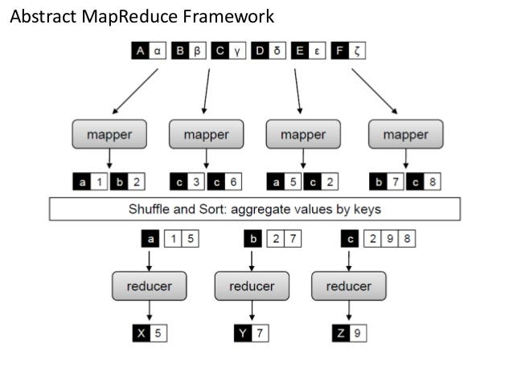
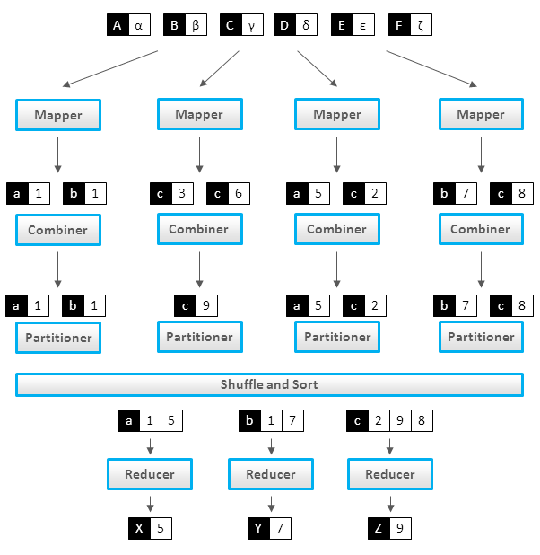

# General MapReduce Paradigm

* @Date: 10/03/2024

* @Author: Mahmoud Parsian

The purpose of this document is to provide a
MapReduce Example with and without combiners.

MapReduce is a programming model and an 
associated implementation for processing 
and generating big data sets with a parallel, 
distributed algorithm on a cluster.

## MapReduce with Mappers and Reducers

## MapReduce with Mappers, Combiners, and Reducers

## MapReduce Functions

MapReduce has 3 functions:

1. A Mapper: `map(K, V)`

2. A Combiner: `combine(K, V)` [OPTIONAL]
   a mini-reducer
   
3. A Reducer: `reduce(K, V)`

## Mapper
In MapReduce, a mapper is a task that transforms 
input records into intermediate key-value pairs. 
The mapper's output is then passed to a reducer, 
which aggregates the intermediate key-value pairs 
into a smaller set of key-value pairs as the 
final output.

A mapper can emit any number (0, 1, 2, 3, ...) 
of (K, V) pairs as output.

~~~
map(key, value):
 (K1, V1)
 (K2, V2)
 (K3, V3)
 ...
~~~
 
## Reducer
In MapReduce, a reducer is a function that takes 
in a set of (key, value) pairs as input and produces 
a smaller, more meaningful set of (key, value) pairs 
as output. The reducer is one of two functions that 
are the core of MapReduce, the other being the map function. 

A reducer can emit any number (0, 1, 2, 3, ...) 
of (K, V) pairs as output.

~~~
reduce(key, values):
 (Key1, Value1)
 (Key2, Value2)
 (Key3, Value3)
 ...
~~~

## Combiner
In the MapReduce framework, a combiner is an 
optional step that reduces the amount of data 
transferred across a network during the Shuffle 
and Sort phase. It's similar to a reducer, but 
it operates locally on the output of each mapper 
before data is shuffled. 

A combiner can emit any number (0, 1, 2, 3, ...) 
of (K, V) pairs as output.

~~~
combine(key, values):
 (Key1, Value1)
 (Key2, Value2)
 (Key3, Value3)
 ...
~~~  

# Example: Word Count in MapReduce: 

Problem Statement: Given a set of text 
documents, where a document can have 
hundreds, thousands or millions of records, 
find frequency of each unique word.

Given the following 3 documents: doc1, doc2, doc3

~~~
$ cat doc1
fox jumped and jumped
fox jumped high

$ cat doc2
fox jumped high
fox jumped 
fox is red

$cat doc3
fox is red
~~~

Then the MapReduce output should be as:

~~~
(fox, 6)
(jumped, 5)
(and, 1)
(high, 2)
(is, 2)
(red, 2)
~~~

# MapReduce Solution Without a Combiner

## Mapper

Assume the key is a record number and value
is the actual record passed to a mapper:

~~~
# key: record number: ignored
# value: an actual record 
map(key, value) {
   # tokenize the input record
   # assume that words are separated by a space " "
   words = value.split(" ")
   
   # iterate words and emit (word, 1) for each word
   for word in words {
       emit(word, 1)
   }
}
~~~

## Output of Mappers

~~~
for first record of doc1:
map(key=1, value="fox jumped and jumped"):
(fox, 1)
(jumped, 1)
(and, 1)
(jumped, 1)

for the second record of doc1:
map(key=2, value="fox jumped high"):
(fox, 1)
(jumped, 1)
(high, 1)

for first record of doc2:
map(key=1, value="fox jumped high"):
(fox, 1)
(jumped, 1)
(high, 1)

for second record of doc2:
map(key=2, value="fox jumped"):
(fox, 1)
(jumped, 1)

for third record of doc2:
map(key=3, value="fox is red"):
(fox, 1)
(is, 1)
(red, 1)

for first record of doc3:
map(key=1, value="fox is red"):
(fox, 1)
(is, 1) 
(red, 1)
~~~

# Input to Sort & Shuffle:

~~~
(fox, 1)
(jumped, 1)
(and, 1)
(jumped, 1)

(fox, 1)
(jumped, 1)
(high, 1)

(fox, 1)
(jumped, 1)
(high, 1)

(fox, 1)
(jumped, 1)

(fox, 1)
(is, 1)
(red, 1)

(fox, 1)
(is, 1) 
(red, 1)
~~~

# Output of Sort & Shuffle:

~~~
(fox, [1, 1, 1, 1, 1, 1])
(jumped, [1, 1, 1, 1, 1])
(and, [1])
(high, [1, 1])
(is, [1, 1])
(red, [1, 1])
~~~

## Reducer: LONGER VERSION

~~~
#key: unique word
#values: Iterable<Integer>
reduce(key, values) {
   total = 0
   for v in values {
     total += v
   }
   
   #emit frequency for the unique word
   emit(key, total)
}
~~~

## Reducer: SHORTER VERSION

~~~
#key: unique word
#values: Iterable<Integer>
reduce(key, values) {
   total = sum(values)

   #emit frequency for the unique word
   emit(key, total)
}
~~~

# Output of Reducers

~~~
(fox, 6)
(jumped, 5)
(and, 1)
(high, 2)
(is, 2)
(red, 2)
~~~

# MapReduce Solution With a Combiner

## Mapper

Assume the key is a record number and value
is the actual record passed to a mapper:

~~~
# key: record number: ignored
# value: an actual record 
map(key, value) {
   # tokenize the input record
   words = value.split(" ")
   
   # iterate words and emit (word, 1) for each word
   for word in words {
       emit(word, 1)
   }
}
~~~

Output of Mappers with Partitions: 
Assume that we have 3 partitions

Partition-1:

~~~
mappers output  ---> combiner             combiner
==============       INPUT:               OUTPUT:
(fox, 1)            (fox, [1, 1])         (fox, 2)
(jumped, 1)         (jumped,  [1, 1, 1])  (jumped, 3)
(and, 1)            (and, [1])            (and, 1)
(jumped, 1)         (high, [1])           (high, 1)
                                          
(fox, 1)
(jumped, 1)
(high, 1)
~~~

Partition-2:

~~~
mappers output  ---> combiner             combiner
==============       INPUT:               OUTPUT:
(fox, 1)            (fox, [1, 1])         (fox, 2)
(jumped, 1)         (jumped,  [1, 1])     (jumped, 2)
(high, 1)           (high, [1])           (high, 1)

(fox, 1)
(jumped, 1)
~~~

Partition-3:

~~~
mappers output  ---> combiner             combiner
==============       INPUT:               OUTPUT:
(fox, 1)            (fox, [1, 1])         (fox, 2)
(is, 1)             (is, [1, 1])          (is, 2)
(red, 1)            (red, [1, 1])         (red, 2)

(fox, 1)
(is, 1) 
(red, 1)
~~~

## Combiner:

~~~
#key: word
#values: Iterable<Integer>
combine(key, values) {
   total = sum(values)
   emit(key, total)
}
~~~

## Input to final Sort & Shuffle
~~~
(fox, 2)
(jumped, 3)
(and, 1)
(high, 1)
                                          
(fox, 2)
(jumped, 2)
(high, 1)

(fox, 2)
(is, 2)
(red, 2)
~~~

## Output of final Sort & Shuffle

~~~
(fox, [2, 2, 2])
(jumped, [3, 2])
(and, [1])
(high, [1, 1])
(is, [2])
(red, [2])
~~~

## Reducer:

~~~
#key: word
#values: Iterable<Integer>
reduce(key, values) {
   total = sum(values)
   emit(key, total)
}
~~~

Final Output of Reducers:

~~~
(fox, 6)
(jumped, 5)
(and, 1)
(high, 2)
(is, 2)
(red, 2)
~~~

# Some Questions and Answers

## Question-1: 

Apply a filter to your MapReduce solution
so that if any word appears less than 4 times,
then ignore it.

## Solution-1: apply filter in reducer:

Revided Reducer:

~~~
#key: word
#values: Iterable<Integer>
reduce(key, values) {
   total = sum(values)
   if (total < 4) {
      return
   }
   else {
     emit(key, total)
   }
}
~~~

Final Output of Revised Reducers:

~~~
(fox, 6)
(jumped, 5)
~~~

## Question-2: 

Ignore any word which is less than 
3 characters: such as "a", "of" "is", ...

Solution-2: apply filter in mapper:

Revised Mapper

~~~
# key: record number: ignored
# value: an actual record 
map(key, value) {
   # tokenize the input record
   words = value.split(" ")
   
   # iterate words and emit (word, 1) for each word
   for word in words {
       if (len(word) > 2) {
          emit(word, 1)
       }
   }
}
~~~

## Question-3: Homework:

Given input records of `gene_id` and value.

~~~
g1,3
g1,2
g1,5
g2,3
g2,1
...
~~~

1) Find a MapReduce solution to find average per gene_id
   by using map() and reduce()
   
2) Find a MapReduce solution to find average per gene_id
   by using map(), combine(), and reduce()
     
   

# References:

1. [MapReduce – Combiners](https://www.geeksforgeeks.org/mapreduce-combiners/)

2. [MapReduce - Combiners](https://www.tutorialspoint.com/map_reduce/map_reduce_combiners.htm)

3. [Best Explanation to MapReduce Combiner](
https://data-flair.training/blogs/hadoop-combiner-tutorial/)

4. [MapReduce From Wikipedia](
https://en.wikipedia.org/wiki/MapReduce)

