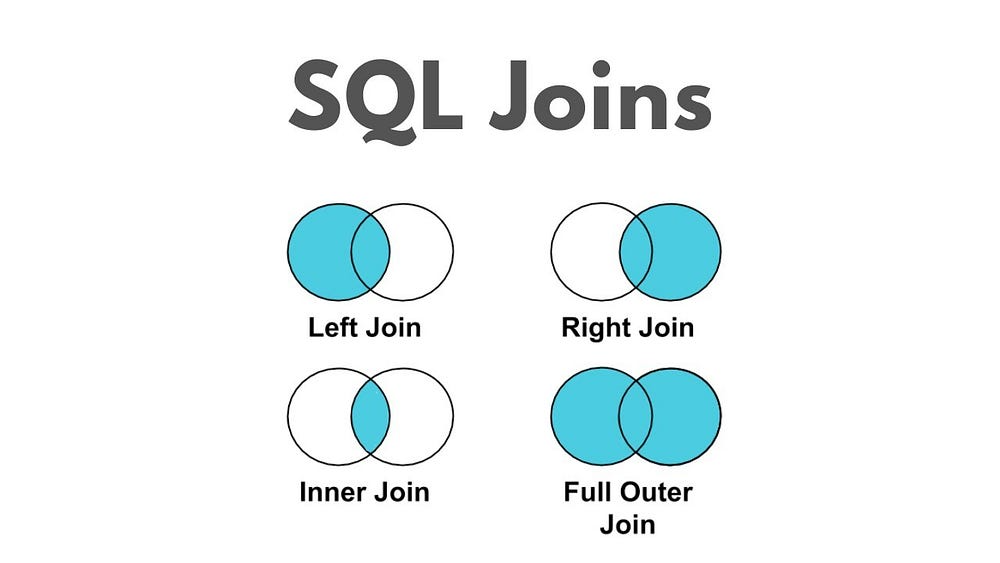
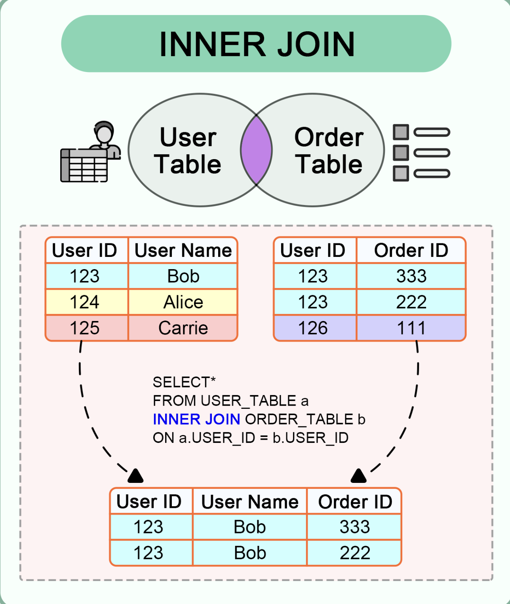
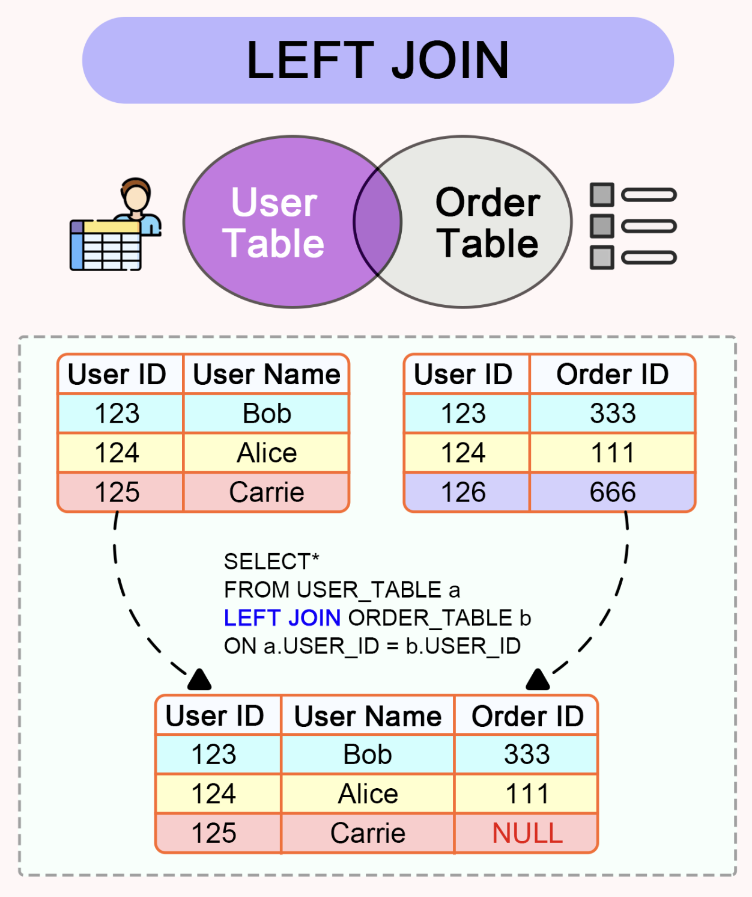
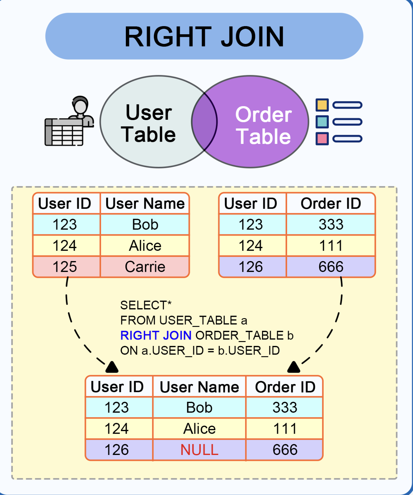
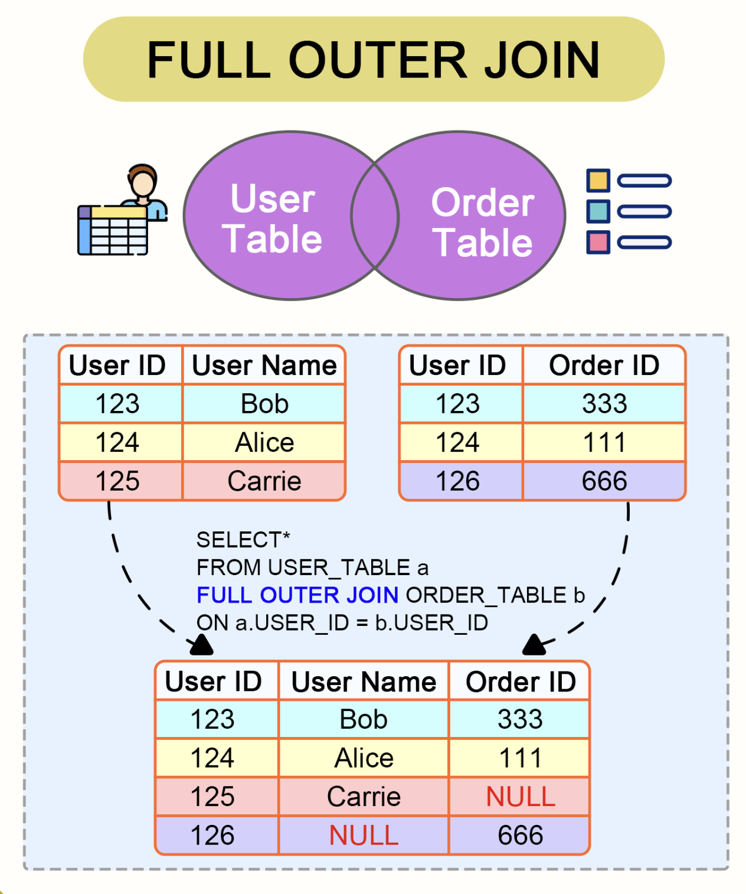

# PySpark DataFrames: Join Tutorial <br> Join Operation in Action




## df1

```python
>>> d1 = [(1, 'v1'), (1, 'v2'), (2, 'v3'), (2, 'v4'), (3, 'v5'), (4, 'v6'), (5, 'v7')]
>>> df1 = spark.createDataFrame(d1, ["id", "value1"])
>>> df1.show()
+---+------+
| id|value1|
+---+------+
|  1|    v1|
|  1|    v2|
|  2|    v3|
|  2|    v4|
|  3|    v5|
|  4|    v6|
|  5|    v7|
+---+------+
```

## df2

```python
>>> d2 = [(1, 'w1'), (1, 'w2'), (2, 'w3'), (2, 'w4'), (2, 'w5'), (3, 'w6'), (6, 'w7'), (7, 'w8')]
>>> df2 = spark.createDataFrame(d2, ["id", "value2"])
>>> df2.show()
+---+------+
| id|value2|
+---+------+
|  1|    w1|
|  1|    w2|
|  2|    w3|
|  2|    w4|
|  2|    w5|
|  3|    w6|
|  6|    w7|
|  7|    w8|
+---+------+
```

## `df1.join(df2, on="id", how="inner")`




```python
>>> df1.join(df2, on="id", how="inner").show()
+---+------+------+
| id|value1|value2|
+---+------+------+
|  1|    v1|    w1|
|  1|    v1|    w2|
|  1|    v2|    w1|
|  1|    v2|    w2|
|  2|    v3|    w3|
|  2|    v3|    w4|
|  2|    v3|    w5|
|  2|    v4|    w3|
|  2|    v4|    w4|
|  2|    v4|    w5|
|  3|    v5|    w6|
+---+------+------+
```

## `df1.join(df2, on="id", how="left")`




```python
>>> df1.join(df2, on="id", how="left").show()
+---+------+------+
| id|value1|value2|
+---+------+------+
|  1|    v1|    w2|
|  1|    v1|    w1|
|  1|    v2|    w2|
|  1|    v2|    w1|
|  2|    v3|    w5|
|  2|    v3|    w4|
|  2|    v3|    w3|
|  2|    v4|    w5|
|  2|    v4|    w4|
|  2|    v4|    w3|
|  3|    v5|    w6|
|  4|    v6|  NULL|
|  5|    v7|  NULL|
+---+------+------+
```

## `df1.join(df2, on="id", how="right")`




```python
>>> df1.join(df2, on="id", how="right").show()
+---+------+------+
| id|value1|value2|
+---+------+------+
|  1|    v2|    w1|
|  1|    v1|    w1|
|  1|    v2|    w2|
|  1|    v1|    w2|
|  2|    v4|    w3|
|  2|    v3|    w3|
|  2|    v4|    w4|
|  2|    v3|    w4|
|  2|    v4|    w5|
|  2|    v3|    w5|
|  3|    v5|    w6|
|  6|  NULL|    w7|
|  7|  NULL|    w8|
+---+------+------+
```

## `df1.join(df2, on="id", how="full")`




```python
>>> df1.join(df2, on="id", how="full").show()
+---+------+------+
| id|value1|value2|
+---+------+------+
|  1|    v1|    w1|
|  1|    v1|    w2|
|  1|    v2|    w1|
|  1|    v2|    w2|
|  2|    v3|    w3|
|  2|    v3|    w4|
|  2|    v3|    w5|
|  2|    v4|    w3|
|  2|    v4|    w4|
|  2|    v4|    w5|
|  3|    v5|    w6|
|  4|    v6|  NULL|
|  5|    v7|  NULL|
|  6|  NULL|    w7|
|  7|  NULL|    w8|
+---+------+------+
```

## `df1.join(df2, on="id", how="cross")`

#### Cross Join = Cartesian Product

```python
>>> df1.join(df2,  how="cross").show(100)
+---+------+---+------+
| id|value1| id|value2|
+---+------+---+------+
|  1|    v1|  1|    w1|
|  1|    v1|  1|    w2|
|  1|    v1|  2|    w3|
|  1|    v1|  2|    w4|
|  1|    v1|  2|    w5|
|  1|    v1|  3|    w6|
|  1|    v1|  6|    w7|
|  1|    v1|  7|    w8|
|  1|    v2|  1|    w1|
|  1|    v2|  1|    w2|
|  1|    v2|  2|    w3|
|  1|    v2|  2|    w4|
|  1|    v2|  2|    w5|
|  1|    v2|  3|    w6|
|  1|    v2|  6|    w7|
|  1|    v2|  7|    w8|
|  2|    v3|  1|    w1|
|  2|    v3|  1|    w2|
|  2|    v3|  2|    w3|
|  2|    v3|  2|    w4|
|  2|    v3|  2|    w5|
|  2|    v3|  3|    w6|
|  2|    v3|  6|    w7|
|  2|    v3|  7|    w8|
|  2|    v4|  1|    w1|
|  2|    v4|  1|    w2|
|  2|    v4|  2|    w3|
|  2|    v4|  2|    w4|
|  2|    v4|  2|    w5|
|  2|    v4|  3|    w6|
|  2|    v4|  6|    w7|
|  2|    v4|  7|    w8|
|  3|    v5|  1|    w1|
|  3|    v5|  1|    w2|
|  3|    v5|  2|    w3|
|  3|    v5|  2|    w4|
|  3|    v5|  2|    w5|
|  3|    v5|  3|    w6|
|  3|    v5|  6|    w7|
|  3|    v5|  7|    w8|
|  4|    v6|  1|    w1|
|  4|    v6|  1|    w2|
|  4|    v6|  2|    w3|
|  4|    v6|  2|    w4|
|  4|    v6|  2|    w5|
|  4|    v6|  3|    w6|
|  4|    v6|  6|    w7|
|  4|    v6|  7|    w8|
|  5|    v7|  1|    w1|
|  5|    v7|  1|    w2|
|  5|    v7|  2|    w3|
|  5|    v7|  2|    w4|
|  5|    v7|  2|    w5|
|  5|    v7|  3|    w6|
|  5|    v7|  6|    w7|
|  5|    v7|  7|    w8|
+---+------+---+------+
>>>
>>> cross_join_df = df1.join(df2,  how="cross")
>>> cross_join_df.count()
56
```
