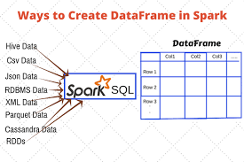

# PySpark DataFrames: A 30‑Slide Detailed Tutorial

## Slide 1 — Title
# **Introduction to PySpark DataFrames**
A beginner‑friendly guide for students transitioning from RDDs to DataFrames.


	A PySpark DataFrame is a distributed collection of data 
	organized into named columns, conceptually similar to a 
	table in a relational database or a Pandas DataFrame, but 
	designed for processing large datasets across a cluster 
	of machines. 
	
	It is built on top of Spark's Resilient Distributed Datasets 
	(RDDs) and provides a higher-level, more user-friendly API 
	for data manipulation and analysis.
	




---

## Slide 2 — Why DataFrames?

* Higher-level abstraction over RDDs  
* Optimized via Catalyst optimizer  
* SQL-like operations  
* Better performance for structured/semi-structured data  

---

## Slide 3 — SparkSession

```python
from pyspark.sql import SparkSession
spark = SparkSession.builder.appName("app3").getOrCreate()
spark = SparkSession.builder.getOrCreate()

```
> `SparkSession` is the entry point for DataFrame operations.

---

## Slide 4 — Creating DataFrames from Python Lists

```python
data = [("Alice", 34), ("Bob", 29)]
df = spark.createDataFrame(data, ["name", "age"])
df.show()
```

Example:

```python
from datetime import datetime, date
from pyspark.sql import Row
from pyspark.sql import SparkSession

spark = SparkSession.builder.getOrCreate()
df = spark.createDataFrame([
	Row(a=1, b=4., c='GFG1', d=date(2000, 8, 1),
		e=datetime(2000, 8, 1, 12, 0)),

	Row(a=2, b=8., c='GFG2', d=date(2000, 6, 2),
		e=datetime(2000, 6, 2, 12, 0)),

	Row(a=4, b=5., c='GFG3', d=date(2000, 5, 3),
		e=datetime(2000, 5, 3, 12, 0))
])


>>> df.show()
+---+---+----+----------+-------------------+
|  a|  b|   c|         d|                  e|
+---+---+----+----------+-------------------+
|  1|4.0|GFG1|2000-08-01|2000-08-01 12:00:00|
|  2|8.0|GFG2|2000-06-02|2000-06-02 12:00:00|
|  4|5.0|GFG3|2000-05-03|2000-05-03 12:00:00|
+---+---+----+----------+-------------------+

>>>
>>> df.printSchema()
root
 |-- a: long (nullable = true)
 |-- b: double (nullable = true)
 |-- c: string (nullable = true)
 |-- d: date (nullable = true)
 |-- e: timestamp (nullable = true)
```
---

## Slide 5 — Reading CSV (with header)

```python
df = spark.read.csv("people.csv", header=True, inferSchema=True)
df.show()
df.printSchema()
```

---

## Slide 6 — Reading CSV (without header)
```python
df = spark.read.csv("people_no_header.csv", header=False)
```
Default column names: `_c0`, `_c1`, ...

---

## Slide 7 — Reading CSV (with schema)
```python
from pyspark.sql.types import StructType
from pyspark.sql.types import StructField
from pyspark.sql.types import IntegerType
from pyspark.sql.types import StringType

schema = StructType([
    StructField("name", StringType(), True),
    StructField("age", IntegerType(), True)
])

df = spark.read.csv("people.csv", header=True, schema=schema)
```

---

## Slide 8 — Reading JSON Files

	A JSON (JavaScript Object Notation) file is a 
	lightweight text-based file used for storing 
	and exchanging data in a format that is both 
	human-readable and machine-parsable. 

JSON Example:

```
{ "name"   : "John Smith",
  "sku"    : "20223",
  "price"  : 23.95,
  "shipTo" : { "name" : "Jane Smith",
               "address" : "123 Maple Street",
               "city" : "Pretendville",
               "state" : "NY",
               "zip"   : "12345" },
  "billTo" : { "name" : "John Smith",
               "address" : "123 Maple Street",
               "city" : "Pretendville",
               "state" : "NY",
               "zip"   : "12345" }
}
```

```python
df = spark.read.json("people.json")
df.show()
df.printSchema()
```
JSON is automatically schema‑inferred.

---

## Slide 9 — Reading Multiple JSON Files
```python
df = spark.read.json("json_folder/*.json")
```

---

## Slide 10 — Common DataFrame Actions
```python
df.show()
df.head()
df.take(5)
df.count()
```

---

## Slide 11 — Common DataFrame Transformations

### filter:

```python
	df2 = df.filter(df.age > 30)
```

### select needed columns:
```python
	df3 = df.select("name", "age")
```

### add a new column:
```python
	df4 = df.withColumn("age_plus_10", df.age + 10)
```

---

## Slide 12 — Column Expressions
```python
from pyspark.sql.functions import col
from pyspark.sql.functions import upper

df.select(upper(col("name")).alias("NAME"), col("age")).show()
```

---

## Slide 13 — Adding Columns
```python
	df = df.withColumn("age2", df.age * 2)
```

---

## Slide 14 — Dropping Columns
```python
	df = df.drop("age2")
```

---

## Slide 15 — Renaming Columns
```python
df = df.withColumnRenamed("name", "full_name")
```

---

## Slide 16 — Handling Missing Data
```python
	df.na.fill({"age": 0})
	df.na.drop()
```

---

## Slide 17 — Sorting
```python
	df.orderBy("age").show()
	df.orderBy(df.age.desc()).show()
```

---

## Slide 18 — GroupBy Aggregations
```python
	df.groupBy("country").count().show()
	df.groupBy("country").agg({"salary": "avg"}).show()
```

---

## Slide 19 — More Aggregations
```python
from pyspark.sql.functions import avg
from pyspark.sql.functions import sum

df.groupBy("dept").agg(
    avg("salary").alias("avg_salary"),
    sum("salary").alias("total_salary")
).show()
OR
df.createOrReplaceTempView("people")
df2 = spark.sql("""
             SELECT dept, 
                    AVG(salary) as avg_salary, 
                    SUM(salary) as total_salary 
             from people 
             GROUP BY dept
""")
```

---

## Slide 20 — Joining DataFrames
```python
df.join(df2, on="id", how="inner").show()
```

---

## Slide 21 — Join Types
* inner  
* left  
* right  
* full  

```python
df.join(df2, "id", "left").show()
```

---

## Slide 22 — Window Functions

### Window Function Definition

```python
from pyspark.sql.window import Window
from pyspark.sql.functions import row_number

w = Window.partitionBy("dept").orderBy("salary")

df.withColumn("rn", row_number().over(w)).show()
```

### Window Function in Action

```python
>>> rows = [('alex', 'ENG', 12000), ('bob', 'ENG', 14000), ('jane', 'ENG', 16000), ('ted', 'HR', 34000), ('rafa', 'HR', 44000)]
>>> rows
[('alex', 'ENG', 12000), ('bob', 'ENG', 14000), ('jane', 'ENG', 16000), ('ted', 'HR', 34000), ('rafa', 'HR', 44000)]
>>> df = spark.createDataFrame(rows, ["name", "dept", "salary"])
>>> df.show()
+----+----+------+
|name|dept|salary|
+----+----+------+
|alex| ENG| 12000|
| bob| ENG| 14000|
|jane| ENG| 16000|
| ted|  HR| 34000|
|rafa|  HR| 44000|
+----+----+------+

>>> from pyspark.sql.window import Window
>>> from pyspark.sql.functions import row_number
>>>
>>> w = Window.partitionBy("dept").orderBy("salary")
>>>
>>> df.withColumn("rn", row_number().over(w)).show()
+----+----+------+---+
|name|dept|salary| rn|
+----+----+------+---+
|alex| ENG| 12000|  1|
| bob| ENG| 14000|  2|
|jane| ENG| 16000|  3|
| ted|  HR| 34000|  1|
|rafa|  HR| 44000|  2|
+----+----+------+---+
```
---

## Slide 23 — SQL Queries (register temp view)

```python
df.createOrReplaceTempView("people")
spark.sql("SELECT * FROM people WHERE age > 30").show()
```

---

## Slide 24 — Aggregation via SQL
```sql
SELECT dept, AVG(salary)
FROM people
GROUP BY dept;
```

---

## Slide 25 — Reading Parquet

```python
df = spark.read.parquet("people.parquet")
```
Parquet = columnar + compressed + fastest in Spark.

Example:

```
>>> parquet_file = "/Users/mparsian/Downloads/iris.parquet"
>>> df = spark.read.parquet(parquet_file)
>>> df.show()
+------------+-----------+------------+-----------+-------+
|sepal.length|sepal.width|petal.length|petal.width|variety|
+------------+-----------+------------+-----------+-------+
|         5.1|        3.5|         1.4|        0.2| Setosa|
|         4.9|        3.0|         1.4|        0.2| Setosa|
|         4.7|        3.2|         1.3|        0.2| Setosa|
|         4.6|        3.1|         1.5|        0.2| Setosa|
|         5.0|        3.6|         1.4|        0.2| Setosa|
|         5.4|        3.9|         1.7|        0.4| Setosa|
|         4.6|        3.4|         1.4|        0.3| Setosa|
|         5.0|        3.4|         1.5|        0.2| Setosa|
|         4.4|        2.9|         1.4|        0.2| Setosa|
|         4.9|        3.1|         1.5|        0.1| Setosa|
|         5.4|        3.7|         1.5|        0.2| Setosa|
|         4.8|        3.4|         1.6|        0.2| Setosa|
|         4.8|        3.0|         1.4|        0.1| Setosa|
|         4.3|        3.0|         1.1|        0.1| Setosa|
|         5.8|        4.0|         1.2|        0.2| Setosa|
|         5.7|        4.4|         1.5|        0.4| Setosa|
|         5.4|        3.9|         1.3|        0.4| Setosa|
|         5.1|        3.5|         1.4|        0.3| Setosa|
|         5.7|        3.8|         1.7|        0.3| Setosa|
|         5.1|        3.8|         1.5|        0.3| Setosa|
+------------+-----------+------------+-----------+-------+
only showing top 20 rows
```

>>> df.printSchema()
root
 |-- sepal.length: double (nullable = true)
 |-- sepal.width: double (nullable = true)
 |-- petal.length: double (nullable = true)
 |-- petal.width: double (nullable = true)
 |-- variety: string (nullable = true)
---

## Slide 26 — Writing CSV, JSON, Parquet
```python
df.write.csv("out_csv", header=True)
df.write.json("out_json")
df.write.parquet("out_parquet")
```

---

## Slide 27 — DataFrame Describe + Summary
```python
df.describe().show()
df.summary().show()
```

---

## Slide 28 — Dropping Duplicates
```python
df.dropDuplicates(["name"]).show()
```

---

## Slide 29 — Converting Between RDDs and DataFrames
```python
rdd = df.rdd
df2 = rdd.toDF()
```

---

## Slide 30 — Final Summary
* Read CSV/JSON/Parquet  
* Transformations + actions  
* SQL integration  
* Joins + window functions  
* Schema inference + explicit schema  

## Join Operation in Action
```
>>> data = [("Alice", 34), ("Bob", 29)]
>>> df = spark.createDataFrame(data, ["name", "age"])
df.show()
>>> df.show()
+-----+---+
| name|age|
+-----+---+
|Alice| 34|
|  Bob| 29|
+-----+---+

>>> df.printSchema()
root
 |-- name: string (nullable = true)
 |-- age: long (nullable = true)

>>> d1 = [(1, 'v1'), (1, 'v2'), (2, 'v3'), (2, 'v4'), (3, 'v5'), (4, 'v6'), (5, 'v7')]
>>> df1 = spark.createDataFrame(d1, ["id", "value1"])
>>> df1.show()
+---+------+
| id|value1|
+---+------+
|  1|    v1|
|  1|    v2|
|  2|    v3|
|  2|    v4|
|  3|    v5|
|  4|    v6|
|  5|    v7|
+---+------+

>>> d2 = [(1, 'w1'), (1, 'w2'), (2, 'w3'), (2, 'w4'), (2, 'w5'), (3, 'w6'), (6, 'w7'), (7, 'w8')]
>>> df2 = spark.createDataFrame(d2, ["id", "value2"])
>>> df2.show()
+---+------+
| id|value2|
+---+------+
|  1|    w1|
|  1|    w2|
|  2|    w3|
|  2|    w4|
|  2|    w5|
|  3|    w6|
|  6|    w7|
|  7|    w8|
+---+------+

>>> df1.join(df2, on="id", how="inner").show()
+---+------+------+
| id|value1|value2|
+---+------+------+
|  1|    v1|    w1|
|  1|    v1|    w2|
|  1|    v2|    w1|
|  1|    v2|    w2|
|  2|    v3|    w3|
|  2|    v3|    w4|
|  2|    v3|    w5|
|  2|    v4|    w3|
|  2|    v4|    w4|
|  2|    v4|    w5|
|  3|    v5|    w6|
+---+------+------+

>>> df1.join(df2, on="id", how="left").show()
+---+------+------+
| id|value1|value2|
+---+------+------+
|  1|    v1|    w2|
|  1|    v1|    w1|
|  1|    v2|    w2|
|  1|    v2|    w1|
|  2|    v3|    w5|
|  2|    v3|    w4|
|  2|    v3|    w3|
|  2|    v4|    w5|
|  2|    v4|    w4|
|  2|    v4|    w3|
|  3|    v5|    w6|
|  4|    v6|  NULL|
|  5|    v7|  NULL|
+---+------+------+

>>> df1.join(df2, on="id", how="right").show()
+---+------+------+
| id|value1|value2|
+---+------+------+
|  1|    v2|    w1|
|  1|    v1|    w1|
|  1|    v2|    w2|
|  1|    v1|    w2|
|  2|    v4|    w3|
|  2|    v3|    w3|
|  2|    v4|    w4|
|  2|    v3|    w4|
|  2|    v4|    w5|
|  2|    v3|    w5|
|  3|    v5|    w6|
|  6|  NULL|    w7|
|  7|  NULL|    w8|
+---+------+------+

>>> df1.join(df2, on="id", how="full").show()
+---+------+------+
| id|value1|value2|
+---+------+------+
|  1|    v1|    w1|
|  1|    v1|    w2|
|  1|    v2|    w1|
|  1|    v2|    w2|
|  2|    v3|    w3|
|  2|    v3|    w4|
|  2|    v3|    w5|
|  2|    v4|    w3|
|  2|    v4|    w4|
|  2|    v4|    w5|
|  3|    v5|    w6|
|  4|    v6|  NULL|
|  5|    v7|  NULL|
|  6|  NULL|    w7|
|  7|  NULL|    w8|
+---+------+------+

>>> df1.join(df2,  how="cross").show()
+---+------+---+------+
| id|value1| id|value2|
+---+------+---+------+
|  1|    v1|  1|    w1|
|  1|    v1|  1|    w2|
|  1|    v1|  2|    w3|
|  1|    v1|  2|    w4|
|  1|    v1|  2|    w5|
|  1|    v1|  3|    w6|
|  1|    v1|  6|    w7|
|  1|    v1|  7|    w8|
|  1|    v2|  1|    w1|
|  1|    v2|  1|    w2|
|  1|    v2|  2|    w3|
|  1|    v2|  2|    w4|
|  1|    v2|  2|    w5|
|  1|    v2|  3|    w6|
|  1|    v2|  6|    w7|
|  1|    v2|  7|    w8|
|  2|    v3|  1|    w1|
|  2|    v3|  1|    w2|
|  2|    v3|  2|    w3|
|  2|    v3|  2|    w4|
+---+------+---+------+
only showing top 20 rows
>>>
```
