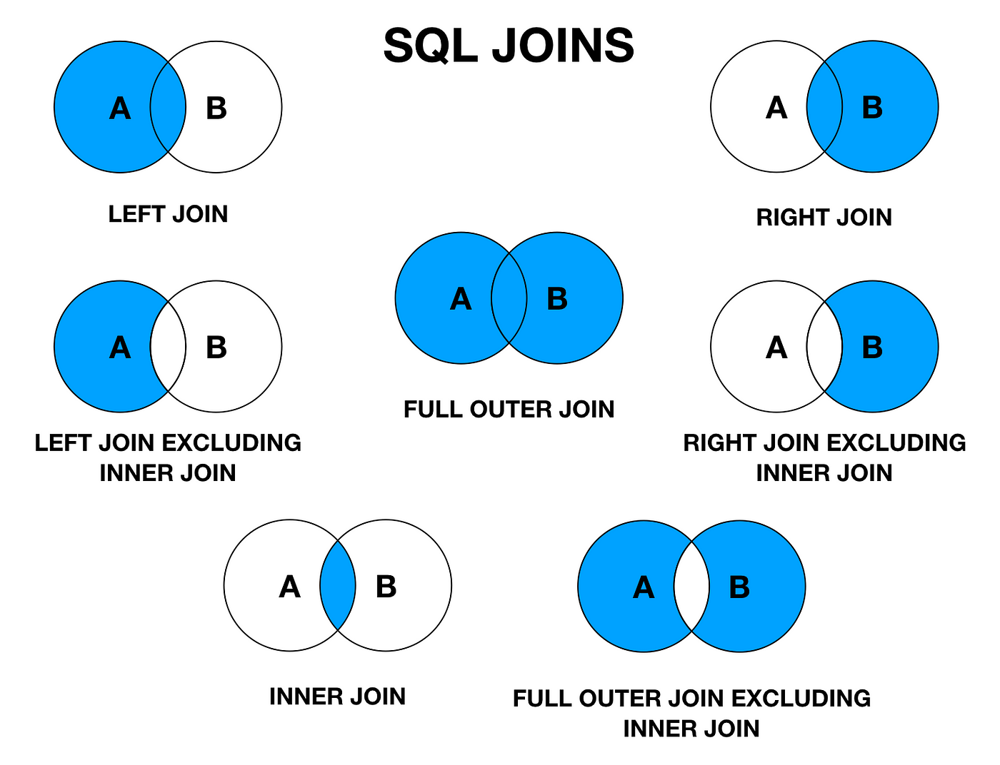

# Join in Spark RDDs

## SQL Joins

SQL joins are explained [here](https://medium.com/@iammanolov98/mastering-sql-joins-coding-interview-preparation-innerjoin-e96bef58afc2).

        

-------

## RDD Joins

PySpark supports JOIN operation for `(key, value)` RDDs.
The most common join is an inner join and is supported 
by `RDD.join`:

	RDD.join(other: pyspark.rdd.RDD[Tuple[K, U]], 
		numPartitions: Optional[int] = None) 
		→ pyspark.rdd.RDD[Tuple[K, Tuple[V, U]]]¶

	Return an RDD containing all pairs of elements 
	with matching keys in self and other.  Each pair 
	of elements will be returned as a (k, (v1, v2)) 
	tuple, where (k, v1) is in self and (k, v2) is 
	in other. Performs a hash join across the cluster.

PySpark supports other join operations as  well:

* `RDD.leftOuterJoin()`
* `RDD.rightOuterJoin()`
* `RDD.fullOuterJoin()`
* `RDD.cogroup()`
* `RDD.groupWith()`
* `pyspark.sql.DataFrame.join()`

# Example of Inner, Left Outer, and Right Outer Joins

~~~python
~  % cd spark-3.5.0
spark-3.5.0  % ./bin/pyspark
Python 3.11.4 (v3.11.4:d2340ef257, Jun  6 2023, 19:15:51) 
[Clang 13.0.0 (clang-1300.0.29.30)] on darwin
Welcome to
      ____              __
     / __/__  ___ _____/ /__
    _\ \/ _ \/ _ `/ __/  '_/
   /__ / .__/\_,_/_/ /_/\_\   version 3.5.0
      /_/

Using Python version 3.11.4 (v3.11.4:d2340ef257, Jun  6 2023 19:15:51)
Spark context Web UI available at http://172.20.193.144:4040
Spark context available as 'sc' (master = local[*], app id = local-1697594039497).
SparkSession available as 'spark'.

>>> A = [('k1', 2), ('k1', 3), ('k2', 4), ('k2', 5), ('k3', 20), ('k4', 200)]
>>> B = [('k1', 20), ('k1', 30), ('k2', 40), ('k2', 50), ('k7', 20), ('k8', 2)]
>>> A
[('k1', 2), ('k1', 3), ('k2', 4), ('k2', 5), ('k3', 20), ('k4', 200)]
>>> B
[('k1', 20), ('k1', 30), ('k2', 40), ('k2', 50), ('k7', 20), ('k8', 2)]

>>> rdd1 = sc.parallelize(A)
>>> rdd1.collect()
[('k1', 2), ('k1', 3), ('k2', 4), ('k2', 5), ('k3', 20), ('k4', 200)]

>>> rdd2 = sc.parallelize(B)
>>> rdd2.collect()
[('k1', 20), ('k1', 30), ('k2', 40), ('k2', 50), ('k7', 20), ('k8', 2)]
>>>
>>>

>>> joined = rdd1.join(rdd2)
>>> joined.collect()
[
 ('k1', (2, 20)), 
 ('k1', (2, 30)), 
 ('k1', (3, 20)), 
 ('k1', (3, 30)), 
 ('k2', (4, 40)), 
 ('k2', (4, 50)), 
 ('k2', (5, 40)), 
 ('k2', (5, 50))
]
>>> joined2 = rdd2.join(rdd1)
>>> joined2.collect()
[
 ('k1', (20, 2)), 
 ('k1', (20, 3)), 
 ('k1', (30, 2)), 
 ('k1', (30, 3)), 
 ('k2', (40, 4)), 
 ('k2', (40, 5)), 
 ('k2', (50, 4)), 
 ('k2', (50, 5))
]
>>>
>>>
>>> left_outer_join = rdd1.leftOuterJoin(rdd2)
>>> left_outer_join.collect()
[
 ('k1', (2, 20)), 
 ('k1', (2, 30)), 
 ('k1', (3, 20)), 
 ('k1', (3, 30)), 
 ('k2', (4, 40)), 
 ('k2', (4, 50)), 
 ('k2', (5, 40)), 
 ('k2', (5, 50)), 
 ('k3', (20, None)), 
 ('k4', (200, None))
]
>>>
>>>
>>> right_outer_join = rdd1.rightOuterJoin(rdd2)
>>> right_outer_join.collect()
[
 ('k1', (2, 20)), 
 ('k1', (2, 30)), 
 ('k1', (3, 20)), 
 ('k1', (3, 30)), 
 ('k2', (4, 40)), 
 ('k2', (4, 50)), 
 ('k2', (5, 40)), 
 ('k2', (5, 50)), 
 ('k8', (None, 2)), 
 ('k7', (None, 20))
]
>>>
~~~
