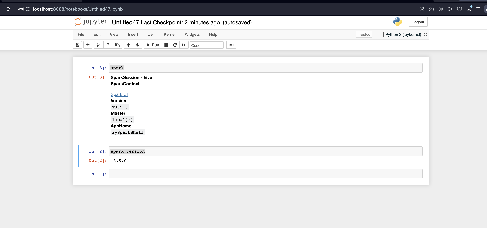

# 1. Create a Shell Script File 

I have an example of [`pyspark_jupyter.sh`](./pyspark_jupyter.sh)

Update directories accordingly.

# 2. Execute Created Shell Script as:

		source pyspark_jupyter.sh
		
		
# 3. Then try some Spark commands from Jupyter:

