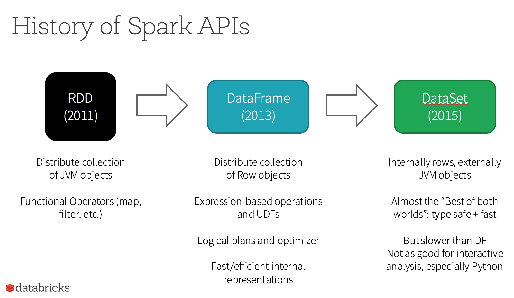
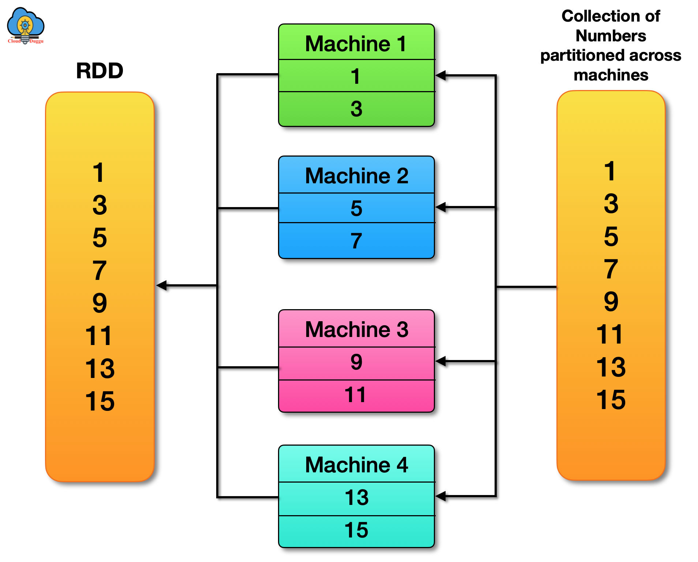
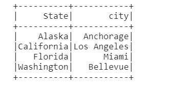
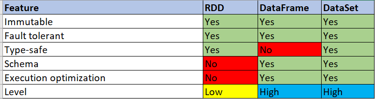

# Data abstraction in Apache Spark
Data abstraction in Apache Spark is the 
idea of a distributed collection of objects 
that can be represented as a resilient 
distributed dataset (RDD), DataFrame, or 
Dataset. Data abstraction allows users to 
write programs that transform these datasets 
into the desired form. 

Here are some of the main data abstractions in Spark:

* Resilient Distributed Dataset (RDD)
* DataFrame

## Resilient Distributed Dataset (RDD)
Resilient Distributed Dataset (RDD): A fault-tolerant
collection of data elements that can be stored in memory 
or on disk across a cluster of machines. RDDs can be 
created from files in the Hadoop file system, Scala
collections, or local file systems. RDDs support
transformations and actions, which can be used to 
create new datasets or return the results of data transformations.

## RDD Example

## DataFrame
DataFrame: A declarative programming paradigm for 
batch processing built using the DataFrame abstraction. 
From a programming perspective, a DataFrame is a 
collection of generic objects.

## DataFrame Example

## Comparison of RDD and DataFrame

## References

1. [A Tale of Three Apache Spark APIs: RDDs vs DataFrames and Datasets by Databricks](https://www.databricks.com/blog/2016/07/14/a-tale-of-three-apache-spark-apis-rdds-dataframes-and-datasets.html)

2. [Quick Start on Spark](https://spark.apache.org/docs/latest/quick-start.html)

3. [RDD Programming Guide](https://spark.apache.org/docs/latest/rdd-programming-guide.html)

4. [Spark SQL, DataFrames and Datasets Guide](https://spark.apache.org/docs/latest/sql-programming-guide.html)

5. [PySpark API](https://spark.apache.org/docs/latest/api/python/index.html)
