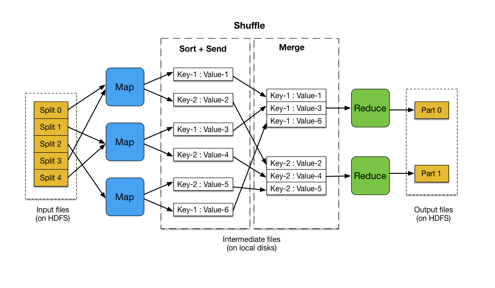

# MapReduce Tutorials

#### 1. [Fundamentals of MapReduce with MapReduce Example](https://medium.com/edureka/mapreduce-tutorial-3d9535ddbe7c)

#### 2. [MapReduce Algorithm Design, Jimmy Lin (PDF, 137 slides)](https://cs.uwaterloo.ca/~jimmylin/publications/WWW2013-MapReduce-tutorial-slides.pdf)

#### 3. [Introduction to MapReduce by Fernando Chirigati, (PDF, 50 Slides)](https://vgc.poly.edu/~fchirigati/mda-class/mapreduce-intro.pdf)

#### 4. [Google's MapReduce Programming Modell Revisited by Ralf Lammel](./Googles_MapReduce_Programming_Modell_Revisited_by_Ralf_Lammel.pdf)

------
## MapReduce Flow

-------
## MapReduce Example

------

